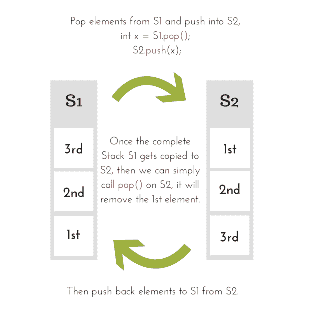

# 使用栈实现队列

> 原文：<https://www.studytonight.com/data-structures/queue-using-stack>

队列由其属性**先进先出**定义，这意味着先进先出，即先添加的元素先被取出。这种行为定义了一个队列，而数据实际上存储在后台的**数组**或**列表**中。

我们在这里的意思是，无论数据是如何以及在哪里存储的，如果添加的第一个元素是被移除的第一个元素，并且我们实现了函数`enqueue()`和`dequeue()`来实现这种行为，我们可以说我们实现了一个队列数据结构。

在我们之前的教程中，我们使用了一个简单的**数组**来存储数据元素，但是在本教程中，我们将使用**栈数据结构**来存储数据。

在使用栈实现队列数据结构时，我们还必须考虑栈的自然行为，即**先进先出**。

为了执行**入队**，我们只需要**一个栈**，因为我们可以直接**将**数据推到栈上，但是为了执行**出队**，我们将需要**两个栈**，因为我们需要遵循队列的先进先出属性，如果我们直接**将**任何数据元素弹出栈，它将遵循后进先出方法。

* * *

## 使用栈实现队列

总之，我们需要两个栈来实现一个队列，我们称它们为`S1`和`S2`。

```cpp
class Queue {
    public:
    Stack S1, S2;

    //declaring enqueue method
    void enqueue(int x);

    //declaring dequeue method
    int dequeue();
}
```

在上面的代码中，我们简单地定义了一个类`Queue`，有两个类型为`Stack`的变量`S1`和`S2`。

我们知道，Stack 是一种数据结构，其中数据可以使用`push()`方法添加，数据可以使用`pop()`方法移除。

您可以在[栈数据结构教程](stack-data-structure)中找到`Stack`类的代码。

要实现队列，我们可以遵循两种方法:

1.  **通过使`enqueue`操作代价高昂**
2.  **通过使`dequeue`操作代价高昂**

* * *

### 1.使得入队操作成本很高

在这种方法中，我们确保添加到队列中最早的元素停留在栈的**顶部**，其次才是最早的元素，以此类推。

为了实现这一点，我们需要两个栈。将新元素排入队列时，将涉及以下步骤。

> **注:**第一栈(`S1`)是用来存储数据的主栈，第二栈(`S2`)是在各种操作中辅助和临时存储数据。

1.  如果队列为空(表示`S1`为空)，直接**将**第一个元素推送到栈`S1`上。
2.  如果队列不为空，则将第一个栈(`S1`)中的所有元素逐个移动到第二个栈(`S2`)。然后将新元素添加到第一个栈中，然后将第二个栈中的所有元素移回第一个栈。
3.  这样做将始终保持栈中元素的正确顺序，第一个数据元素始终位于**顶部**，第二个数据元素位于其正下方，新的数据元素将被添加到底部。

这使得从队列中移除一个元素变得非常简单，我们所要做的就是调用`pop()`方法来堆叠`S1`。

* * *

* * *

### 2.使得出列操作成本很高

在这种方法中，我们通过简单地调用`push()`函数向栈`S1`中插入一个新元素，但是这样做将把我们的第一个元素推向栈的底部，因为我们向栈中插入了更多的元素。

但是我们希望首先移除第一个元素。因此在`dequeue`操作中，我们将不得不使用第二个栈`S2`。

对于`dequeue`操作，我们必须遵循以下步骤:

1.  如果队列是空的(意味着`S1`是空的)，那么我们返回一个错误消息，说队列是空的。
2.  如果队列不为空，则将第一个栈(`S1`)中的所有元素逐个移动到第二个栈(`S2`)。然后从第二个栈中移除**顶部**的元素，然后将第二个栈中的所有元素移回第一个栈。
3.  将第一个栈中存在的所有元素移动到第二个栈的目的是颠倒元素的顺序，因为插入队列的第一个元素位于第二个栈的顶部，我们所要做的就是调用第二个栈上的`pop()`函数来移除该元素。

> **注:** *我们将实施**第二种方法**，我们将使`dequeue()`方法代价高昂。*

* * *

### 将数据添加到队列- `enqueue()`

由于我们的队列有一个用于数据存储的栈，而不是数组，因此我们将向栈添加数据，这可以使用`push()`方法来完成，因此`enqueue()`方法看起来像:

```cpp
void Queue :: enqueue(int x) 
{
    S1.push(x);
}
```

就是这样，新的数据元素被排队并存储在我们的队列中。

* * *

### 从队列中删除数据- `dequeue()`

当我们说从队列中移除数据时，它总是意味着取出首先插入队列的元素，然后是第二个，以此类推，因为我们必须遵循**先进先出方法**。

但是如果我们简单地在我们的**出列**方法中执行`S1.pop()`，那么它将首先移除插入队列中的最后一个元素。那现在怎么办？



如上图所示，我们将第一个栈中存在的所有元素都移动到第二个栈，然后移除**顶部**元素，之后我们将元素移回第一个栈。

```cpp
int Queue :: dequeue() 
{
    int x, y;
    while(S1.isEmpty()) 
    {
        // take an element out of first stack
        x = S1.pop();
        // insert it into the second stack
        S2.push();
    }

    // removing the element
    y = S2.pop();

    // moving back the elements to the first stack
    while(!S2.isEmpty()) 
    {
        x = S2.pop();
        S1.push(x);
    }

    return y;
}
```

现在我们已经知道了`enqueue()`和`dequeue()`操作的实现，让我们编写一个完整的程序来使用栈实现一个队列。

* * *

## C++ 中的实现

我们不会遵循使用指针的传统方法，而是定义适当的类，就像我们在栈教程中所做的那样。

```cpp
/*  Below program is written in C++ language  */

# include<iostream>

using namespace std;

// implementing the stack class
class Stack
{
    int top;
    public:
    int a[10];  //Maximum size of Stack
    Stack()
    {
        top = -1;
    }

    // declaring all the function
    void push(int x);
    int pop();
    bool isEmpty();
};

// function to insert data into stack
void Stack::push(int x)
{
    if(top >= 10)
    {
        cout << "Stack Overflow \n";
    }
    else
    {
        a[++top] = x;
        cout << "Element Inserted into Stack\n";
    }
}

// function to remove data from the top of the stack
int Stack::pop()
{
    if(top < 0)
    {
        cout << "Stack Underflow \n";
        return 0;
    }
    else
    {
        int d = a[top--];
        return d;
    }
}

// function to check if stack is empty
bool Stack::isEmpty()
{
    if(top < 0)
    {
        return true;
    }
    else
    {
        return false;
    }
}

// implementing the queue class
class Queue {
    public:
    Stack S1, S2;

    //declaring enqueue method
    void enqueue(int x);

    //declaring dequeue method
    int dequeue();
};

// enqueue function
void Queue :: enqueue(int x) 
{
    S1.push(x);
    cout << "Element Inserted into Queue\n";
}

// dequeue function
int Queue :: dequeue() 
{
    int x, y;
    while(!S1.isEmpty()) 
    {
        // take an element out of first stack
        x = S1.pop();
        // insert it into the second stack
        S2.push(x);
    }

    // removing the element
    y = S2.pop();

    // moving back the elements to the first stack
    while(!S2.isEmpty()) 
    {
        x = S2.pop();
        S1.push(x);
    }

    return y;
}

// main function
int main()
{
    Queue q;
    q.enqueue(10);
    q.enqueue(100);
    q.enqueue(1000);
    cout << "Removing element from queue" << q.dequeue();

    return 0;
}
```

就这样，我们做到了。

* * *

* * *