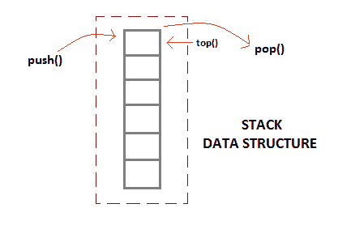

# 使用链表实现栈

> 原文：<https://www.studytonight.com/data-structures/stack-using-linked-list>

我们所知道的栈是一种**后进先出(LIFO)** 数据结构。它具有以下操作:

*   **推入:**将元素推入栈
*   **弹出:**移除最后添加的元素
*   **top:** 返回栈顶部的元素



* * *

## 使用链表实现栈

使用链表可以很容易地实现栈。栈是一种数据结构，可以使用`push()`方法向其中添加数据，也可以使用`pop()`方法从其中移除数据。有了链表，**推**操作可以用链表的`addAtFront()`方法代替，**弹出**操作可以用删除链表前节点的函数代替。

通过这种方式，我们的链表将虚拟地变成一个具有`push()`和`pop()`方法的栈。

首先我们创建一个类**节点**。这是我们的链表节点类，其中将有**数据**和一个**节点指针**来存储下一个节点元素的地址。

```cpp
class node
{
	int data;
	node *next;
};
```

然后我们定义栈类，

```cpp
class Stack
{
	node *front;  // points to the head of list
	public:
	Stack()
	{
		front = NULL;
	}
	// push method to add data element
	void push(int);
	// pop method to remove data element
	void pop();
	// top method to return top data element
	int top();
};
```

* * *

### 在栈中插入数据(链表)

为了将一个元素插入到栈中，我们将创建一个节点并将其放在列表的前面。

```cpp
void Stack :: push(int d)
{
	// creating a new node
	node *temp;
	temp = new node();
	// setting data to it
	temp->data = d;

	// add the node in front of list
	if(front == NULL)
	{
		temp->next = NULL;
	}
	else
	{
		temp->next = front;
	}
	front = temp;
}
```

现在，每当我们调用`push()`函数时，一个新的节点就会被添加到前面的列表中，这就是栈的行为。

* * *

### 从栈中移除元素(链接列表)

为了做到这一点，我们将简单地删除第一个节点，并使第二个节点成为列表的头部。

```cpp
void Stack :: pop()
{
	// if empty
	if(front == NULL)
		cout << "UNDERFLOW\n";

	// delete the first element
	else
	{
		node *temp = front;
		front = front->next;
		delete(temp);
	}
}
```

* * *

### 返回栈顶部(链表)

在这种情况下，我们只需返回存储在列表头部的数据。

```cpp
int Stack :: top()
{
	return front->data;
}
```

* * *

### 结论

当我们说“使用链表实现栈”时，我们指的是如何让链表表现得像一个栈，毕竟它们都是逻辑实体。所以任何数据结构作为一个 Stack，都应该有`push()`方法在顶部添加数据，有`pop()`方法从顶部移除数据。这正是我们所做的，并因此实现了使链表表现为栈。

* * *

* * *