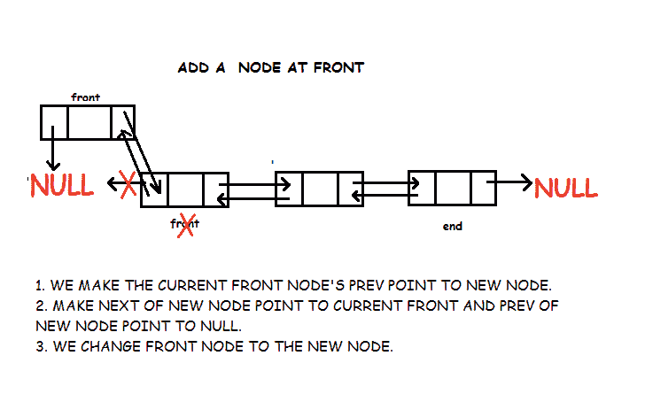
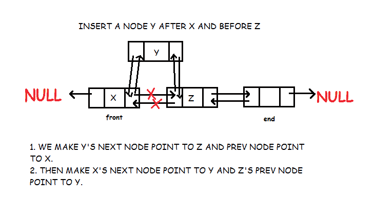
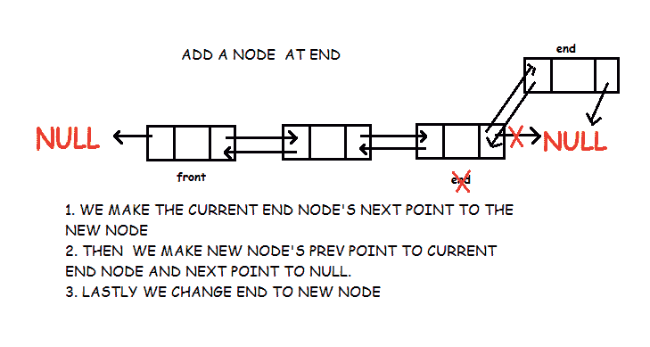
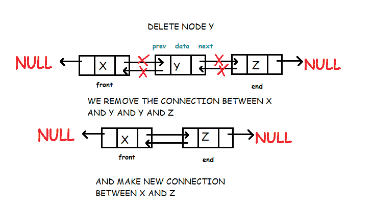

# 双向链表

> 原文：<https://www.studytonight.com/data-structures/doubly-linked-list>

双向链表是一种类型的[链表](introduction-to-linked-list)，其中每个节点除了存储其数据之外还有两个链接。第一个链接指向列表中的上一个节点，第二个链接指向列表中的下一个节点。列表的第一个节点的前一个链接指向空。同样，列表的最后一个节点的下一个节点指向空。


这两个链接帮助我们向前和向后遍历列表。但是存储一个额外的链接需要一些额外的空间。

* * *

## 双链表的实现

首先我们定义节点。

```cpp
struct node
{
	int data;     	// Data
	node *prev;  	// A reference to the previous node
	node *next; 	// A reference to the next node
};
```

现在我们定义我们的类双链表。它有以下方法:

*   **add_front:** 在列表开头增加一个新节点
*   **add_after:** 在另一个节点后添加一个新节点
*   **add_before:** 在另一个节点之前添加一个新节点
*   **add_end:** 在列表末尾添加新节点
*   **删除:**删除节点
*   **正向遍历:**正向遍历列表
*   **向后遍历:**向后遍历列表

```cpp
class Doubly_Linked_List
{
	node *front;  	// points to first node of list
	node *end;   	// points to first las of list
	public:
	Doubly_Linked_List()
	{
		front = NULL;
		end = NULL;
	}
	void add_front(int );
	void add_after(node* , int );
	void add_before(node* , int );
	void add_end(int );
	void delete_node(node*);
	void forward_traverse();
	void backward_traverse();
};
```

* * *

### 在开头插入数据

1.  第一个节点的 **prev** 指针将始终为空，下一个的**将指向**前方**。**
2.  如果插入的节点是列表的第一个节点，那么我们让**前面的**和**末端的**指向这个节点。
3.  否则我们只让**前面的**指向这个节点。



```cpp
void Doubly_Linked_List :: add_front(int d)
{
	// Creating new node
	node *temp;
	temp = new node();
	temp->data = d;
	temp->prev = NULL;
	temp->next = front;

	// List is empty
	if(front == NULL)
		end = temp;

	else
		front->prev = temp;

	front = temp;
}
```

* * *

### 在节点前插入数据

假设我们在 Y 之前插入节点 X，那么 X 的下一个指针将指向 Y，X 的上一个指针将指向 Y 的上一个指针所指向的节点。Y 的上一个指针现在指向 X。我们需要确保如果 Y 是列表的第一个节点，那么在添加 X 之后，我们会指向 X



```cpp
void Doubly_Linked_List :: add_before(node *n, int d)
{
	node *temp;
	temp = new node();
	temp->data = d;
	temp->next = n;
	temp->prev = n->prev;
	n->prev = temp;

	//if node is to be inserted before first node
	if(n->prev == NULL)
		front = temp;
} 
```

* * *

### 在节点后插入数据

假设我们在 X 之后插入节点 Y，那么 Y 的上一个指针将指向 X，Y 的下一个指针将指向节点 X 的下一个指针。现在，X 的下一个指针将指向 Y。我们需要确保如果 X 是列表的最后一个节点，那么在添加 Y 之后，我们将结束点指向 Y

```cpp
void Doubly_Linked_List :: add_after(node *n, int d)
{
	node *temp;
	temp = new node();
	temp->data = d;
	temp->prev = n;
	temp->next = n->next;
	n->next = temp;

	//if node is to be inserted after last node
	if(n->next == NULL)
		end = temp;
}
```

* * *

### 在末尾插入数据

1.  最后一个节点的**下一个**指针将始终为空，**上一个**将指向结束。
2.  如果插入的节点是列表的第一个节点，那么我们将前端和末端指向这个节点。
3.  否则我们只对这个节点进行终结。



```cpp
void Doubly_Linked_List :: add_end(int d)
{
	// create new node
	node *temp;
	temp = new node();
	temp->data = d;
	temp->prev = end;
	temp->next = NULL;

	// if list is empty
	if(end == NULL)
		front = temp;
	else
		end->next = temp;	
	end = temp;
}
```

* * *

### 移除节点

在双向链表中删除节点非常容易，但是如果要删除的节点是链表的第一个或最后一个元素，则需要特殊处理。与我们需要前一个节点的单链表不同，这里只需要被删除的节点。我们只需使上一个节点的下一个指向当前节点(要删除的节点)的下一个，下一个节点的上一个指向当前节点的上一个。更多细节请查看代码。



```cpp
void Doubly_Linked_List :: delete_node(node *n)
{	
	// if node to be deleted is first node of list
	if(n->prev == NULL)
	{
		front = n->next; //the next node will be front of list
		front->prev = NULL;
	}
	// if node to be deleted is last node of list
	else if(n->next == NULL)
	{
		end = n->prev;   // the previous node will be last of list
		end->next = NULL;
	}
	else
	{
		//previous node's next will point to current node's next
		n->prev->next = n->next;
		//next node's prev will point to current node's prev
		n->next->prev = n->prev;
	}
	//delete node
	delete(n);			
}
```

* * *

### 向前遍历

从前面的节点开始，访问所有节点，直到该节点变为空。

```cpp
void Doubly_Linked_List :: forward_traverse()
{
	node *trav;
	trav = front;
	while(trav != NULL)
	{
		cout<<trav->data<<endl;
		trav = trav->next;
	}
}
```

* * *

### 向后遍历

从结束节点开始，访问所有节点，直到该节点变为空。

```cpp
void Doubly_Linked_List :: backward_traverse()
{
	node *trav;
	trav = end;
	while(trav != NULL)
	{
		cout<<trav->data<<endl;
		trav = trav->prev;
	}
}
```

现在我们已经了解了双向链表，您还可以查看其他类型的链表:

*   [线性链表](linear-linked-list)
*   [循环链表](circular-linked-list)

* * *

* * *