# 普里姆最小生成树

> 原文：<https://www.studytonight.com/data-structures/prims-minimum-spanning-tree>

在本教程中，我们将介绍另一种算法，它使用贪婪方法/技术来寻找解决方案。

让我们从一个真实的场景开始来理解这个算法的前提:

1.  A telecommunications organization, has offices spanned across multiple locations around the globe.

    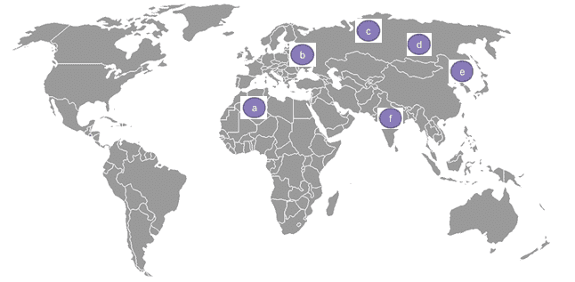图 1

2.  它必须使用租用的电话线来连接所有这些办公室。
3.  The cost(in units) of connecting each pair of offices is different and is shown as follows:

    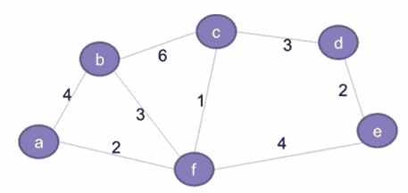图 2

4.  因此，该组织希望以最低成本连接其所有办公室。这就要求所有的办公室都应该使用最少数量的租用线路进行连接，以降低有效成本。
5.  这个问题的解决方案可以通过使用**最小生成树**的概念来实现，这将在后续章节中讨论。
6.  本教程还详细介绍了与 Prim 算法相关的概念，该算法用于为给定的图寻找最小生成树。

* * *

## 什么是生成树？

第二图所示的网络基本上代表了一个图 **G = (V，E)** 有一组顶点 **V = {a，b，c，d，E，f}** 和一组边 **E = { (a，b)、(b，c)、(c，d)、(d，E)、(E，f)、(f，a)、(b，f)、(c，f) }** 。该图为:

*   连通的(每对顶点之间都有一条路径)
*   无方向(边没有任何相关方向，因此(a，b)和(b，a)是等价的)
*   加权(每条边都分配了权重或成本)

给定图 G 的生成树`G' = (V, E')`将包括:

*   G 的所有顶点(V)
*   所有顶点应通过最小数量的边(E’)连接，这样`E' ⊂ E`
*   G '可以有最大`n-1`条边，其中`n`等于 G 中的边总数
*   ' g '不应有任何周期。这是树和图的基本区别之一**一个图可以有循环，但是树不能**。因此，树也被定义为**非循环图**。

以下是上图的生成树示例。请注意，生成树中只包含突出显示的边，

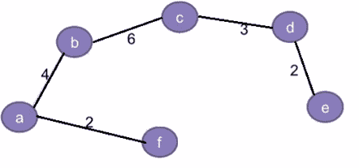图 3

此外，对于任何给定的图，可能存在多个生成树。例如:除了上图中的生成树，该图还可以有另一个生成树，如下所示:

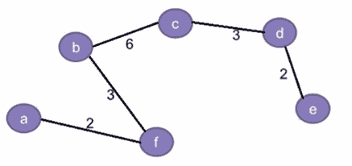图 4

按照惯例，给定图的生成树总数可以定义为:

`<sup>n</sup>C<sub>m</sub> = n!/(m!*(n-m)!)`，其中，

*   `n`等于给定图中边的总数
*   `m`等于生成树中边的总数，这样`m <= (n-1)`。

因此，给定图(从上到下的第二个图)的生成树总数可以计算如下:

*   **n = 8** ，对于图 2 中给定的图形
*   **m = 5** ，因为它对应的生成树只能有 5 条边。增加第 6 条边会导致形成不允许的循环。
*   所以，**S =<sup>n</sup>C<sub>m</sub>=<sup>8</sup>C<sub>5</sub>= 8！/ (5!* 3!)= 56** ，这意味着可以为给定的图创建不同变化的展树。

* * *

## 什么是最小生成树？

生成树的成本是树中所有边的总权重。例如，图 3 中生成树的成本是 **(2+4+6+3+2) = 17** 个单位，而图 4 中是 **(2+3+6+3+2) = 16** 个单位。

因为一个图可以有多个生成树，每个生成树都有自己的成本值，所以目标是找到成本最小的生成树。这被称为**最小生成树(MST)** 。

**注**:一个图可以有多个最小生成树，如果图中任意两条边的权重相同。然而，如果每条边都有不同的权重，那么对于任何给定的图，将只有一个最小生成树。

* * *

## 最小生成树的问题陈述

给定一个加权的、无向的连通图 **G** ，目标是找到 G 的最小生成树 **G'**

除了最小生成树的 Prim 算法，我们还有寻找最小生成树的 Kruskal 算法。

然而，本教程将只讨论 **Prim 算法的基础。**

由于该算法旨在寻找代价最小的生成树，因此使用**贪婪方法**来寻找解。

作为查找或创建给定图的最小生成树框架的一部分，我们将遵循以下步骤:

*   最初，树是空的。
*   树从一个随机的源顶点开始构建。
*   每一步都会有一个新的顶点被添加到树中。
*   这一直持续到图的所有顶点都被添加到树中。

**输入数据**将为:

A **成本邻接矩阵**为出图 **G** ，称`cost`

**输出**将为:

总成本最小的生成树

* * *

## Prim 的最小生成树算法

下面我们有完整的逻辑，逐步的，这是遵循 prim 的算法:

**第 1 步**:记录所有已经访问并添加到生成树的顶点。

**第二步**:最初生成树为空。

**第三步**:随机选择一个**顶点**，添加到生成树中。这就变成了**根节点**。

**第四步**:添加一个新的顶点，比如说 **x** ，这样

*   **x** 不在已经构建的生成树中。
*   **x** 使用最小权边连接到构建的生成树。(因此， **x** 可以与生成树中已经添加的任何节点相邻)。
*   将 **x** 添加到生成树中不应形成循环。

**第五步**:重复第四步，直到图的所有顶点都加入到生成树中。

**第 6 步**:打印生成树的总开销。

* * *

## Prim 最小生成树算法示例

让我们尝试跟踪上面的算法，为图 2 中的图找到最小生成树:

### 第一步:

1.  定义`key[]`数组存储每个顶点的键值(或代价)。将所有顶点初始化为`∞`(无穷大)
2.  定义另一个数组`booleanvisited[]`来跟踪已经添加到生成树的所有顶点。最初这将是所有顶点的 **0** ，因为生成树是空的。
3.  定义一个数组`parent[]`来跟踪父顶点。初始化所有顶点的 **-1** 。
4.  初始化最小成本，**最小成本= 0**

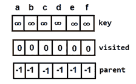 <small>图 5:树为空时的初始数组</small>

### 第二步:

选择任意一个任意顶点，说出 **f** ，设置`key[f]=0`。

 <small>图 6:设置根节点键值</small>

由于其键值最小且未被访问，因此将 **f** 添加到生成树中。

 <small>图 7:根节点</small>

另外，更新以下内容:

*   `minCost = 0 + key[f] = 0`
*   This is how the `visited[]` array will look like:

     <small>图 8:添加根节点后的访问数组</small>

*   Key values for all the adjacent vertices of **f** will look like this(key value is nothing but the cost or the weight of the edge, for **(f,d)** it is still infinity because they are not directly connected):

     <small>图 9:添加根节点后的键数组</small>

**注**:因为 **f** 是根节点，所以`parent[]`不会有变化。

 <small>图 10:添加根节点后的父数组</small>

### 第三步:

将搜索数组`key[]`和`visited[]`来寻找下一个顶点。

*   **f** 具有最小键值，但不会被考虑，因为它已经被添加(`visited[f]==1`)
*   具有最小关键值的下一个顶点是 **c** 。从`visited[c]==0`开始，将添加到生成树中。

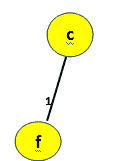 <small>图 11:添加顶点 c</small>

再次更新以下内容:

*   `minCost = 0 + key[c] = 0 + 1 = 1`
*   This is how the `visited[]` array will look like:

     <small>图 12:添加顶点 c 后访问数组</small>

*   And, the `parent[]` array (**f** becomes the parent of **c**):

     <small>图 13:添加根节点后的父数组</small>

*   For every adjacent vertex of **c**, say **v**, values in `key[v]` will be updated using the formula:

    `key[v] = min(key[v], cost[c][v])`

    这样`key[]`阵就会变成:

     <small>图 14:添加根节点后的键数组</small>

### 第四步:

对其余顶点重复步骤 C。

*   Next vertex to be selected is **a**. And minimum cost will become `minCost=1+2=3`

    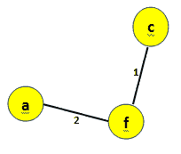 <small>图 15:添加顶点 a</small>

    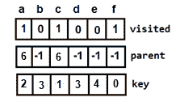 <small>图 16:添加顶点 a 后更新数组</small>

*   Next, either **b** or **d** can be selected. Let's consider **b**. Then the minimum cost will become `minCost=3+3=6`

    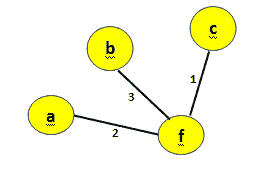 <small>图 17:给最小生成树添加顶点 b</small>

    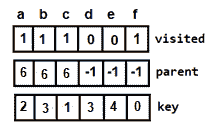 <small>图 18:添加顶点 b</small> 后更新数组

*   Next vertex to be selected is **d**, making the minimum cost `minCost=6+3=9`

    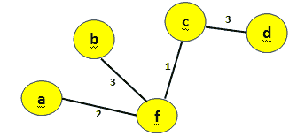 <small>图 19:添加顶点 d</small>

    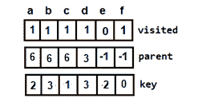 <small>图 20:添加顶点 d 后更新数组</small>

*   Then, **e** is selected and the minimum cost will become, `minCost=9+2=11`

    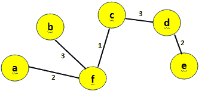 <small>图 21:添加顶点 e 这是最终的最小生成树</small>

    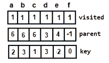 <small>图 22:添加顶点 e 后更新的数组(最终数组)</small>

*   由于现在已经访问了所有顶点，算法终止。
*   因此，图 21 表示总**成本=11** 的最小生成树。

* * *

## Prim 最小生成树算法的实现

现在是时候用 C++编写一个程序，用 prim 的算法找出最小生成树了。

```cpp
#include<iostream>

using namespace std;

// Number of vertices in the graph  
const int V=6;

// Function to find the vertex with minimum key value 
int min_Key(int key[], bool visited[])  
{ 
    int min = 999, min_index;  // 999 represents an Infinite value

    for (int v = 0; v < V; v++) { 
        if (visited[v] == false && key[v] < min) { 
        	// vertex should not be visited
            min = key[v];
			min_index = v;  
        }
    }    
    return min_index;  
}  

// Function to print the final MST stored in parent[]  
int print_MST(int parent[], int cost[V][V])  
{  
    int minCost=0;
	cout<<"Edge \tWeight\n";  
    for (int i = 1; i< V; i++) {
		cout<<parent[i]<<" - "<<i<<" \t"<<cost[i][parent[i]]<<" \n";  
		minCost+=cost[i][parent[i]];
    }
	cout<<"Total cost is"<<minCost;
}  

// Function to find the MST using adjacency cost matrix representation  
void find_MST(int cost[V][V])  
{  
    int parent[V], key[V];
    bool visited[V];

    // Initialize all the arrays 
    for (int i = 0; i< V; i++) { 
        key[i] = 999;    // 99 represents an Infinite value
        visited[i] = false;
        parent[i]=-1;
    }    

    key[0] = 0;  // Include first vertex in MST by setting its key vaue to 0\.  
    parent[0] = -1; // First node is always root of MST  

    // The MST will have maximum V-1 vertices  
    for (int x = 0; x < V - 1; x++) 
    {  
        // Finding the minimum key vertex from the 
        //set of vertices not yet included in MST  
        int u = min_Key(key, visited);  

        visited[u] = true;  // Add the minimum key vertex to the MST  

        // Update key and parent arrays
        for (int v = 0; v < V; v++)  
        {
            // cost[u][v] is non zero only for adjacent vertices of u  
            // visited[v] is false for vertices not yet included in MST  
            // key[] gets updated only if cost[u][v] is smaller than key[v]  
            if (cost[u][v]!=0 && visited[v] == false && cost[u][v] < key[v])
            {  
                parent[v] = u;
                key[v] = cost[u][v];  
            }        
        }
    }

    // print the final MST  
	print_MST(parent, cost);  
}  

// main function
int main()  
{  
    int cost[V][V];
	cout<<"Enter the vertices for a graph with 6 vetices";
    for (int i=0;i<V;i++)
    {
        for(int j=0;j<V;j++)
        {
			cin>>cost[i][j];
        }
    }
	find_MST(cost);  

    return 0;  
} 

```

输入图形与图 2 中的图形相同。

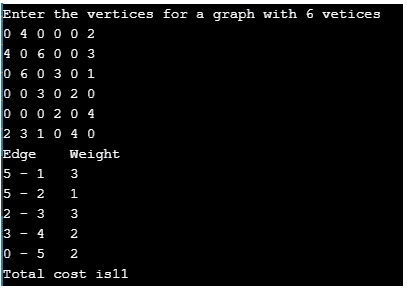 <small>图 23:程序输出</small>

* * *

### 普里姆最小二乘时间复杂度分析

上述 C++程序的时间复杂度为 **O(V2)** ，因为它对输入图使用了邻接矩阵表示。然而，使用邻接表表示，借助二进制堆，可以将 Prim 算法的复杂度降低到 **O(ElogV)** 。

* * *

### 最小生成树的现实应用

找到一个 MST 是一个基本问题，它有以下实际应用:

1.  设计网络，包括计算机网络、电信网络、交通网络、电网和供水网络。
2.  用于近似求解旅行商问题、最小割问题等问题的算法。
    *   一个**旅行推销员问题**的目标是在一个只访问每个顶点一次并返回到源顶点的图中找到最短路径。
    *   A **minimum cut problem** is used to find the minimum number of cuts between all the pairs of vertices in a planar graph. A graph can be classified as planar if it can be drawn in a plane with no edges crossing each other. For example,

         <small>图 24:平面图</small>

3.  Also, a cut is a subset of edges which, if removed from a planar graph, increases the number of components in the graph

     <small>图 25:平面图中的割集</small>

4.  聚类分析。
5.  数学表达式的手写识别。
6.  图像配准和分割

* * *

* * *