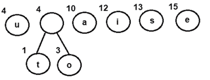
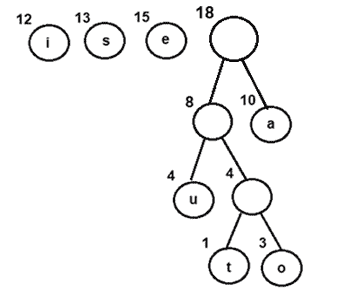
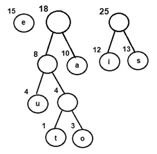
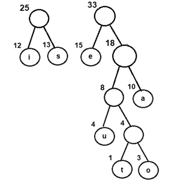
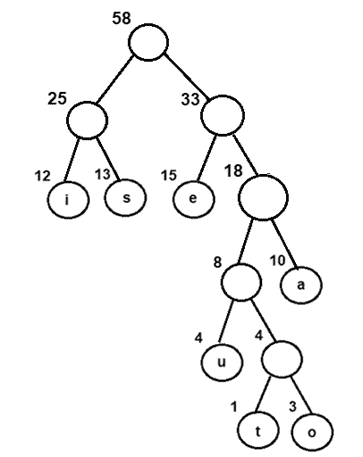
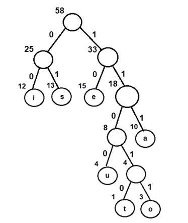
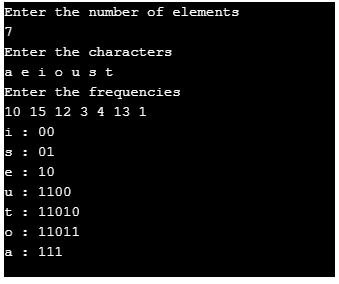

# 霍夫曼编码算法

> 原文：<https://www.studytonight.com/data-structures/huffman-coding>

计算机科学中的每一个信息都被**编码为**1 和 0**的字符串。信息论的目标是通常用最少的比特数来传输信息，使得每个编码都是明确的。本教程讨论了固定长度和可变长度编码以及霍夫曼编码，霍夫曼编码是所有数据编码方案的基础**

在计算机中，编码可以定义为有效地传输或存储字符序列的过程。固定长度和可变长度是两种编码方案，解释如下-

**固定长度编码** -使用相同的位数为每个字符分配一个二进制代码。因此，像“aabacdad”这样的字符串可能需要 64 位(8 字节)来存储或传输，假设每个字符使用 8 位。

**可变长度编码** -与固定长度编码相反，该方案根据字符在给定文本中的出现频率，使用可变位数对字符进行编码。因此，对于像“aabacdad”这样的给定字符串，字符“a”、“b”、“c”和“d”的频率分别是 4、1、1 和 2。由于“a”比“b”、“c”和“d”出现得更频繁，因此它使用的位数最少，其次是“d”、“b”和“c”。假设我们给每个字符随机分配二进制代码如下-

**a 0**
**b 011**
**c 111**
**d 11**

因此，字符串“aabacdad”被编码为**0001101111011(0 | 0 | 011 | 0 | 111 | 11 | 0 | 11)，**与固定长度编码方案相比使用更少的位数。

但真正的问题在于解码阶段。如果我们尝试解码字符串 0001101111011，它将非常模糊，因为它可以解码为多个字符串，其中很少是-

**aaadacdad (0 | 0 | 0 | 11 | 0 | 111 | 11 | 0 | 11)**
**aaadbcad (0 | 0 | 0 | 11 | 011 | 111 | 0 | 11)**
**aabbcb (0 | 0 | 011 | 011 | 111 | 011)**

…等等

为了防止解码过程中出现这种歧义，编码阶段应该满足**“前缀规则”**，该规则规定任何二进制代码都不应该是另一个代码的前缀。这将产生独特的**可解码代码**。上述“a”、“b”、“c”和“d”的代码不遵循前缀规则，因为 a 的二进制代码即 0 是 b 的二进制代码即 011 的前缀，导致不明确的**可解码代码。**

让我们重新考虑将二进制代码分配给字符“a”、“b”、“c”和“d”。

**a 0**
**b 11**
**c 101**
**d 100**

使用上述代码，字符串**“aabacdad”**被编码为 0011011000100(0 | 0 | 11 | 0 | 101 | 100 | 0 | 100)。现在，我们可以将其解码回字符串**“aabacdad”**。

### 问题陈述-

**输入:**待传输或存储的符号集及其频率/概率/权重

**输出:**期望码字长度最小的无前缀变长二进制码。等效地，从根开始具有最小加权路径长度的树状数据结构可以用于生成二进制代码

#### 霍夫曼编码-

霍夫曼编码可用于寻找给定问题陈述的解决方案。

*   这项技术由大卫·霍夫曼于 1951 年开发，是所有数据压缩和编码方案的基础
*   这是一种用于无损数据编码的著名算法
*   它遵循贪心方法，因为它处理生成最小长度的无前缀二进制代码
*   它使用可变长度编码方案，根据字符在给定文本中出现的频率，为字符分配二进制代码。出现频率最高的字符被分配最小的代码，出现频率最低的字符获得最大的代码

霍夫曼编码的主要步骤是-

**第一步** -使用输入符号集和每个符号的权重/频率构建霍夫曼树

*   类似于二叉树数据结构，需要创建具有 **n** 叶节点和 **n-1** 内部节点的霍夫曼树
*   优先级队列用于构建霍夫曼树，使得具有最低频率的节点具有最高优先级。最小堆数据结构可用于实现优先级队列的功能。
*   最初，所有节点都是叶节点，包含字符本身以及该字符的权重/频率
*   另一方面，内部节点包含权重和两个子节点的链接

**第二步** -通过遍历霍夫曼树为每个符号分配二进制代码

*   通常，位“0”代表左边的子级，位“1”代表右边的子级

**Algorithm for creating the Huffman Tree-**

**步骤 1** -为每个字符创建一个叶节点，并使用所有节点构建一个最小堆(频率值用于比较最小堆中的两个节点)

**步骤 2-当堆有多个节点时，重复步骤 3 至 5**

 ****步骤 3** -从堆中提取两个频率最小的节点，比如 x 和 y

**第 4 步** -创建一个新的内部节点 z，x 作为其左子节点，y 作为其右子节点。同样`frequency(z)= frequency(x)+frequency(y)`

**步骤 5** -将 z 添加到最小堆中

**第 6 步** -堆中的最后一个节点是霍夫曼树的根

让我们尝试使用上述算法为以下字符及其频率创建霍夫曼树

| 特性 | 频率 |
| a | Ten |
| e | Fifteen |
| 我 | Twelve |
| o | three |
| u | four |
| s | Thirteen |
| t | one |

**步骤 A** -为所有角色创建叶节点，并将它们添加到最小堆中。

*   **Step 1**- Create a leaf node for each character and build a min heap using all the nodes (The frequency value is used to compare two nodes in min heap)

    图 1:每个字符的叶节点

**步骤 B** -重复以下步骤，直到堆有多个节点

*   **步骤 3** -从堆中提取两个频率最小的节点，比如 x 和 y
*   **第 4 步** -创建一个新的内部节点 z，x 作为其左子节点，y 作为其右子节点。同样频率(z)=频率(x)+频率(y)
*   **步骤 5** -将 z 添加到最小堆中

 ***   提取并组合一个以 4 为频率的内部节点
*   将新的内部节点添加到优先级队列-

图 2:结合节点 o 和 t

*   提取并组合一个以 8 为频率的内部节点
*   将新的内部节点添加到优先级队列-

图 3:将节点 u 与频率为 4 的内部节点组合

*   提取并合并节点 I 和 s
*   将新的内部节点添加到优先级队列-

图 4:将节点 u 与频率为 4 的内部节点组合

*   提取并合并节点 I 和 s
*   将新的内部节点添加到优先级队列-

图 5:合并节点 I 和 s

*   提取并合并以 18 为频率的内部节点
*   将新的内部节点添加到优先级队列-

图 6:将节点 e 与具有 18 作为频率的内部节点组合

*   最后，提取并合并以 25 和 33 为频率的内部节点
*   将新的内部节点添加到优先级队列-

图 7:通过组合具有 25 和 33 作为频率的内部节点获得的最终霍夫曼树

现在，由于队列中只有一个节点，控件将退出循环

**步骤 C** -由于频率为 58 的内部节点是队列中唯一的节点，因此它成为**霍夫曼树**的根。

**第 6 步** -堆中的最后一个节点是霍夫曼树的根

### 遍历霍夫曼树的步骤

1.  创建辅助数组
2.  从根节点开始遍历树
3.  遍历左子时向数组中添加 0，遍历右子时向数组中添加 1
4.  只要找到叶节点，就打印数组元素

按照上面生成的霍夫曼树的步骤，我们得到了无前缀和可变长度的二进制码，其期望码字长度最小

图 8:给霍夫曼树分配二进制代码

| 特性 | 二进制码 |
| 我 | 00 |
| s | 01 |
| e | Ten |
| u | One thousand one hundred |
| t | Eleven thousand and ten |
| o | Eleven thousand and eleven |
| a | One hundred and eleven |

**Using the above binary codes-**

假设字符串“staeiout”需要通过网络从计算机 A(发送方)传输到计算机 B(接收方)。使用霍夫曼编码的概念，字符串在发送方被编码为**“01110101111000110110011010”(01 | 11010 | 111 | 10 | 00 | 11011 | 1100 | 11010)**。

一旦在接收器端接收到，它将通过遍历霍夫曼树被解码回来。为了解码每个字符，我们从根节点开始遍历树。从字符串的第一位开始。比特流中的“1”或“0”将决定在树中向左还是向右。打印字符，如果我们到达一个叶节点。

**Thus for the above bit stream**

图 9:解码比特流

**On similar lines-**

*   111 被解码为 a
*   10 被解码为“e”
*   00 被解码为“I”
*   11011 被解码为“o”
*   1100 被解码为 u
*   最后，11010 被解码为“t”，从而返回字符串“staeiout”

**Implementation-**

下面是霍夫曼编码的 C++ 实现。该算法可以根据需要映射到任何编程语言。

```cpp
	 #include <iostream>
#include <vector>
#include <queue>
#include <string>

using namespace std;

class Huffman_Codes
{
 struct New_Node
 {
  char data;
  size_t freq;
  New_Node* left;
  New_Node* right;
  New_Node(char data, size_t freq) : data(data),
                                 freq(freq),
left(NULL),
right(NULL)
                                 {}
 ~New_Node()
 {
   delete left;
   delete right;
 }
 };

 struct compare
 {
  bool operator()(New_Node* l, New_Node* r)
  {
    return (l->freq > r->freq);
  }
};

New_Node* top;

void print_Code(New_Node* root, string str)
{
if(root == NULL)
   return;

 if(root->data == '$')
 {
  print_Code(root->left, str + "0");
  print_Code(root->right, str + "1");
 }

 if(root->data != '$')
 {
   cout << root->data <<" : " << str << "\n";
   print_Code(root->left, str + "0");
   print_Code(root->right, str + "1");
 }
}

public:
  Huffman_Codes() {};
  ~Huffman_Codes()
  {
    delete top;
  }
  void Generate_Huffman_tree(vector<char>& data, vector<size_t>& freq, size_t size)
  {
   New_Node* left;
   New_Node* right;
   priority_queue<New_Node*, vector<New_Node*>, compare > minHeap;

for(size_t i = 0; i < size; ++i)
   {
      minHeap.push(new New_Node(data[i], freq[i]));
   }

while(minHeap.size() != 1)
    {
      left = minHeap.top();
minHeap.pop();

      right = minHeap.top();
minHeap.pop();

      top = new New_Node('$', left->freq + right->freq);
      top->left  = left;
      top->right = right;
      minHeap.push(top);
     }
    print_Code(minHeap.top(), "");
 }
};

 int main()
 {
  int n, f;
  char ch;
  Huffman_Codes set1;
  vector<char> data;
  vector<size_t> freq;
  cout<<"Enter the number of elements \n";
  cin>>n;
  cout<<"Enter the characters \n";
  for (int i=0;i<n;i++)
  {
      cin>>ch;
data.insert(data.end(), ch);
  }
  cout<<"Enter the frequencies \n";
  for (int i=0;i<n;i++)
  {
      cin>>f;
freq.insert(freq.end(), f);
  }

  size_t size = data.size();
  set1.Generate_Huffman_tree(data, freq, size);

  return 0;
} 

```

使用与上述示例相同的输入来执行程序。这将有助于用实际输出来验证结果解集。

图 10:输出

### 时间复杂度分析-

由于霍夫曼编码使用最小堆数据结构来实现优先级队列，因此复杂度为 0(nlogn)。这可以解释如下-

*   构建一个最小堆需要`O(nlogn)`时间(将一个元素从根节点移动到叶节点需要`O(logn)`比较，在最坏的情况下，这是针对 n/2 个元素完成的)。
*   构建一个最小堆需要`O(nlogn)`时间(将一个元素从根节点移动到叶节点需要`O(logn)`比较，在最坏的情况下，这是针对 n/2 个元素完成的)。

由于构建最小堆和排序是按顺序执行的，因此整个过程的算法复杂度计算为 0(nlogn)

我们也可以有一个线性时间算法，如果字符已经按照它们的频率排序的话。

### 霍夫曼编码的优点-

*   这种编码方案节省了大量存储空间，因为生成的二进制码长度可变
*   它生成较短的二进制代码，用于编码在输入字符串中更频繁出现的符号/字符
*   生成的二进制代码没有前缀

### 霍夫曼编码的缺点-

*   与有损编码技术相比，像霍夫曼编码这样的无损数据编码方案实现了更低的压缩比。因此，像霍夫曼编码这样的无损技术只适用于编码文本和程序文件，而不适用于编码数字图像。
*   霍夫曼编码是一个相对较慢的过程，因为它使用两个过程-一个用于建立统计模型，另一个用于编码。因此，使用霍夫曼编码的无损技术比其他技术要慢得多。
*   由于所有二进制码的长度不同，解码软件很难检测编码数据是否损坏。这可能导致不正确的解码，进而导致错误的输出。

### 霍夫曼编码的实际应用

*   霍夫曼编码广泛用于类似`GZIP, PKZIP (winzip) and BZIP2`的压缩格式。
*   像`JPEG, PNG and MP3`这样的多媒体编解码器使用霍夫曼编码(更准确地说是前缀码)
*   霍夫曼编码仍然主导着压缩行业，因为由于专利问题，避免了较新的算术和范围编码方案。

* * *

* * *****