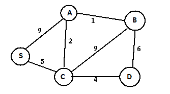
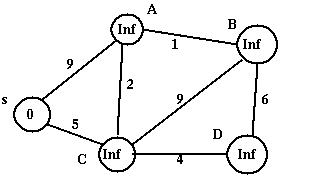
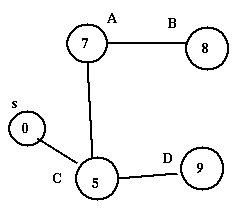
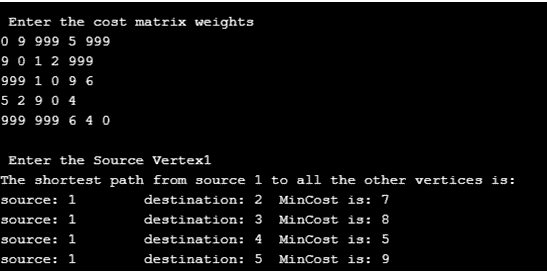
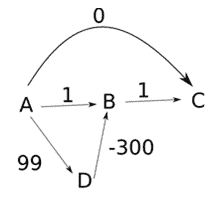

# 迪克斯特拉算法

> 原文：<https://www.studytonight.com/data-structures/dijkstras-algorithm>

迪杰斯特拉的算法发表于 1959 年，以其发现者埃德格·迪杰斯特拉的名字命名，他是一名荷兰计算机科学家。该算法旨在寻找具有非负边权重的有向或无向图中的最短路径。

在我们研究这个算法的细节之前，让我们先简单了解一下以下内容:

*   **图**:图是定义为 G=(V，E)的非线性数据结构，其中 V 是顶点的有限集合，E 是边的有限集合，使得每条边都是连接任意两个顶点的直线或圆弧。
*   **加权图**:这是一种特殊类型的图，其中每条边都被赋予一个数值，称为权重
*   **连通图**:这类图中每对顶点之间都存在一条路径
*   **图 G 的生成树**是一个子图 G ’,它包括 G 的所有顶点，这些顶点与最小数量的边相连。因此，对于具有 n 个顶点的图 G，生成树 G’将具有 n 个顶点和最大 n-1 条边。

* * *

### 问题陈述

给定一个加权图 G，目标是找到从给定源顶点到 G 的所有其他顶点的最短路径。该图具有以下特征-

*   顶点集`V`
*   加权边组`E`，使得`(q,r)`表示**顶点** q 和 r 之间的**边**，成本(q，r)表示其权重

### 迪克斯特拉算法:

*   这是一种单源最短路径算法，旨在找到给定问题陈述的解决方案
*   该算法适用于有向图和无向图
*   它只适用于连通图
*   该图不应包含负边权重
*   该算法主要遵循贪婪方法寻找局部最优解。但是，它也使用动态规划方法来构建全局最优解，因为先前的解被存储并进一步添加，以获得到源顶点的最终距离
*   该算法的主要逻辑基于以下公式-
    `dist[r]=min(dist[r], dist[q]+cost[q][r])`

该公式规定，当且仅当`dist[q]+cost[q][r] is less than dist[r]`的值为时，与顶点 q 相邻的距离顶点 r 将被更新。这里

*   dist 是一个一维数组，它在每一步跟踪从源顶点到所有其他顶点的最短距离，并且
*   成本是一个二维数组，表示图的成本邻接矩阵
*   这个公式同时使用了贪婪和动态方法。贪婪方法用于寻找最小距离值，而动态方法用于组合先前的解( **dist[q]** 已经被计算并用于计算 **dist[r]** )

### 算法-

**Input Data-**

*   图 G 的成本邻接矩阵，比如成本
*   源顶点，比如 s

**Output Data-**

*   从 s 到 G 中所有其他顶点的最短路径的生成树

### 以下是寻找解决方案的步骤-

**第一步**；Set dist[s]=0，S=ϕ // s 是源顶点，s 是包含所有访问顶点的一维数组

**第二步**:对于除 s 之外的所有节点 v，设置 dist[v]= ∞

**第三步**:找到 q 不在 S，这样 dist[q]最小//顶点 q 不应该被访问

**步骤 4** :将 q 添加到 S //将顶点 q 添加到 S，因为它现在已经被访问过了

**第 5 步**:更新与 q 相邻的所有 r 的距离【r】，使得 r 不在 S 中//不应访问顶点 r `dist[r]=min(dist[r], dist[q]+cost[q][r])` //贪婪和动态方法

**第 6 步**:重复第 3 步到第 5 步，直到所有节点都在 S //中，重复，直到所有顶点都被访问过

**第 7 步**:打印从源顶点 u 到所有其他顶点的最短路径的数组距离

**第 8 步**:退出

### 让我们试着用下面的例子来理解这个算法的工作原理

图 1:输入图(加权和连通)

给定上述加权连通图和源顶点 s，以下步骤用于寻找表示 s 和所有其他顶点之间最短路径的树-

**步骤 A** -使用以下算法步骤初始化距离阵列–

*   **步骤 1** -设置 dist[s]=0，S=ϕ // u 是源顶点，s 是具有所有访问顶点的一维数组

*   **步骤 2** -对于除 s 之外的所有节点 v，设置 dist[v]=∠

| 访问顶点集 | S | A | B | C | D |
|  | Zero | ∞ | ∞ | ∞ | ∞ |

图 2:初始化 dist[]后的图形

**步骤 B** - a)选择源顶点 s，因为距离[s]最小，s 不在 s 中

**第 3 步** -发现 q 不在 S 中，这样 dist[q]最小//不应访问顶点

**通过将其添加到 S** 来访问 S

**步骤 4** -将 q 添加到 S //将顶点 q 添加到 S，因为它现在已经被访问过了

**步骤 c)** 对于所有尚未被访问(不在 S 中)的 S 的相邻顶点，即 A 和 C，使用以下算法步骤更新距离数组-

**第 5 步** -更新与 q 相邻的所有 r 的距离【r】，使得 r 不在 S 中//不应访问顶点 r `dist[r]=min(dist[r], dist[q]+cost[q][r])` //贪婪和动态方法

`dist[A]= min(dist[A], dist[s]+cost(s, A)) = min(∞, 0+9) = 9`
`dist[C] = min(dist[C], dist[s]+cost(s, C)) = min(∞, 0+5) = 5`

**因此 dist[]更新如下-**

| 访问顶点集 | S | A | B | C | D |
| [s] | Zero | nine | ∞ | five | ∞ |

**步骤 C** -重复步骤 B

1.  选择并访问顶点 C，因为它没有被访问过(不在 S 中)，距离[C]是最小的
2.  更新 C 的相邻顶点(即 A、B 和 D)的距离数组

**第 6 步** -重复第 3 步到第 5 步，直到所有节点都在 S

`dist[A]=min(dist[A], dist[C]+cost(C,A)) = min(9, 5+2)= 7`

`dist[B]= min(dist[B], dist[C]+cost(C,B)) = min(∞, 5+9)= 14`

`dist[D]= min(dist[D], dist[C]+cost(C,D))= min((∞,5+4)=9`

**这将更新 dist[]如下-**

| 访问顶点集 | S | A | B | C | D |
| [s] | Zero | nine | ∞ | five | ∞ |
| [南、北] | Zero | seven | Fourteen | five | nine |

继续类似的路线，重复步骤 B，直到所有的顶点都被访问(添加到 S)。`dist[]`也会在每次迭代中更新，结果如下–

| 访问顶点集 | S | A | B | C | D |
| [s] | Zero | nine | ∞ | five | ∞ |
| [南、北] | Zero | seven | Fourteen | five | nine |
| [南、中、北] | Zero | seven | eight | five | nine |
| [南、中、南、北] | Zero | seven | eight | five | nine |
| [南、中、北、南] | Zero | seven | eight | five | nine |

dist[]的最后一次更新给出了从 s 到所有其他顶点的最短路径值

**给定图的合成最短路径生成树如下-**

图 3:最短路径生成树

**Note-**

*   取决于源顶点，同一图可以有多个最短路径生成树

**Implementation-**

下面是迪克斯特拉算法的 C++实现

**注:**
算法可以根据需要映射到任意编程语言。

```cpp
	 #include<iostream>
using namespace std;
#define V 5  //Defines total number of vertices in the graph
#define INFINITY 999
int min_Dist(int dist[], bool visited[])   
//This method used to find the vertex with minimum distance and is not yet visited
{
	int min=INFINITY,index;                 //Initialize min with infinity
	for(int v=1;v<=V;v++)
	{
		if(visited[v]==false &&dist[v]<=min)      
		{
			min=dist[v];
			index=v;
		}
	}
	return index;
}
void Dijkstra(int cost[V][V],int src) //Method to implement shortest path algorithm
{
	int dist[V];                             
	bool visited[V];
	for(int i=1;i<=V;i++)                    //Initialize dist[] and visited[] 
	{
		dist[i]=INFINITY;
		visited[i]=false;	
	}
	//Initialize distance of the source vertec to zero
	dist[src]=0;                                   
	for(int c=2;c<=V;c++)                           
	{
		//u is the vertex that is not yet included in visited and is having minimum 
		int u=min_Dist(dist,visited);            distance
		visited[u]=true;                          //vertex u is now visited 
		for(int v=1;v<=V;v++)                    
//Update dist[v] for vertex v which is not yet included in visited[] and
//there is a path from src to v through u that has smaller distance than
// current value of dist[v]
		{
			if(!visited[v] && cost[u][v] &&dist[u]+cost[u][v]<dist[v])
			dist[v]=dist[u]+cost[u][v];
		}
	}
	 //will print the vertex with their distance from the source
	cout<<"The shortest path  "<<src<<" to all the other vertices is: \n";
	for(int i=1;i<=V;i++)                      
	{
	   if(i!=src)
	   cout<<"source:"<<src<<"\t destination:"<<i<<"\t MinCost is:"<<dist[i]<<"\n";
	}
}
int main()
{
	int cost[V][V], i,j, s;
	cout<<"\n Enter the cost matrix weights";
	for(i=1;i<=V;i++)      //Indexing ranges from 1 to n
          for(j=1;j<=V;j++)
          {
cin>>cost[i][j];
			//Absence of edge between vertices i and j is represented by INFINITY
             if(cost[i][j]==0)     
               cost[i][j]=INFINITY;    
           }
cout<<"\n Enter the Source Vertex"; 
cin>>s;

	Dijkstra(cost,s);
	return 0;	
} 

```

该程序使用与图 1 中相同的输入图来执行。这将有助于用实际输出来验证结果解集。

图 4:输出

### 时间复杂性分析-

以下是计算迪克斯特拉算法时间复杂度的例子

*   **案例 1** -当图 G 使用邻接矩阵表示时-这个场景在上面的 **C++** 基础程序中实现。由于实现包含两个嵌套的 for 循环，每个循环的复杂度为 **O(n)** ，因此迪克斯特拉算法的复杂度为 **O(n2)** 。请注意，这里的 n 指的是给定图中的顶点总数
*   **情况 2** -当使用邻接表表示图 G 时-时间复杂度，在这种情况下降低到 **O(|E| + |V| log |V|)** 其中|E|表示图中的边数，|V|表示图中的顶点数

### 迪克斯特拉算法的缺点-

迪克斯特拉算法不能获得正确的具有负边的加权图的最短路径。让我们考虑下面的例子来解释这个场景-

图 5:负边加权图

选择源顶点为 A，算法工作如下-

**步骤 A** -初始化距离阵列(dist)-

| 访问顶点集 | A | B | C | D |
|  | Zero | ∞ | ∞ | ∞ |

**步骤 B** -选择顶点 A，因为`dist[A]`是最小值，A 不在 S 中。访问 A 并将其添加到 S 中。对于 A 的所有尚未访问(不在 S 中)的相邻顶点，即 C、B 和 D，更新距离数组

`dist[C]= min(dist[C], dist[A]+cost(A, C)) = min(∞, 0+0) = 0`

`dist[B] = min(dist[B], dist[A]+cost(A, B)) = min(∞, 0+1) = 1`

`dist[D]= min(dist[D], dist[A]+cost(A, D)) = min(∞, 0+99) = 99`

**因此 dist[]更新如下-**

| 访问顶点集 | A | B | C | D |
| [答] | Zero | one | Zero | Ninety-nine |

**步骤 C** -重复步骤 B

1.  选择并访问顶点 C，因为它没有被访问过(不在 S 中)，距离[C]是最小的
2.  距离数组不会更新，因为 C 没有相邻的顶点

| 访问顶点集 | A | B | C | D |
| [答] | Zero | one | Zero | Ninety-nine |
| [甲、丙] | Zero | one | Zero | Ninety-nine |

继续类似的路线，重复步骤 B，直到所有的顶点都被访问(添加到 S)。`dist[]`也会在每次迭代中更新，结果如下–

| 访问顶点集 | A | B | C | D |
| [答] | Zero | one | Zero | Ninety-nine |
| [甲、丙] | Zero | one | Zero | Ninety-nine |
| [甲、丙、乙] | Zero | one | Zero | Ninety-nine |
| [甲、丙、乙、丁] | Zero | one | Zero | Ninety-nine |

**因此，以下是从 A 到 B、C 和 D 的最短距离-**

`A->C = 0` `A->B = 1` `A->D = 99`

但是这些值是不正确的，因为我们可以有另一条路径从 **A** 到 **C，A- > D- > B- > C** 有**总成本= -200** 小于 0。发生这种情况是因为一旦访问了一个顶点并将其添加到集合 S 中，它就再也不会“回头”了。因此，迪克斯特拉的算法并不试图找到一条更短的路径到达已经被添加到 s 的顶点。

*   它执行盲搜索来寻找最短路径，因此，消耗大量时间并浪费其他资源

### 迪克斯特拉算法的应用

*   交通信息系统使用迪克斯特拉算法从给定的源位置跟踪目的地
*   **开源路径优先(OSPF)** 是一种基于互联网的路由协议，使用 Dijkstra 算法来寻找从源路由器到网络中其他路由器的最佳路由
*   它被**电话和蜂窝网络**用于路由管理
*   它也被**地理信息系统(GIS)** 使用，例如谷歌地图，用于寻找从 A 点到 B 点的最短路径

* * *

* * *