# 树型数据结构

> 原文：<https://www.studytonight.com/advanced-data-structures/avl-tree>

AVL 树是另一种特殊的树，它有几个特性使它特别。这些是:

*   这是一个本质上平衡的 BST。

*   它是自我平衡的。

*   它不是完全平衡的。

*   每个子树也是一个 AVL 树。

AVL 树的图示如下所示:

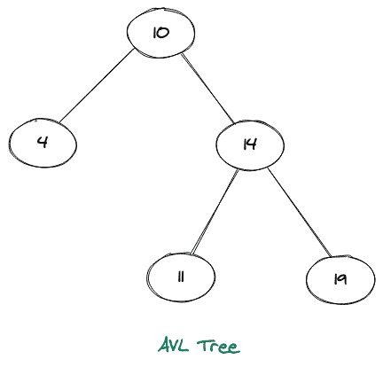

当被解释时，我们可以说这是一个高度平衡的二叉查找树。**高度平衡**表示每个节点的左右子树高度之差不能大于 1(即**高度(左)-高度(右)< = 1** )。

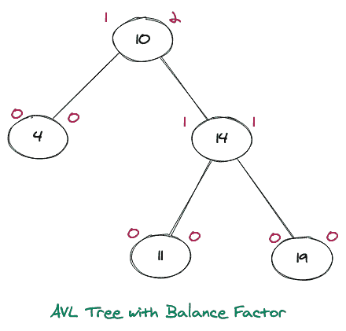

请注意，上面的 BST 中的每个节点都包含两个值，左值表示该节点的左子树的高度，右值表示该节点的右子树的高度，可以看出，在没有一个节点上，我们的值差大于 1，因此使其成为平衡的 AVL Tree。

一个**自平衡树**意味着当我们试图在这个 BST 中插入任何元素，如果它违反了任何节点的平衡因子，那么它会相应地动态旋转自己，使自己自平衡。众所周知，AVL 树是第一个被提出的著名的动态平衡树。

它不是完美平衡的，完美平衡意味着每个节点的右子树和左子树之间的**高度等于 **0** 。**

完美平衡自动车辆定位树的图示如下所示:

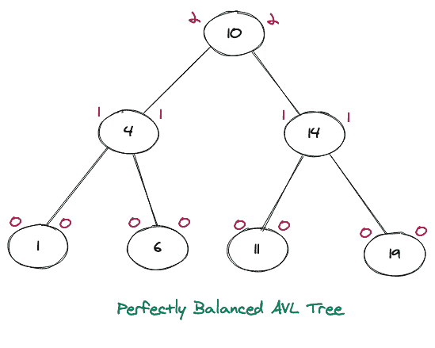

上述 AVL 树的所有节点的平衡因子等于 0( **高度(左)-高度(右)= 0** )，使其成为完美的 AVL 树。还需要注意的是，一个完美的 BST 和一个完美的 AVL 树是一样的。如果我们仔细看看上面所有的图形表示，我们可以清楚地看到，AVL 树的每个子树也是一个 AVL 树。

现在我们再来看两个图片，其中一个是 AVL 树，一个不是。

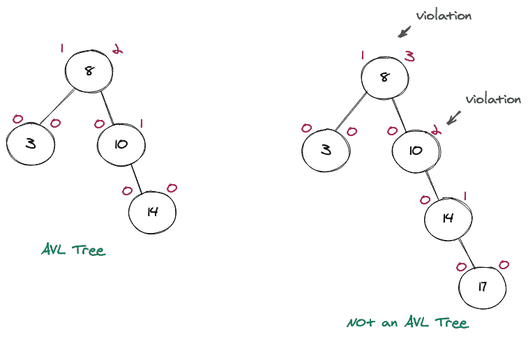

虽然上面的两棵树都是 BST，但是上面的图中只有左边的 BST 是 AVL 树，因为它高度平衡。在右 BST 中，我们有两个违规节点(即 8 和 10)，在这两种情况下，平衡因子都大于 2。需要注意的是，这个树可以通过一定的方式进行旋转，使其成为 AVL 树。

## 为什么是 AVL 树？

当我们已经有了类似的数据结构(即 BST 的)时，为什么我们还需要它的复杂版本呢？。答案在于，BST 在某些场景中有一些限制，使得搜索、插入等操作成本很高(与`O(n)`一样高)。

考虑下面两个 BST 的图示:

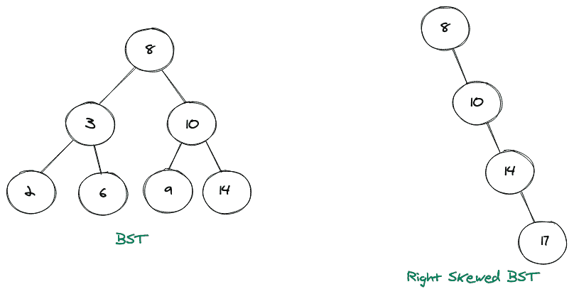

左 BST 的高度为`O(logn)`，右 BST 的高度为`O(n)`，因此左 BST 的搜索操作时间复杂度为`O(logn)`，右偏斜的为`O(n)`，这也是其最坏的情况。因此，如果我们有这样一个倾斜的树，那么使用 BST 就没有任何好处，因为当涉及到时间和空间复杂度时，它就像一个链表。

这就是为什么我们需要一个平衡的 BST，这样所有的基本操作都保证了 O(logN)的时间复杂度。

## 树旋转

如果 AVL 树遇到任何违反平衡因子的情况**，那么它会尝试做一些旋转来使树再次平衡。总共有四次旋转，我们将逐一查看。主要有:**

*   向左旋转

*   右旋转

*   左右旋转

*   左右旋转

### 1.向左旋转

当违规发生在违规节点的左子节点的左子树中时，将执行此循环。考虑下面一个不平衡的 BST 的图形表示，为了做到这一点，我们将做一些旋转。

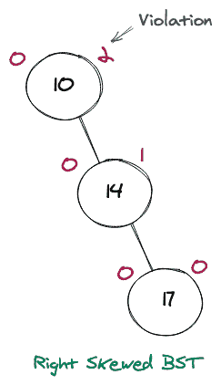

很明显，这不是一个 AVL 树，但是考虑到违规发生的节点，我们把这个节点作为一个枢纽来进行我们的旋转。右边的树很重，导致问题的节点是 17，如果我们移除那个节点，我们将有一个平衡的 BST(即 AVL)。由于它严重向右倾斜，我们将向左旋转以使其平衡。

考虑将上面的右斜树做成 AVL 树的图示。

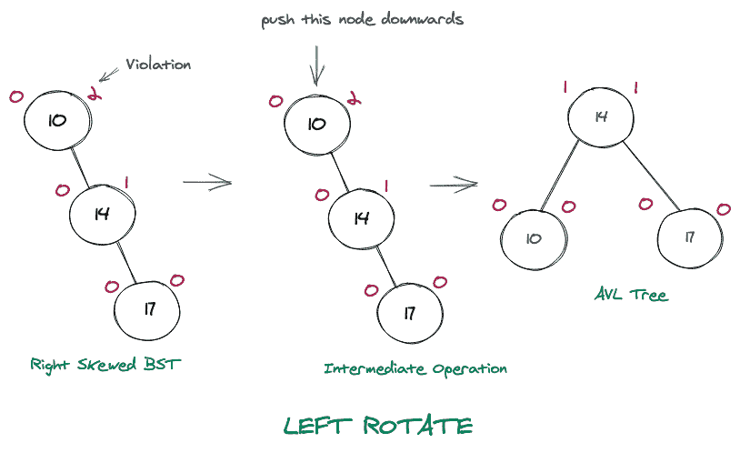

### 2.右旋转

当违规发生在违规节点的右子节点的右子树中时，将执行此循环。考虑下面一个不平衡的 BST 的图形表示，为了做到这一点，我们将做一些旋转。

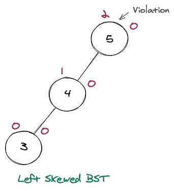

很明显，这不是一个 AVL 树，但是考虑到违规发生的节点，我们把这个节点作为一个枢纽来进行我们的旋转。树的左边很重，导致问题的节点是 3，如果我们移除那个节点，我们将有一个平衡的 BST(即 AVL)。由于它严重偏左，我们将做一个右旋转，使其平衡。

考虑将上面左倾的树做成 AVL 树的图示。

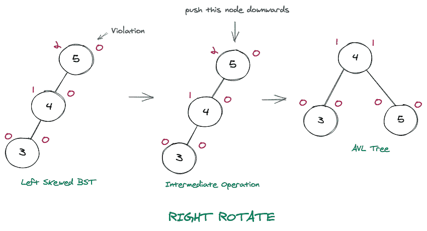

### 3.左右旋转

当违规发生在违规节点的左子节点的右子树中时，将执行此循环。考虑下面一个不平衡的 BST 的图形表示，为了做到这一点，我们将做一些旋转。

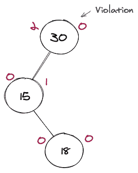

很明显，这不是一个 AVL 树，但是考虑到违规发生的节点，我们把这个节点作为一个枢纽来进行我们的旋转。导致问题的节点是 18，就好像我们去掉那个节点，我们就会有一个平衡的 BST(即 AVL)。因为这个问题是因为左子树的右子树，我们将进行左右旋转，使其平衡。

考虑将上面的树做成 AVL 树的图示。

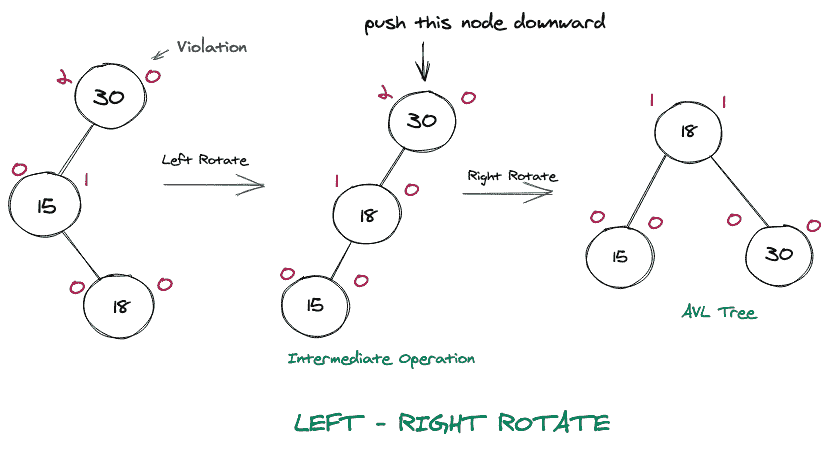

### 4.左右旋转

当违规发生在违规节点的右子节点的左子树中时，将执行此循环。考虑下面一个不平衡的 BST 的图形表示，为了做到这一点，我们将做一些旋转。

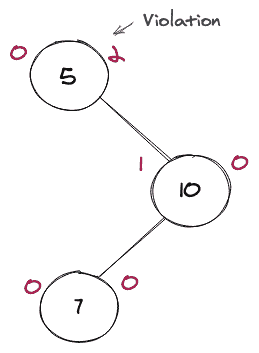

很明显，这不是一个 AVL 树，但是考虑到违规发生的节点，我们把这个节点作为一个枢纽来进行我们的旋转。导致问题的节点是 7，如果我们移除那个节点，我们将有一个平衡的 BST(即 AVL)。由于问题是由于右子树的左子树，我们将进行左右旋转，使其平衡。

考虑将上面的树做成 AVL 树的图示。

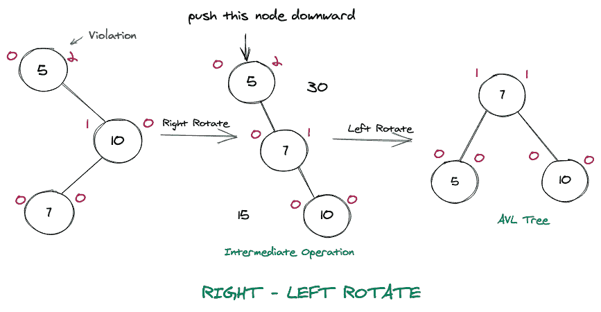

## 树插入

让我们取一组数组元素，并构建这些元素的 AVL 树。让，`nums = [12 , 3 , 9 , 4 , 6 , 2]`

制作 AVL 树(带旋转)的完整步骤如下所示。

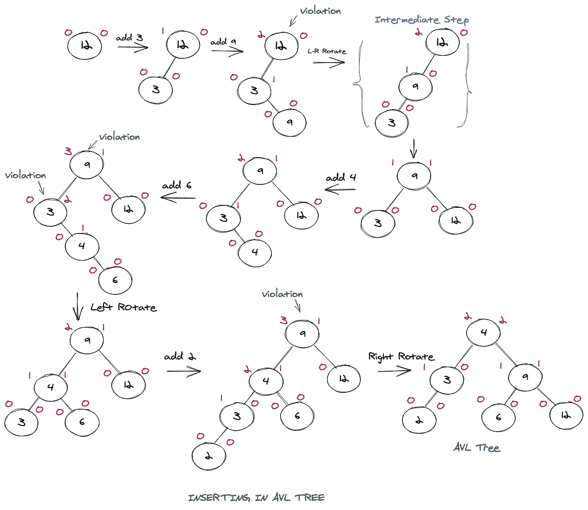

### 要点:

*   具有 N 个节点的 AVL 树的最小楼层高度(logN)可以是 2。

*   节点数为 N 的 AVL 树的高度不能超过 1.44(logN)基数 2。

*   高度为 h 的 AVL 树中的最大节点数可以是:2^H+1 - 1

*   AVL 树的高度为 h 的最小节点数可以表示为:N(h) = N(h-1) + N(h-2) + 1，n>2，其中 N(0) = 1，N(1) = 2。

## 结论

*   我们了解了什么是 AVL 树以及为什么需要它。
*   然后，我们学习了 AVL 树中可能的不同类型的旋转，以使其成为一个平衡的旋转。
*   在旋转之后，我们还在 AVL 树中做了一个插入示例。
*   最后，我们谈到了我们应该记住的与 AVL 不同的关键点。

* * *

* * *