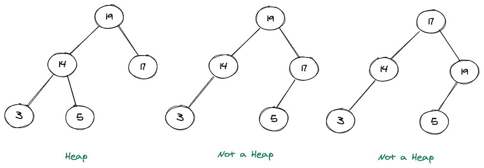
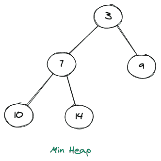
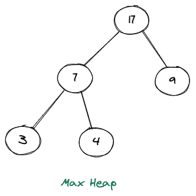
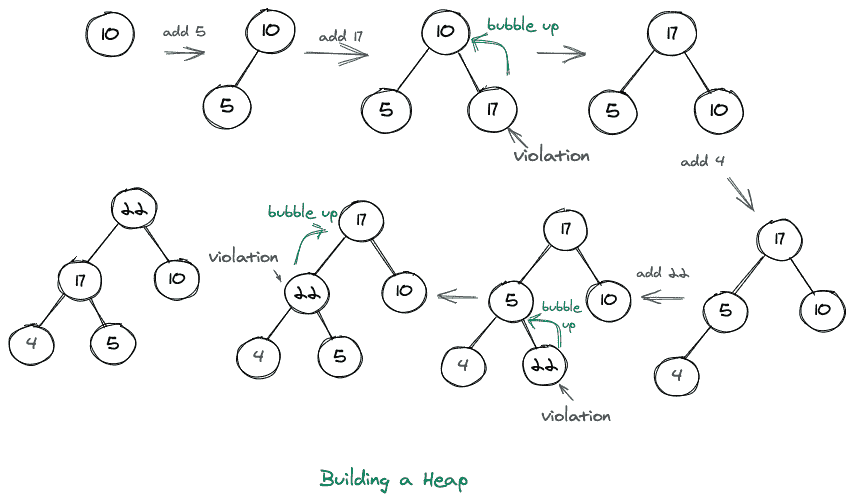
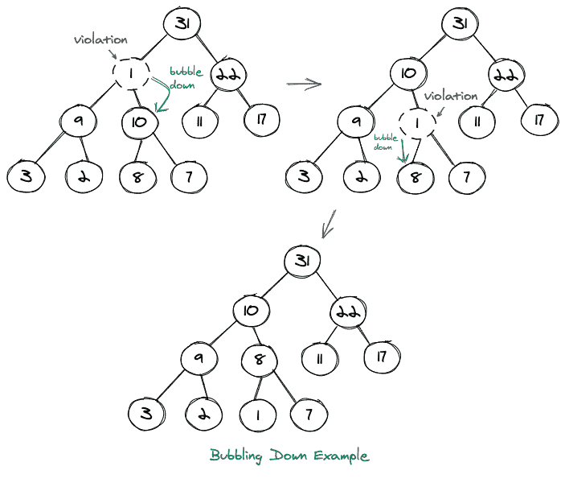
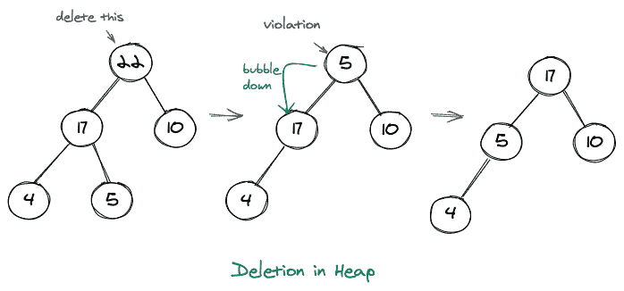

> 原文:[https://www.studytonight.com/advanced-data-structures/heap](https://www.studytonight.com/advanced-data-structures/heap)

# 堆数据结构

堆是遵循两个属性的特殊类型的树。这些属性是:

*   对于某些`h > 0`(完全二叉树属性)，所有叶子必须处于`h`或`h-1`级别。

*   节点的值必须是`>=`(或`<=`)其子节点的值，称为堆属性。

考虑如下所示的图示:

在上面显示的图片中，最左边的树表示一个堆(最大堆)，它右边的两个树不是堆，因为中间的树违反了第一个堆属性(不是完整的二叉树)，左边的最后一个树违反了第二个堆属性(17 < 19)。

## 堆的类型

如果我们考虑堆的属性，那么我们可以有两种类型的堆。这些主要是:

*   最小堆

*   最大堆

### 最小堆

在此堆中，节点的值必须小于或等于其子节点的值。

考虑下面最小堆的图示:

可以清楚地看到，上述堆中任何节点的值总是小于其子节点的值。

### 最大堆

在此堆中，节点的值必须大于或等于其子节点的值。

考虑下面最大堆的图示:

可以清楚地看到，上述堆中任何节点的值总是大于其子节点的值。

## 建立一个堆

让我们看看一些操作，比如在堆中插入一个元素或者从堆中删除一个元素。

### 1.插入元素:

*   首先将堆大小增加 1。

*   然后在可用位置插入新元素(最左边的位置？最后一级)。

*   从底部到顶部堆积元素(向上冒泡)。

构建堆包括向堆中添加元素。让我们考虑一个元素数组，即 nums = [10，5，17，4，22]。我们想用这些元素做一个最大堆，我们这样做的方式如下图所示。

每当我们在构建堆时添加一个元素，它很可能会违反其中一个属性。我们通过简单地用最大节点填充每个级别来处理第一个堆属性，然后当我们进入下一个级别时，我们先填充左边的子级，然后填充右边的子级。但是我们仍然有可能违反第二个堆属性，在这种情况下，我们只是冒泡我们已经插入的当前元素，并试图找到它在堆中的正确位置。冒泡包括将当前元素与其父元素交换，直到堆成为最大堆。在最小堆的情况下，我们在向堆中添加元素的同时执行相同的过程。

上面的表示总共显示了三个违规(17，22，22)，在所有这些情况下，我们基本上已经用父节点交换了当前节点，因此冒泡了。还可以注意到，这种冒泡的过程也被称为筛上。

现在让我们来看另一个例子，我们泡下去。考虑下面显示的树(不是堆)的图形表示:

### 2.删除元素:

*   将堆的第一个元素(根)复制到某个变量中

*   将堆的最后一个元素放在根的位置

*   向下冒泡，使其成为有效的堆

每当我们删除一个元素时，我们只需删除根元素，并用堆的最后一个元素(最后一级的最右边的子元素)替换它。我们这样做是因为我们只想维护第一个属性，就好像我们从堆中取出任何其他元素，我们将没有有效的完整二叉树。然后我们将这个节点放在根节点上，这个节点可能不满足堆的第二个属性，因此我们向下冒泡，使它成为一个有效的堆。还可以注意到，这种向下冒泡的过程也被称为向下筛选。

考虑如下所示的图示:

## 二进制堆的应用

*   二进制堆用于一种著名的排序算法，称为堆排序。

*   二进制堆也是实现优先级队列的主要原因，因为因为它们，像 add()，remove()等几个优先级队列操作的时间复杂度为 O(n)。

*   它们也是解决 Kth 最小/ Kth 最大元素问题的最优选选择。

## 堆:时间复杂性分析

让我们看看堆的各种操作的时间复杂度。

### 1.插入元素:

在堆中插入一个元素包括在叶级别插入它，然后如果它违反了堆的任何属性，就冒泡它。我们知道堆是一个完整的二叉树，完整二叉树的高度是(`log N`)，其中 N 代表树中元素的个数。因此，如果我们考虑最糟糕的情况，我们可能不得不将这个新插入的节点交换到最上面，那么在树的每一层我们将有 1 个交换，因此我们将需要 N 个交换。因此，在二进制堆中插入元素的最坏时间复杂度是:0(对数 N)

### 2.删除元素:

从堆中删除元素包括移除根节点，然后将其与最后一级的最后一个节点交换，然后如果这个新的根节点违反了任何堆属性，我们需要将其与子节点交换，直到树是有效的二进制堆。因为，在最坏的情况下，我们可能不得不将这个新的根节点与较低级别的节点交换到最底层(叶级别)，这又意味着树的高度，因此从二进制堆中删除节点的时间复杂度依次为:`O(log N)`。

### 3.获取最小/最大元素:

在二进制堆中获取 max(或 min)元素只是一个恒定的时间操作，因为我们知道，如果是 min 堆，最小值将是根节点，同样，在 max 堆的情况下，最大值元素也将是根节点。所以，提取最小值/最大值的时间复杂度为:`O(1)`。

## 结论

*   我们了解了什么是堆，然后解释了什么是最小/最大堆。
*   然后我们学习了如何插入堆，然后从堆中删除一个元素。
*   然后我们讨论了二进制堆的应用。
*   最后，我们讨论了堆的时间复杂性。

* * *

* * *