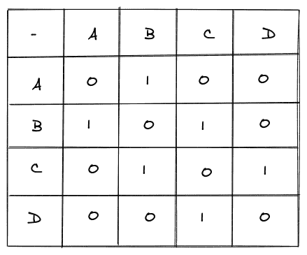
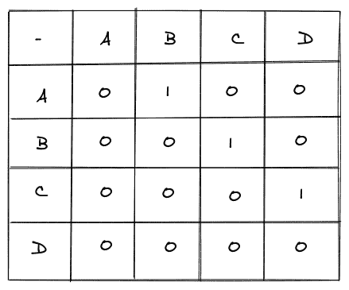
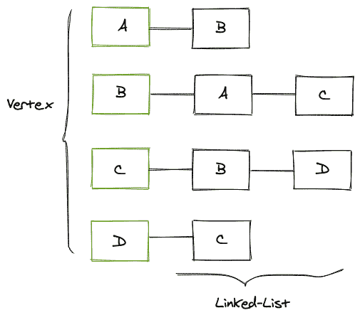
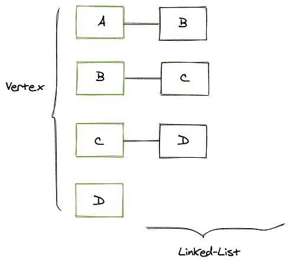

> 原文:[https://www . study south . com/advanced-数据结构/图表示-邻接矩阵和列表](https://www.studytonight.com/advanced-data-structures/graph-representations-adjacency-matrix-and-list)

# 图表示-邻接矩阵和列表

我们有两种方法来表示图形，它们是:

*   邻接矩阵

*   邻接表

这两者各有利弊。在本教程中，我们将介绍这两种图形表示以及如何实现它们。

## 邻接矩阵

邻接矩阵表示使用矩阵(表)，其中矩阵的第一行和第一列表示图的节点(顶点)。其余单元格的**包含 0 或 1** (如果是加权图，可以包含关联的**权重 w** )。

每个**行 X 列**的交点指向一个单元格，该单元格的值将帮助我们确定该行所表示的顶点与该列所表示的顶点是否相连。如果 v1 X v2 的单元格的值等于 1，那么我们可以得出结论，这两个顶点 v1 和 v2 通过一条边相连，否则它们根本不相连。

考虑下面给出的图表:


上图是一个无向图，其邻接矩阵如下:



上面的矩阵是上图的邻接矩阵表示。如果我们仔细观察，我们可以看到矩阵是对称的。现在让我们看看有向图的邻接矩阵是如何变化的。

考虑下面给出的图表:


对于上面显示的有向图，邻接矩阵看起来像这样:



### 邻接矩阵的实现

邻接矩阵的结构(Java 中的[构造函数](https://www.studytonight.com/java/constructor-in-java.php))如下所示:

```cpp
public AdjacencyMatrix(int vertex){
        this.vertex = vertex;
        matrix = new int[vertex][vertex];
}
```

还应该注意的是，我们有两个类级变量，比如:

```cpp
int vertex;
int[][] matrix;
```

上面我们有一个名为 AdjacencyMatrix 的构造函数，它计算图中存在的顶点的数量，然后为我们的全局顶点变量赋值，并创建一个相同大小的 2D 矩阵。现在，由于我们的结构部分已经完成，我们只需要将边添加到一起，我们的方法是:

```cpp
public void addEdge(int start,int destination){
        matrix[start][destination] = 1;
        matrix[destination][start] = 1; // for un-directed graph
}
```

在上面的`addEdge`函数中，我们还为从目的地到开始节点的方向指定了 1，就像在这段代码中我们看到的无向图的例子一样，其中的关系是一个双向过程。如果它是一个有向图，那么我们可以简单地使这个值等于 0，我们就会有一个有效的邻接矩阵。

现在只剩下打印图表了。

```cpp
public void printGraph(){
        System.out.println("Adjacency Matrix : ");
        for (int i = 0; i < vertex; i++) {
            for (int j = 0; j <vertex ; j++) {
                System.out.print(matrix[i][j]+ " ");
            }
            System.out.println();
        }
}
```

整个代码如下所示:

```cpp
public class AdjacencyMatrix {
    int vertex;
    int[][] matrix;

    // constructor
    public AdjacencyMatrix(int vertex){
        this.vertex = vertex;
        matrix = new int[vertex][vertex];
    }

    public void addEdge(int start,int destination){
        matrix[start][destination] = 1;
        matrix[destination][start] = 1;
    }

    public void printGraph(){
        System.out.println("Adjacency Matrix : ");
        for (int i = 0; i < vertex; i++) {
            for (int j = 0; j <vertex ; j++) {
                System.out.print(matrix[i][j]+ " ");
            }
            System.out.println();
        }
    }

    public static void main(String[] args) {
        AdjacencyMatrix adj = new AdjacencyMatrix(4);
        adj.addEdge(0,1); // 0 as the array is 0-indexed
        adj.addEdge(1,2);
        adj.addEdge(2,3);
        adj.printGraph();
    }
}
```

上面的输出如下所示:

邻接矩阵:
0 1 0 0
1 0 1 0
0 1 0 1
0 0 1 0

## 邻接表

在邻接表表示中，我们有一个链表数组，其中数组的大小是图中顶点(节点)的数量。每个顶点都有自己的链表，其中包含它所连接的节点。

考虑以下图表:


上图是一个无向图，它的邻接表如下:



第一列包含我们在上面的图中拥有的所有顶点，然后这些顶点中的每一个都包含一个链表，该链表又包含每个顶点所连接的节点。对于有向图而言，唯一的变化是链表将只包含出现入射边的节点。

考虑以下图表:


上图是有向图，其邻接表如下所示:



### 邻接表的实现

邻接表的结构(Java 中的构造函数)如下所示:

```cpp
public AdjacencyList(int vertex){
        this.vertex = vertex;
        list = new LinkedList[vertex];
        for(int i=0;i<vertex;i++){
            list[i] = new LinkedList<Integer>();
        }
}
```

上面的构造函数将顶点的数量作为一个参数，然后将这个值赋给类级变量，然后我们创建一个图中顶点大小的链表数组。最后，我们为链表数组中的每一项创建一个空链表。

还应该注意的是，我们有两个类级变量，比如:

```cpp
int vertex;
LinkedList<Integer> []list;
```

现在我们已经打好了基础，剩下的唯一事情就是把边加在一起，我们是这样做的:

```cpp
public void addEdge(int start,int destination){
        list[start].addFirst(destination);
        list[destination].addFirst(start); // un-directed graph
}
```

我们取一条边的起点和终点的顶点，我们只需将目标顶点插入起点顶点的链表中，反之亦然(无向图也是如此)。

现在只剩下打印图表了。

```cpp
public void printGraph(){
        for (int i = 0; i < vertex ; i++) {
            if(list[i].size()>0) {
                System.out.print("Node " + i + " is connected to: ");
                for (int j = 0; j < list[i].size(); j++) {
                    System.out.print(list[i].get(j) + " ");
                }
                System.out.println();
            }
        }
}
```

整个代码如下所示:

```cpp
import java.util.LinkedList;

public class AdjacencyList {
    int vertex;
    LinkedList<Integer> []list;

    public AdjacencyList(int vertex){
        this.vertex = vertex;
        list = new LinkedList[vertex];
        for(int i=0;i<vertex;i++){
            list[i] = new LinkedList<Integer>();
        }
    }

    public void addEdge(int start,int destination){
        list[start].addFirst(destination);
        list[destination].addFirst(start); // un-directed graph
    }

    public void printGraph(){
        for (int i = 0; i < vertex ; i++) {
            if(list[i].size()>0) {
                System.out.print("Node " + i + " is connected to: ");
                for (int j = 0; j < list[i].size(); j++) {
                    System.out.print(list[i].get(j) + " ");
                }
                System.out.println();
            }
        }
    }

    public static void main(String[] args) {
        AdjacencyList adl = new AdjacencyList(4);
        adl.addEdge(0,1);
        adl.addEdge(1,2);
        adl.addEdge(2,3);
        adl.printGraph();
    }

} 
```

上面的输出如下所示:

节点 0 连接到:1
节点 1 连接到:2 0
节点 2 连接到:3 1
节点 3 连接到:2

## 结论

*   我们学习了如何在编程中通过邻接矩阵和邻接表来表示图形。

* * *

* * *