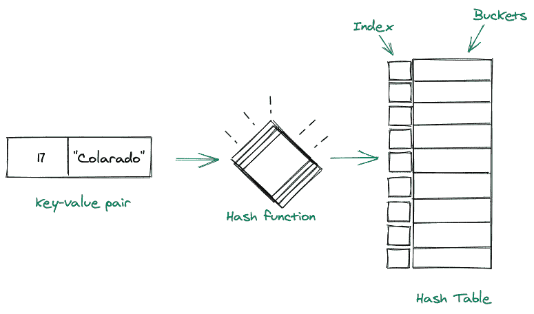
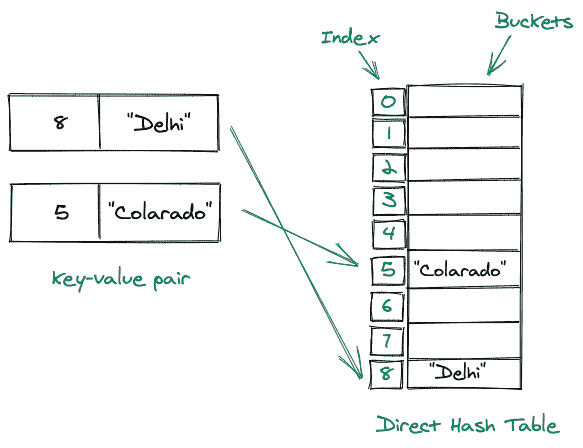
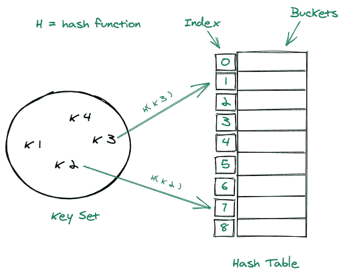
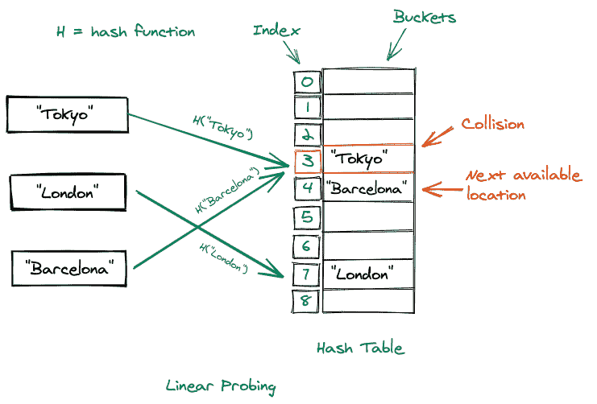
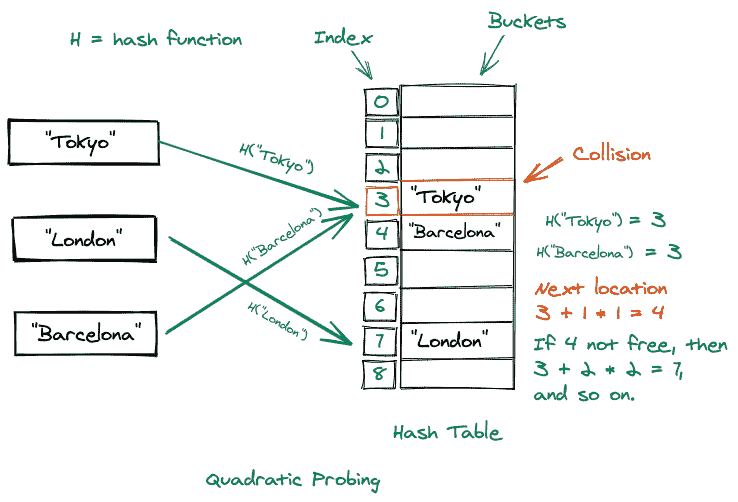
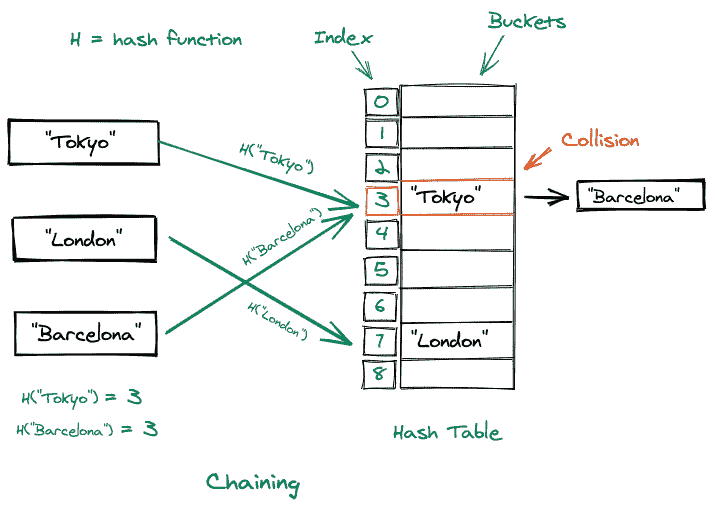

# 哈希表数据结构

> 原文：<https://www.studytonight.com/advanced-data-structures/hash-table-data-structure>

### 哈希表是一种数据结构，用于存储键值对中的数据。

*   哈希表中的每个键都映射到哈希表中的一个值。

*   哈希表中的键用于索引值，因为我们获取这个键并将其传递给哈希函数，哈希函数又对其执行一些算术运算。操作后得到的结果值是哈希表的索引，我们在该表中存储键-值对。

*   在内部，哈希表包含桶，特定键使用哪个桶的位置由键的哈希函数决定。

考虑下面的视觉表示:

## 散列表的组成部分

哈希表总共包含两个部分，它们是:

### 哈希函数:

*   散列函数用于确定键值对的索引。

*   总是建议我们应该选择一个好的哈希函数来创建一个好的哈希表。

*   除了一个好的散列函数之外，它应该是一个单向函数，即我们应该能够从密钥中获得散列值，而不是相反。

*   此外，它应该避免为不同的密钥生成相同的哈希。

### 数组:

*   数组(桶)用于保存键值对。

*   数组的大小应该根据我们将拥有的键值对的数量来设置。

## 直接定址

这是一种我们利用直接地址表来映射值和它们的键的技术。它使用关键字作为存储桶的索引，然后将值存储在这些存储桶位置。虽然直接寻址确实有助于快速搜索、快速插入和快速删除操作，但这是有代价的。

考虑下面的图示:

### 直接地址表的优点:

*   **在`O(1)`时间**插入 T4:在直接地址表中插入元素与在数组中插入元素相同，因此我们可以在 **`O(1)`时间**插入元素，因为我们已经知道了索引(通过键)。

*   **删除于`O(1)`时间:**从直接地址表中删除一个元素与从数组中删除相同，因此**时间为`O(1)`**。

*   **在`O(1)`时间内搜索:**搜索一个元素需要线性时间 **( `O(1)` )** 因为如果我们已经知道一个元素的索引，我们可以很容易地在线性时间内访问该元素。

### 直接地址表的缺点:

*   如果键值**非常大**，不建议使用直接地址表。

*   它不能处理两个键相等并且包含不同数据的情况。

## 散列表

直接寻址有严重的缺点，使得它不适合当前世界场景的实际使用，这就是为什么我们使用哈希表。与直接地址表不同，在直接地址表中，我们将键作为地址表的索引，我们以不同的方式使用键。我们通过一个散列函数来处理这些密钥，我们从中得到的结果基本上就是存储数据的桶的位置。哈希表在不同的语言中有不同的实现，比如在 Java 中我们有**哈希表**、**哈希表**等等，在 python 中我们有**字典**，但是不管它们是如何实现的，核心功能都是一样的。

考虑下面的图示:

### 哈希表的优点:

*   当我们谈到元素的**插入**、**删除**或**搜索**时，哈希表的优势是相同的，但是哈希表比地址表有一个巨大的优势，那就是它保持了大小约束。让我们考虑一个**键= 7898789** ，这又是一个很大的数字，如果我们将它插入到一个直接地址表中，那么我们就是**浪费了太多的空间**，因为我们将不得不找到这个位置(键)，然后在那个位置插入值，但是在哈希表的情况下，我们可以通过一个哈希函数处理这个**键，假设它产生我们= 17，现在我们只剩下在哈希表的位置(17)插入。**

### 哈希表的缺点:

*   当我们通过哈希函数为不同的键获取相同的桶位置时，可能会出现一种情况，这种情况称为冲突。虽然我们可以提高哈希质量，但我们不能保证不会发生冲突。

## 处理哈希表中的冲突:

我们有多种方法可以处理冲突。其中一些是:

### 一个好的散列函数:

一个好的散列函数可以同时代表许多东西，但是我们可以得出这样的结论:散列函数被认为是一个好的散列函数，如果:

*   它尽可能减少碰撞的数量。

*   它不应该生成比哈希表更大的桶位置，在这种情况下，我们将浪费太多的空间。

*   生成的铲斗位置既不能相距太远，也不能太近。

### 线性探测:

这是一种技术，可以确保如果我们在某个特定的桶上发生了冲突，那么我们会检查下一个可用的桶位置(就在它的下面)，并将我们的数据插入到那个桶中。

考虑如下所示的图示:

### 二次探测:

在二次探测中，使用以下公式确定下一个铲斗位置: **h(k，i) = (h？(k) + x*i + y*i^2)** 其中`x`和`y`是常数。另一种观点认为，下一个位置之间的距离是二次增加的。

考虑如下所示的图示:

### 链接:

在这种冲突处理技术中，如果在一个特定的桶位置发生冲突，那么在该位置我们只需创建一个链表，该值将被添加为该列表的下一个节点。哈希表变成链表的数组。

考虑如下所示的图示:

## 哈希表的应用:

### 模式匹配:

哈希表搜索时间的复杂性使其成为在字符串池中寻找模式的完美候选。

### 编译器:

编译器利用哈希表存储关键字和其他标识符来存储编程语言的值。

### **文件系统:**

我们的文件系统中的文件名和该文件的路径之间的映射是通过一个映射来存储的，该映射利用了一个哈希表。

## 结论

*   我们了解了哈希表是什么，它的主要组成部分是什么。

*   然后我们学习了直接地址表，接下来是哈希表的详细解释。

*   然后我们讨论了处理哈希表中冲突的不同技术，接着是哈希表的实际应用。

* * *

* * *