# 使用ER 图

> 原文：<https://www.studytonight.com/dbms/er-diagram.php>

ER 图是数据的可视化表示，描述了数据如何相互关联。在 ER 模型中，我们将数据分解为实体、属性和实体之间的设置关系，所有这些都可以用 ER 图直观地表示出来。

例如，在下图中，任何人都可以看到并理解该图想要传达的内容:*开发者开发一个网站，而访问者访问一个网站*。

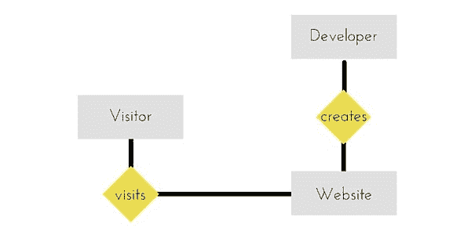

* * *

## ER 图的组成部分

实体、属性、关系等构成了 ER 图的组成部分，并且有定义的符号和形状来表示它们中的每一个。

让我们看看如何在我们的 ER 图中表示这些。

#### 实体

简单的矩形框代表一个实体。

#### 实体之间的关系-弱和强

菱形用于建立两个或多个实体之间的关系。

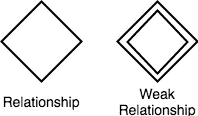

#### 任何实体的属性

椭圆用于表示任何实体的属性。它与实体相连。

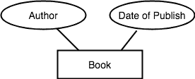

#### 弱实体

弱实体用双矩形框表示。它通常连接到另一个实体。

#### 任何实体的键属性

为了表示关键属性，椭圆内的属性名称带有下划线。

#### 任何实体的派生属性

派生属性是基于其他属性派生的属性，例如，年龄可以从出生日期派生。

To represent a derived attribute, another dotted ellipse is created inside the main ellipse.

#### 任何实体的多值属性

一个在另一个内部的双椭圆表示可以有多个值的属性。

#### 任何实体的复合属性

复合属性是属性，它也有属性。

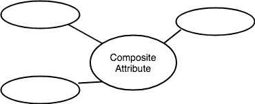

* * *

### ER 图:实体

一个**实体**可以是任何物体、地点、人或类。在 ER 图中，**实体**用矩形表示。以一个组织为例——员工、经理、部门、产品以及更多可以被视为组织中的实体。

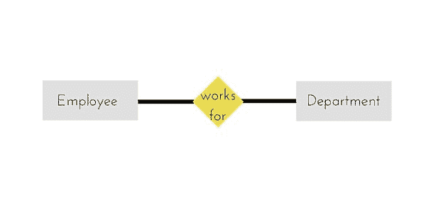

中间的黄色菱形代表一种关系。

* * *

### ER 图:弱实体

弱实体是依赖于另一个实体的实体。弱实体没有自己的主键属性。双矩形用于表示弱实体。

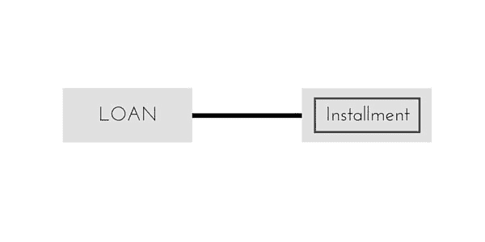

* * *

### ER 图:属性

**属性**描述实体的属性或特征。例如**姓名**、**年龄**、**地址**等都可以是**学生**的属性。属性用 eclipse 表示。

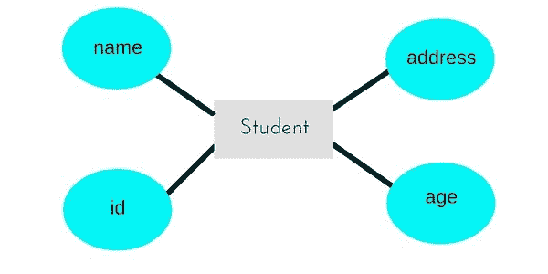

* * *

### ER 图:关键属性

键属性代表实体的主要特征。它用于表示主键。带下划线的椭圆表示关键属性。

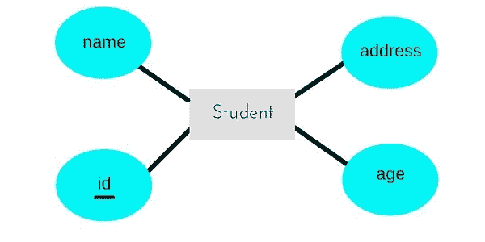

* * *

### ER 图:复合属性

一个属性也可以有自己的属性。这些属性被称为**复合**属性。

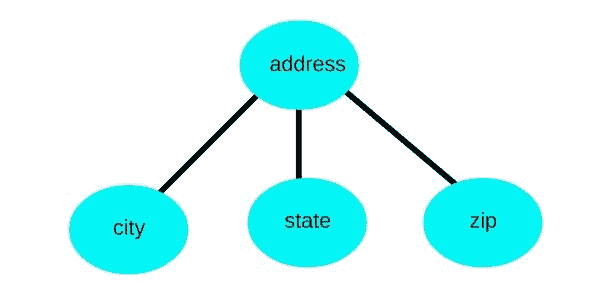

* * *

### 急诊室图:关系

关系描述了**实体**之间的关系。关系用钻石或菱形来表示。

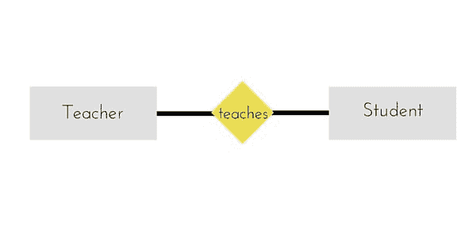

实体之间存在三种类型的关系。

1.  二元关系
2.  递归关系
3.  三元关系

* * *

### ER 图:二元关系

二元关系是指两个实体之间的关系。这进一步分为三种类型。

#### 一对一的关系

这种关系在现实世界中很少见到。

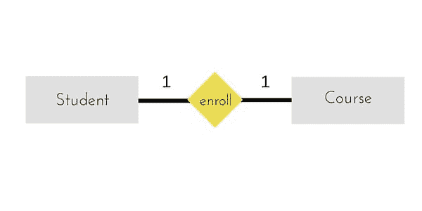

上面的例子描述了一个学生只能注册一门课程，并且一门课程也只有一个学生。这不是你在现实关系中通常会看到的。

#### 一对多关系

下面的例子展示了这种关系，这意味着一个学生可以选择多门课程，但一门课程只能有一个学生。听起来很奇怪！事情就是这样。

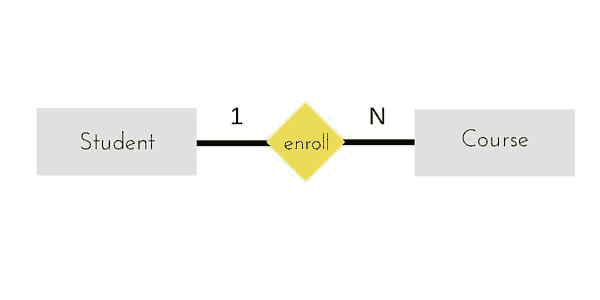

#### 多对一关系

它反映了业务规则，即许多实体只能与一个实体相关联。例如，学生只注册一门课程，但一门课程可以有许多学生。

#### 多对多关系

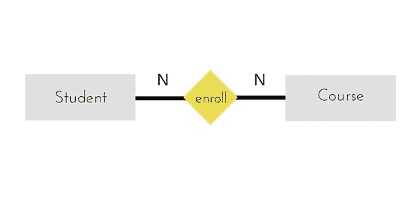

上图表示一个学生可以注册多门课程。一门课程可以有 1 个以上的学生注册。

* * *

### ER 图:递归关系

当一个实体与其自身相关时，它被称为**递归**关系。

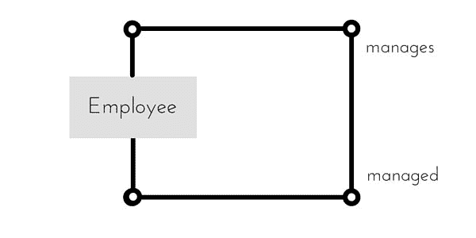

* * *

### ER 图:三元关系

三度关系称为三元关系。

三元关系包含三个实体。在这种关系中，我们总是把两个实体放在一起考虑，然后再看第三个。

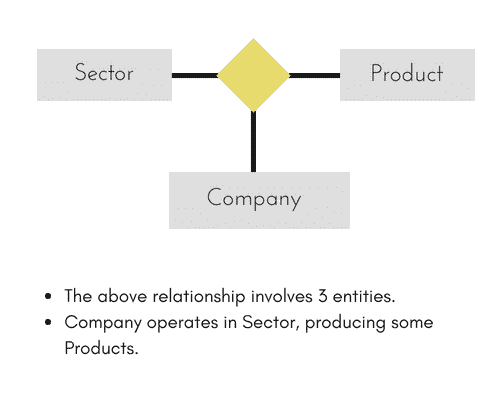

例如，在上图中，我们有三个相关的实体，**公司**、**产品**和**部门**。为了更好地理解这种关系或围绕模型定义规则，我们应该将两个实体联系起来，然后导出第三个实体。

一家**公司**生产多种**产品** /每种产品正好由一家公司生产。

一家**公司**只在一个**区**运营/每个区都有许多公司在运营。

考虑到以上两个规则或关系，我们看到，虽然完整的关系涉及三个实体，但我们一次要看两个实体。

* * *

* * *