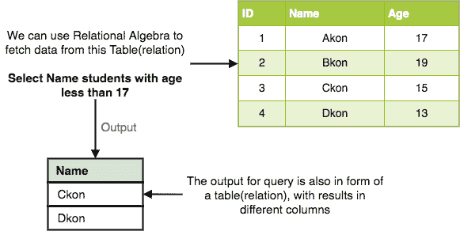

# 什么是关系代数？

> 原文：<https://www.studytonight.com/dbms/relational-algebra.php>

每个数据库管理系统都必须定义一种查询语言，以允许用户访问存储在数据库中的数据。**关系代数**是一种过程查询语言，用于查询数据库表以不同的方式访问数据。

在关系代数中，输入是一个关系(必须从中访问数据的表)，输出也是一个关系(保存用户请求的数据的临时表)。

关系代数一次对整个表起作用，所以我们不必使用循环等逐个迭代数据的所有行(元组)。我们所要做的就是指定我们需要数据的表名，在一行命令中，关系代数将遍历整个给定的表来为您获取数据。

我们可以使用关系代数执行的主要操作是:

1.  挑选
2.  项目
3.  联盟
4.  设置不同
5.  笛卡尔乘积
6.  重新命名

* * *

## 选择操作(σ)

这用于从满足给定条件的表(关系)中获取行(元组)。

**语法:** `σp(r)`

其中，`σ`代表选择谓词，`r`是关系的名称(要在其中查找数据的表名)，`p`是介词逻辑，我们在这里指定数据必须满足的条件。在介词逻辑中，可以使用**一元**和**二元**运算符，如`=`、`<`、`>`等来指定条件。

我们以上面关系代数导论中指定的 Student 表为例，取**年龄**大于 17 的**学生**的数据。

`σage > 17 (Student)`

这将从表**学生**中获取元组(行)，其中**年龄**将大于 **17** 。

您也可以使用、`and`、`or`等运算符来指定两个条件，例如，

`σage > 17 and gender = 'Male' (Student)`

这将返回来自表**学生**的元组(行)，其中包含年龄超过 17 岁的男学生的信息。(考虑学生表也有属性`Gender`。)

* * *

## 项目运营(∏)

项目操作用于仅投影关系的特定属性集。简单来说，如果你只想看到**学生**表中所有学生的**名字**，那么你可以使用项目操作。

它将只投影或显示要求的列或属性，还将从列中删除重复的数据。

**语法:** `∏A1, A2...(r)`

其中 A1、A2 等是属性名(列名)。

例如，

`∏Name, Age(Student)`

上面的语句将只显示**学生**表中所有数据行的**姓名**和**年龄**列。

* * *

## 联合作战(∩)

此操作用于从两个关系(表)或临时关系(另一个操作的结果)中获取数据。

要使该操作起作用，指定的关系(表)应该具有相同数量的属性(列)和相同的属性域。同样，从结果中自动消除重复的元组。

**语法:** `A ∪ B`

其中 A 和 B 是关系。

例如，如果我们有两个表 **RegularClass** 和 **ExtraClass** ，两个表都有一列 **student** 来保存学生的姓名，那么，

`∏Student(RegularClass) ∪ ∏Student(ExtraClass)`

以上操作将给出**学生**的名字，他们既上常规课又上课外课，消除了重复。

* * *

## 设置差异(-)

此操作用于查找存在于一个关系中而不存在于第二个关系中的数据。这个操作也适用于两个关系，就像 Union 操作一样。

**语法:** `A - B`

其中 A 和 B 是关系。

例如，如果我们想找到参加常规课程但不参加额外课程的学生的姓名，那么，我们可以使用以下操作:

`∏Student(RegularClass) - ∏Student(ExtraClass)`

* * *

## 笛卡尔乘积

这用于将两个不同关系(表)中的数据组合成一个，并从组合关系中获取数据。

**语法:** `A X B`

例如，如果我们想找到上午进行的常规课和课外课的信息，那么，我们可以使用以下操作:

`σtime = 'morning' (RegularClass X ExtraClass)`

为了使上述查询起作用，**常规类**和**超类**都应该具有属性**时间**。

* * *

## 重命名操作(ρ)

该操作用于重命名任何查询操作的输出关系，该查询操作返回诸如选择、项目等结果。或者简单地重命名关系(表)

**语法:** `ρ(RelationNew, RelationOld)`

除了这些常见的操作之外，关系代数还用于**连接**操作，例如，

*   自然连接
*   外部连接
*   θ连接等。

* * *

* * *