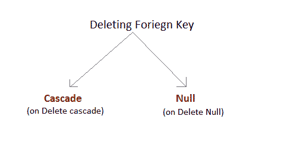

# SQL 约束

> 原文：<https://www.studytonight.com/dbms/sql-constraints.php>

SQL 约束是用于限制可以进入表中的数据类型的规则，以保持表中数据的准确性和完整性。

约束可以分为以下两种类型，

1.  **列级约束:**仅限制列数据。
2.  **表级约束:**限制整表数据。

约束用于确保数据库中数据的完整性。以下是可应用于表的最常用的约束。

*   不为空
*   独一无二的
*   主关键字
*   外键
*   支票
*   系统默认值

* * *

## `NOT NULL`约束

默认情况下，[列](https://www.studytonight.com/dbms/rdbms-concept.php)可以保存空值。如果不希望列具有空值，请使用非空约束。

*   它限制列不能有空值。
*   我们使用 [ALTER](https://www.studytonight.com/dbms/alter-query.php) 语句和 [MODIFY](https://www.studytonight.com/dbms/alter-query.php) 语句来指定这个约束。

关于这个约束需要注意的一点是，它不能在表级别定义。

### 使用`NOT NULL`约束的示例:

```sql
CREATE TABLE Student
(  	s_id int NOT NULL, 
   	name varchar(60), 
   	age  int
);
```

以上查询将声明**学生**表的 **s_id** 字段不取空值。

如果您希望在创建表之后更改它，那么我们可以对它使用 alter 命令:

```sql
ALTER TABLE Student
MODIFY s_id int NOT NULL;
```

* * *

## `UNIQUE`约束

它确保一列只有唯一的值。唯一约束字段不能有任何重复数据。

*   它防止两个记录在一列中具有相同的值
*   我们使用 [ALTER](https://www.studytonight.com/dbms/alter-query.php) 语句和 [MODIFY](https://www.studytonight.com/dbms/alter-query.php) 语句来指定这个约束。

### 唯一约束的示例:

这里我们有一个简单的`CREATE`查询来创建一个表，该表将有一个带有唯一值的列 **s_id** 。

```sql
CREATE TABLE Student
( 	s_id int  NOT NULL, 
  	name varchar(60), 
  	age int  NOT NULL UNIQUE
);
```

以上查询将声明**学生**表的 **s_id** 字段只有唯一的值，不会取空值。

如果您希望在创建表之后更改它，那么我们可以对它使用 alter 命令:

```sql
ALTER TABLE Student
MODIFY age INT NOT NULL UNIQUE;
```

以上查询指定**学生**表的 **s_id** 字段只有唯一值。

* * *

## 主键约束

主键约束唯一标识数据库中的每条记录。主键必须包含唯一值，并且不能包含空值。通常主键用于索引表中的数据。

### 表级主键约束

```sql
CREATE table Student 
(	s_id int PRIMARY KEY, 
	Name varchar(60) NOT NULL, 
	Age int);
```

上述命令将在`s_id`上创建一个主键。

### 列级主键约束

```sql
ALTER table Student 
ADD PRIMARY KEY (s_id);
```

上述命令将在`s_id`上创建一个主键。

* * *

## 外键约束

[外键](https://www.studytonight.com/dbms/database-key.php)用于关联两个表。两个表之间的关系匹配其中一个表中的主键和第二个表中的外键。

*   这也称为引用键。
*   我们使用 [ALTER](https://www.studytonight.com/dbms/alter-query.php) 语句和 [ADD](https://www.studytonight.com/dbms/alter-query.php) 语句来指定这个约束。

为了理解外键，让我们借助下表来看看它的用法:

**客户 _ 明细**表

| c_id | 客户名称 | 地址 |
| One hundred and one | 圣经》和《古兰经》传统中）亚当（人类第一人的名字 | 无聊死了 |
| One hundred and two | 亚历克斯 | 德里 |
| One hundred and three | 斯图亚特 | 罗塔克 |

**订单 _ 明细**表

| 订单 id | 订单名称 | c_id |
| Ten | 订单 1 | One hundred and one |
| Eleven | 订单 2 | One hundred and three |
| Twelve | 订单 3 | One hundred and two |

在 **Customer_Detail** 表中， **c_id** 是主键，在 **Order_Detail** 表中设置为外键。在 **Order_Detail** 表中设置为外键的 **c_id** 中输入的值必须出现在 **Customer_Detail** 表中，在该表中该值被设置为主键。这样可以防止无效数据被插入到 **Order_Detail** 表的 **c_id** 列。

如果您试图插入任何不正确的数据，DBMS 将返回错误，并且不允许您插入数据。

### 表级外键约束

```sql
CREATE table Order_Detail(
    order_id int PRIMARY KEY, 
    order_name varchar(60) NOT NULL,
    c_id int FOREIGN KEY REFERENCES Customer_Detail(c_id)
);
```

在该查询中，表 Order_Detail 中的 **c_id** 作为外键，是对 Customer_Detail 表中 **c_id** 列的引用。

### 列级外键约束

```sql
ALTER table Order_Detail 
ADD FOREIGN KEY (c_id) REFERENCES Customer_Detail(c_id);
```

* * *

### 删除时外键列的行为

当主表中的特定记录被删除时，有两种方法可以保持子表中数据的完整性。当两个表用 Foriegn 键连接，主表中的某些数据被删除，子表中存在某条记录时，那么我们必须有某种机制来保存子表中数据的完整性。



1.  **删除级联时:**如果 foriegn 键的值从主表中删除，这将从子表中删除记录。
2.  **删除空值时:**这将把子表的该记录中的所有值设置为空值，为此从主表中删除外键的值。
3.  如果我们不使用以上任何一项，那么我们就不能从主表中删除子表中存在数据的数据。如果我们试图这样做，我们会得到一个错误。

```sql
ERROR : Record in child table exist
```

* * *

## `CHECK`约束

**检查**约束用于将列的值限制在一个范围内。在将值存储到数据库之前，它会对这些值进行检查。这就像在将数据保存到列中之前进行条件检查。

* * *

### 在表级使用`CHECK`约束

```sql
CREATE table Student(
    s_id int NOT NULL CHECK(s_id > 0),
    Name varchar(60) NOT NULL,
    Age int
);
```

以上查询将限制 **s_id** 值大于零。

* * *

### 在列级使用`CHECK`约束

```sql
ALTER table Student ADD CHECK(s_id > 0);
```

**相关教程**:

*   [SQL 函数](sql-function.php)
*   [SQL 连接](joining-in-sql.php)
*   [SQL 别名](sql-alias.php)
*   [SQL SET 操作](set-operation-in-sql.php)
*   [SQL 序列](sql-sequences.php)
*   [SQL 视图](sql-views.php)

* * *

* * *