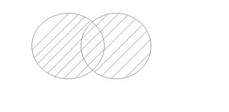
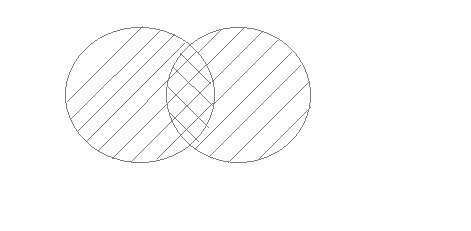
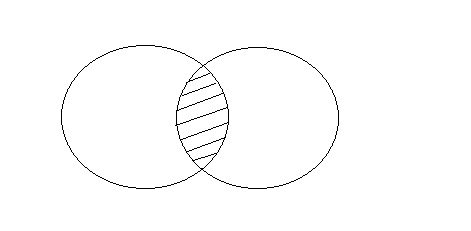
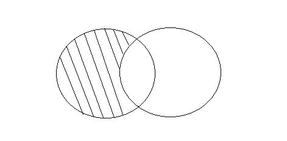

# SQL 中的集合运算

> 原文：<https://www.studytonight.com/dbms/set-operation-in-sql.php>

SQL 支持很少可以对表数据执行的集合操作。这些用于在不同的特殊条件下从存储在表中的数据中获得有意义的结果。

在本教程中，我们将介绍 4 种不同类型的 SET 操作，以及示例:

1.  联盟
2.  联合所有
3.  横断
4.  负的

* * *

## 联合行动

**UNION** 用于组合两个或多个`SELECT`语句的结果。但是，它将从结果集中删除重复的行。对于 union，在应用 UNION 操作的两个表中，列数和数据类型必须相同。



* * *

#### UNION 示例

**第一张**表，

| 身份 | 名字 |
| one | 全面 |
| Two | 亚当 |

第二张**表，**

 **| 身份 | 名字 |
| Two | 亚当 |
| three | 切斯特 |

联合 SQL 查询将是，

```
SELECT * FROM First 
UNION
SELECT * FROM Second;
```

结果集表如下所示，

| 身份 | 名字 |
| one | 全面 |
| Two | 亚当 |
| three | 切斯特 |

* * *

## 联合所有

这个操作类似于 Union。但是它也显示了重复的行。



#### 联合所有的例子

**第一张**表，

| 身份 | 名字 |
| one | 全面 |
| Two | 亚当 |

第二张**表，**

 **| 身份 | 名字 |
| Two | 亚当 |
| three | 切斯特 |

联合所有查询将是这样的，

```
SELECT * FROM First 
UNION ALL
SELECT * FROM Second;
```

结果集表如下所示，

| 身份 | 名字 |
| one | 全面 |
| Two | 亚当 |
| Two | 亚当 |
| three | 切斯特 |

* * *

## 横断

Intersect 操作用于组合两个`SELECT`语句，但它只重新运行两个`SELECT`语句共有的记录。如果**与**相交，列数和数据类型必须相同。

> **注意:** MySQL 不支持 INTERSECT 运算符。



#### 相交示例

**第一张**表，

| 身份 | 名字 |
| one | 全面 |
| Two | 亚当 |

第二张**表，**

 **| 身份 | 名字 |
| Two | 亚当 |
| three | 切斯特 |

相交查询将是，

```
SELECT * FROM First 
INTERSECT
SELECT * FROM Second;
```

结果集表如下所示

| 身份 | 名字 |
| Two | 亚当 |

* * *

## 负的

减操作将两个`SELECT`语句的结果组合起来，只返回最终结果中属于结果第一集的那些。



#### 减的例子

**第一张**表，

| 身份 | 名字 |
| one | 全面 |
| Two | 亚当 |

第二张**表，**

 **| 身份 | 名字 |
| Two | 亚当 |
| three | 切斯特 |

减去查询将是，

```
SELECT * FROM First 
MINUS
SELECT * FROM Second;
```

结果集表如下所示，

| 身份 | 名字 |
| one | 全面 |

* * *

* * *********