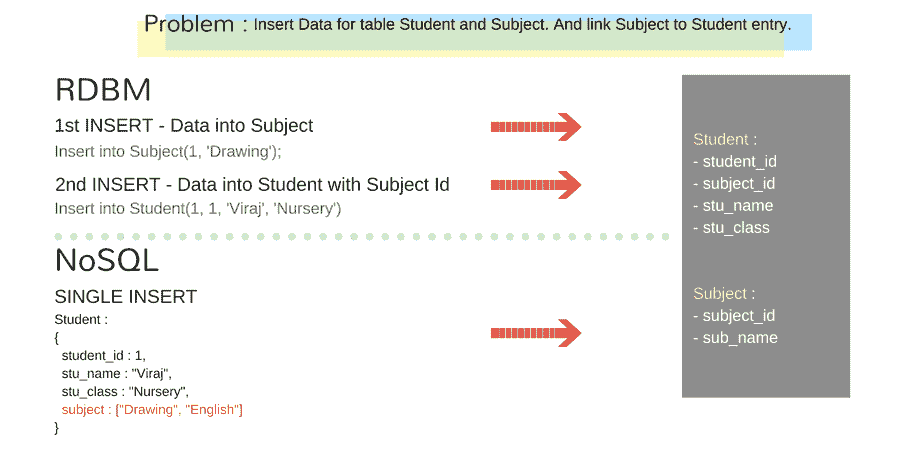

# MongoDB 简介

> 原文：<https://www.studytonight.com/mongodb/introduction-to-mongodb>

MongoDB 是一个 NoSQL 数据库，它以键值对的形式存储数据。这是一个**开源**、**文档数据库**，它提供了高性能和可扩展性，以及企业应用程序中大量数据集的数据建模和数据管理。

MongoDB 还提供了自动缩放功能。因为，MongoDB 是一个跨平台的数据库，可以安装在不同的平台上，如视窗、Linux 等。

* * *

## 什么是基于文档的存储？

一个文档只不过是一个带有名称-值对的数据结构，就像在 JSON 中一样。用 MongoDB 文档映射任何编程语言的任何自定义对象都非常容易。例如:`Student`对象有属性`name`、`rollno`和`subjects`，其中主体为列表。

MongoDB 中的学生文档如下所示:

```sql
{
	name : "Stduytonight",
	rollno : 1,
	subjects : ["C Language", "C++", "Core Java"]
} 
```

我们可以看到，文档实际上是自定义对象的 JSON 表示。此外，通过在文档中以数组和文档(嵌入)的形式保存数据，可以避免过多的连接。

* * *

## MongoDB 简史

MongoDB 是由**艾略特·霍洛维茨**和**德怀特·梅里曼**在 **2007** 年开发的，当时他们在公司**双击**开发企业 web 应用程序时遇到了一些关系数据库的可扩展性问题。根据 MongoDB 的开发人员之一德怀特·梅里曼的说法，数据库的这个名字来源于单词*巨大的*，以支持处理大量数据的想法。

2009 年，MongoDB 被制作成一个开源项目，同时该公司提供商业支持服务。许多公司开始使用 MongoDB 的惊人功能。《纽约时报》使用 MongoDB 构建了一个基于网络的应用程序来提交照片。2013 年，公司正式命名为**MongoDB Inc .**。

* * *

## MongoDB 的主要特性

除了大多数 NoSQL 默认功能之外，MongoDB 还引入了一些更重要、更有用的功能:

1.  MongoDB provides high performance. Input/Output operations are lesser than relational databases due to support of embedded documents(data models) and Select queries are also faster as Indexes in MongoDB supports faster queries.

    

2.  MongoDB 拥有丰富的查询语言，支持所有主要的 CRUD 操作。查询语言还提供了良好的文本搜索和聚合功能。
3.  **MongoDB 的自动复制**功能带来高可用性。它提供了自动故障切换机制，因为如果服务器出现故障，数据将通过备份(副本)拷贝进行恢复。
4.  分片是 MongoDB 的一个主要特性。由于分片，水平可伸缩性是可能的。
5.  MongoDB 支持多个存储引擎。当我们以文档(NoSQL)或表格(关系 DBMS)的形式保存数据时，谁来保存数据？这是存储引擎。存储引擎管理数据如何保存在内存和磁盘上。

* * *

### 使用 MongoDB 的组织

下面是一些大型的著名组织，它们使用 MongoDB 作为大多数业务应用程序的数据库。

*   砖坯黏土
*   商务化人际关系网
*   迈克菲
*   坚定的
*   通过易趣网购买
*   大都会人寿
*   精力

* * *

* * *