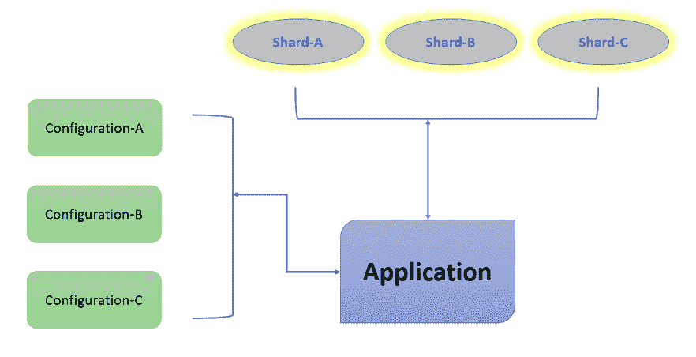

# 蒙古数据库中的分片

> 原文：<https://www.studytonight.com/mongodb/sharding-in-mongodb>

分片是在多台机器上存储数据的机制。MongoDB 的这一特性的基本原理是支持任何应用程序都期望的数据增长。因为，在某个时间点，任何应用程序的可访问性肯定会导致数据增长，并且很难适应这样的数据增长。

考虑到在单个系统中很难管理的数据增长，拥有一个包含数据副本集的集群是一种理想的方式。因此，需要对数据进行水平缩放，而分片是在 MongoDB 中完成的。简单的分片只是增加了更多的机器来处理应用程序中突然或快速增长的数据。

蒙古数据库对分片的需求:

1.  垂直缩放比例太大
2.  在数据备份过程中，所有数据将被写入主节点。
3.  本地磁盘中的空间可能不足以处理数据增长。

下图显示了分片在 mongodb 环境中如何工作的概念图。

让我们看看上图中所示组件的相关细节。

## 应用

利用 mongodb 的应用程序，需要将数据聚集在多台服务器上。

## 陶瓷或玻璃碎片

碎片用于存储实际数据。在任何生产环境中，每个碎片都是一个独立的副本集。

## 配置

配置只不过是存储集群元数据的已配置 mongodb 服务器。基本上，这些配置服务器包含集群数据集到碎片的映射。查询路由器将根据任何目标操作的元数据选择特定的分片。在任何生产环境中，实际上将有 3 台配置服务器。

请参考以下网址，从 mongodb 文档官方网站了解配置共享集群的详细步骤:

[https://docs.mongodb.com/v3.0/tutorial/deploy-shard-cluster/](https://docs.mongodb.com/v3.0/tutorial/deploy-shard-cluster/)

* * *

* * *