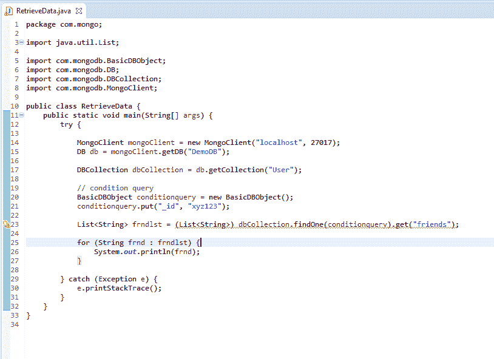
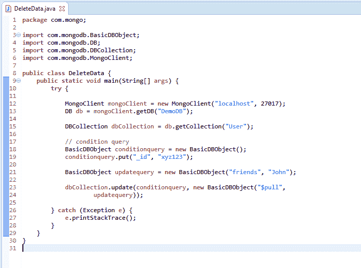

# MongoDB和Java：检索和删除文档

> 原文：<https://www.studytonight.com/mongodb/retrieve-delete-mongodb>

在本教程中，我们将学习如何从存储在集合中的任何文档中检索或获取数据，以及如何删除存储在任何集合中的任何现有文档。

这些功能相当于 MySQL 中的`SELECT`和`DELETE`查询

* * *

## 检索文档

如果我们想用`_id` **xyz123** 从文档中检索字段`friends`的数据，可以借助下面的代码片段来完成:

控制台上产生的输出是:

* * *

## 删除文档

现在，在我们的**好友**字段中，我们有数据为**【安迪】****【约翰】**和**【阿米特】**。如果我们想从列表中删除**“约翰”**，我们可以借助下面的代码。

查询的输出是:

**“约翰”**被移出赛场**好友**。

* * *

* * *