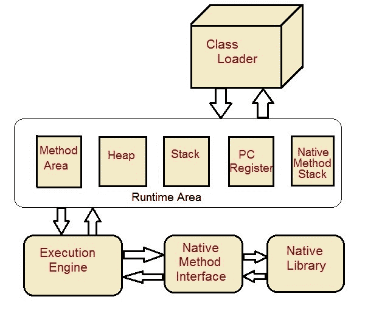
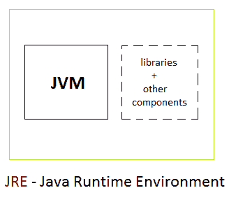
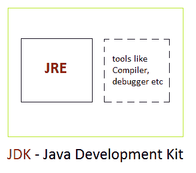

# Java JVM、JDK 和 JRE

> 原文：<https://www.studytonight.com/java/component-of-java.php>

在本教程中，我们将介绍什么是 Java 虚拟机，什么是 JRE 和 JDK。

java 虚拟机(JVM)是一个提供运行时环境来执行 Java 字节代码的虚拟机。JVM 不理解 Java 的错别字，这就是为什么你编译你的`*.java`文件来获得包含 JVM 可以理解的字节码的`*.class`文件。

JVM 控制每个 Java 程序的执行。它支持自动异常处理、垃圾收集堆等功能。

* * *

## JVM 架构

**类加载器:**类加载器加载要执行的类。

**方法区:**将类前结构存储为常量池。

**堆:**堆是分配对象的内存区域。

**栈:**局部变量和部分结果存储在这里。每个线程在创建时都有一个私有的 JVM 堆栈。

**程序寄存器:**程序寄存器保存当前正在执行的 JVM 指令的地址。

**原生方法栈:**包含应用中使用的所有原生。

**执行引擎:**执行引擎控制类的方法中包含的指令的执行。

**原生方法接口:**原生方法接口在执行过程中给出了 java 代码和原生代码之间的接口。

**本机方法库:**本机库由执行本机代码所需的文件组成。

* * *

### JDK 和 JRE 的区别

**JRE**:Java 运行时环境(JRE)提供库、Java 虚拟机和其他组件来运行用 Java 编程语言编写的小程序和应用程序。JRE 不包含用于开发小程序和应用程序的工具和实用程序，如编译器或调试器。

**JDK**:JDK 也叫 Java 开发工具包，是 JRE 的超集，包含了 JRE 中的所有东西，加上开发小程序和应用程序所必需的编译器和调试器等工具。

* * *

* * *