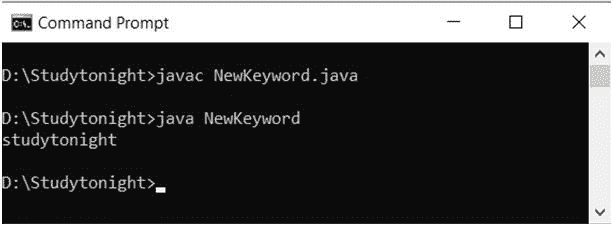
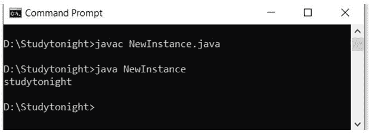
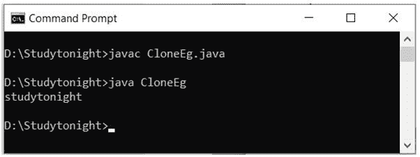
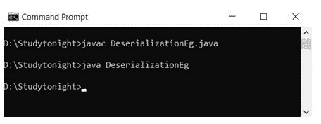
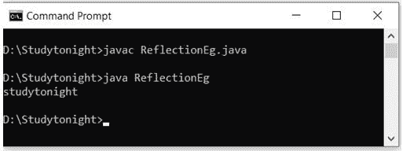

# 在 Java 中创建对象的不同方法

> 原文：<https://www.studytonight.com/java/ways-to-create-object-in-java.php>

Java 是一种面向对象的语言，一切都围绕着对象。一个对象**代表一个类的运行时实体**，并且是**调用类的变量和方法**所必需的。

为了创建一个对象，Java 提供了我们将在本主题中讨论的各种方法。

1.  新关键字
2.  新实例
3.  克隆方法
4.  反序列化
5.  NewInstance()方法

### 1)新关键字

在 Java 中，使用**新关键字**创建对象是非常流行和常见的。使用此方法，将调用用户或系统定义的默认构造器来初始化实例变量。new 关键字在堆中创建一个内存区域来存储创建的对象。

**示例:**

在本例中，我们使用 new 关键字创建一个对象。

```java
	 public class NewKeyword
{ 
    String s = "studytonight"; 
    public static void main(String as[])  
    { 
NewKeyword a = new NewKeyword(); 
System.out.println(a.s); 
    } 
} 
```



### 2)新实例

在这种情况下，我们使用**类**类的静态方法`forName()`。这个方法会载入类别，并传回类别类型的物件。我们进一步输入所需的类型来获得所需的对象类型。这就是我们在这种情况下所做的。

**示例:**

您可以看到这个例子，并理解我们通过使用返回类型类对象的 **Class.forName()** 方法加载了我们的类 **NewInstance** 。

```java
	 public class NewInstance
{ 
    String a = "studytonight"; 
    public static void main(String[] args) 
    { 
        try
        { 
            Class b = Class.forName("NewInstance"); 
NewInstance c = (NewInstance) b.newInstance(); 
System.out.println(c.a); 
        } 
        catch (ClassNotFoundException e) 
        { 
e.printStackTrace(); 
        } 
        catch (InstantiationException e) 
        { 
e.printStackTrace(); 
        } 
        catch (IllegalAccessException e) 
        { 
e.printStackTrace(); 
        } 
    } 
} 

```



### 3)克隆()方法

在 Java 中，对对象调用 clone()。当调用 clone()方法时，JVM 会创建一个新对象，然后将旧对象的所有内容复制到其中。当使用 clone()方法创建对象时，不会调用构造器。为了在程序中使用 clone()方法，类实现了可克隆性，然后定义了 clone()方法。

**示例:**

在这个例子中，我们使用`clone()`方法创建一个对象。

```java

	 public class CloneEg implements Cloneable
{ 
    @Override
    protected Object clone() throws CloneNotSupportedException
    { 
        return super.clone(); 
    } 
    String s = "studytonight"; 

    public static void main(String[] args) 
    { 
CloneEg a= new CloneEg(); 
        try
        { 
CloneEg b = (CloneEg) a.clone(); 
System.out.println(b.s); 
        } 
        catch (CloneNotSupportedException e) 
        { 
e.printStackTrace(); 
        } 
    } 
} 
```



### 4)反序列化

在 Java 中，当一个对象被序列化然后反序列化时，JVM 会创建另一个单独的对象。执行反序列化时，JVM 不使用任何构造器来创建对象。

**示例:**

让我们看一个通过反序列化概念创建对象的例子。

```java
		 import java.io.*; 

class DeserializationEg implements Serializable 
{ 
    private String a; 
DeserializationEg(String name) 
    { 
this.a = a; 
    } 

    public static void main(String[] args) 
    { 
        try
        { 
DeserializationEg b = new DeserializationEg("studytonight"); 
FileOutputStream c = new FileOutputStream("CoreJava.txt"); 
ObjectOutputStream  d = new ObjectOutputStream(c); 
d.writeObject(b); 
d.close(); 
d.close(); 
        } 
        catch (Exception e) 
        { 
e.printStackTrace(); 
        } 
    } 
} 

```




### 构造器类的 newInstance()方法

在 Java 中，在 **java.lang.reflect 包下**构造器类位于。我们可以用它来创建对象。构造器类提供了一种可以用来创建对象的方法`newInstance()`。这个方法也叫做**参数化构造器。**

**示例:**

让我们创建一个使用构造器类的 newInstance()方法创建对象的示例。

```java
		 import java.lang.reflect.*;

public class ReflectionEg
{
private String s;
ReflectionEg()
{
}
public void setName(String s)
{
this.s = s;
}
public static void main(String[] args)
{
try
{
Constructor<reflectioneg>constructor = ReflectionEg.class.getDeclaredConstructor();
ReflectionEg r = constructor.newInstance();
r.setName("studytonight");
System.out.println(r.s);
}
catch (Exception e)
{
e.printStackTrace();
}
}
}</reflectioneg> 

```



* * *

* * *