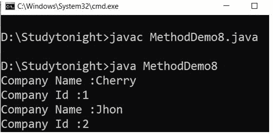
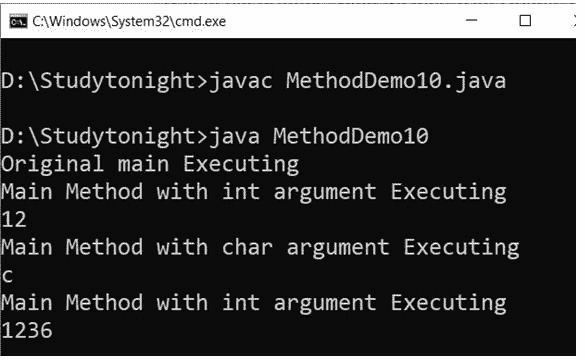
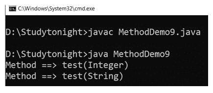

# Java 中的方法重载

> 原文：<https://www.studytonight.com/java/method-and-overloaded-method.php>

方法重载**是一个概念**，允许在同一个类中声明**多个同名但参数不同的方法。**

Java 支持方法重载，并且总是发生在同一个类中(与方法覆盖不同)。

方法重载是 java 支持多态性的方式之一。多态性是面向对象编程的一个概念，它处理多种形式。稍后我们将在单独的主题中讨论多态性。

方法重载可以通过**改变参数数量**或者**改变参数数据类型**来实现。

如果两个或两个以上的方法具有相同的名称和相同的参数表**，但返回类型不同**，则不能重载。

**注意:**重载方法可以有不同的访问修饰符，在方法重载中没有任何意义。

* * *

### 方法重载有两种不同的方式。

1.  参数的不同数据类型
2.  不同数量的参数

#### 通过更改参数的数据类型来重载方法。

**示例:**

在这个例子中，我们有两个 sum()方法，分别接受整型和浮点型参数。

请注意，在同一个类中，我们有两个名称相同但参数类型不同的**方法**

```java
class Calculate
{
  void sum (int a, int b)
  {
    System.out.println("sum is"+(a+b)) ;
  }
  void sum (float a, float b)
  {
    System.out.println("sum is"+(a+b));
  }
  Public static void main (String[] args)
  {
    Calculate  cal = new Calculate();
    cal.sum (8,5);      **//sum(int a, int b) is method is called**.
    cal.sum (4.6f, 3.8f); **//sum(float a, float b) is called**.
  }
}
```

总和是 13 总和是 8.4

可以看到 sum()方法被重载了两次。第一个接受两个整数参数，第二个接受两个浮点参数。

* * *

### 通过更改参数数量来重载方法。

**例**:

在这个例子中，我们有两种方法

```java
class Demo
{
  void multiply(int l, int b)
  {
    System.out.println("Result is"+(l*b)) ;
  }
  void multiply(int l, int b,int h)
  {
    System.out.println("Result is"+(l*b*h));
  }
  public static void main(String[] args)
  {
    Demo  ar = new Demo();
    ar.multiply(8,5);   //multiply(int l, int b) is method is called
    ar.multiply(4,6,2);   //multiply(int l, int b,int h) is called
  }
}
```

结果是 40 结果是 48

在本例中，`multiply()`方法被重载了两次。第一种方法采用两个参数，第二种方法采用三个参数。

当调用重载方法时，Java 寻找调用该方法的参数与其参数之间的匹配。这种匹配不需要总是精确的，有时当没有找到精确的匹配时，Java 自动类型转换起着至关重要的作用。

* * *

### 类型提升的方法重载示例。

Java 支持自动类型提升，如 int 到 long 或 float 到 double 等。在这个例子中，我们做同样的事情，并调用一个函数，该函数接受一个整数和第二个长类型参数。在调用时，我们传递了整数值，Java 将第二个参数视为长类型。见下面的例子。

```java
class Demo
{
 void sum(int l,long b)
 {
  System.out.println("Sum is"+(l+b)) ;
 }
 void sum(int l, int b, int h)
 {
  System.out.println("Sum is"+(l+b+h));
 }
 public static void main (String[] args)
 {
  Demo  ar = new Demo();
  ar.sum(8,5);
 }
} 
```

总和是 13

### 如果参数的顺序改变，方法重载

我们可以有两个具有相同名称和参数的方法，但是参数的顺序是不同的。

**示例:**

在这种情况下，方法重载起作用，但是在内部 JVM 将其视为具有不同类型参数的方法

```java
  class Demo{

    public void get(String name,  int id)
   { 
System.out.println("Company Name :"+ name);
  System.out.println("Company Id :"+ id); 
    } 

    public void get(int id, String name)
   { 
System.out.println("Company Id :"+ id); 
  System.out.println("Company Name :"+ name);
    } 
} 

class MethodDemo8{ 
    public static void main (String[] args) { 
  Demo obj = new Demo();
  obj.get("Cherry", 1);
  obj.get("Jhon", 2);
    } 
} 

```



### 重载主方法

在 Java 中，我们可以使用不同数量和类型的参数重载 main()方法，但是 JVM 只理解原来的 main()方法。

**示例:**

在本例中，我们创建了三个具有不同参数类型的 main()方法。

```java
  public class MethodDemo10{ 
    public static void main(intargs) 
    { 
System.out.println("Main Method with int argument Executing"); 
  System.out.println(args);
    } 
    public static void main(char args) 
    { 
System.out.println("Main Method with char argument Executing");
  System.out.println(args); 
    } 
    public static void main(Double[] args) 
    { 
System.out.println("Main Method with Double Executing"); 
  System.out.println(args);
    } 
    public static void main(String[] args) 
    { 
System.out.println("Original main Executing"); 
  MethodDemo10.main(12);
  MethodDemo10.main('c');
  MethodDemo10.main(1236);
    } 
} 

```



* * *

### 方法重载和空错误

这是处理对象时的一个常见问题，如果同名方法具有引用类型参数，则在传递参数时要小心。

下面是一个示例，在这个示例中，您将知道当方法重载时，空值会如何导致错误。

**示例:**

空值是所有引用类型的默认值。它给报告错误的 JVM 制造了歧义。

```java
  public class Demo 
{ 
    public void test(Integer i) 
    { 
System.out.println("test(Integer ) "); 
    } 
    public void test(String name) 
    { 
System.out.println("test(String ) "); 
    } 
    public static void main(String [] args) 
    { 
        Demo obj = new Demo();  
obj.test(null); 
    } 
} 

```

对于演示类型，方法测试(整数)不明确

#### **原因:**

在上面的例子中出现编译时错误的主要原因是，这里我们有整数和字符串作为参数，它们在 java 中不是原始数据类型，并且这种类型的参数不接受任何空值。当传递空值时，编译器会混淆选择哪个方法，因为上面例子中的两个方法都接受空值。

但是，我们可以**解决这个通过具体的引用类型而不是值。**

**示例:**

在这个例子中，我们传递的是特定的类型参数，而不是空值。

```java
   public class MethodDemo9 
{ 
    public void test(Integer i) 
    { 
System.out.println("Method ==> test(Integer)"); 
    } 
    public void test(String name) 
    { 
System.out.println("Method ==> test(String) "); 
    } 
    public static void main(String [] args) 
    { 
        MethodDemo9 obj = new MethodDemo9 ();  
  Integer a = null;
obj.test(a);
  String b = null;
obj.test(b); 
    } 
} 

```



* * *

* * *