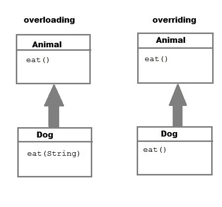
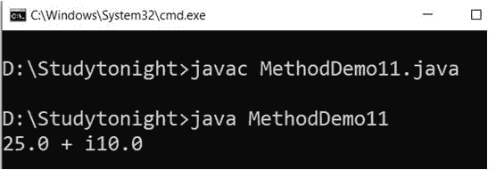

# Java 中的方法覆盖

> 原文：<https://www.studytonight.com/java/method-overriding-in-java.php>

方法覆盖是通过具有更具体定义的派生类方法覆盖基类方法的过程。

只有当两个类具有 **is-a** 关系时，方法覆盖才会执行。这意味着类必须具有继承性。换句话说，它是使用继承关系在两个类之间执行的。

在覆盖中，两个类**的方法必须**具有相同的**名称**和相同数量的**参数**。

方法覆盖也被称为**运行时多态性**，因为调用方法是由 JVM 在运行时决定的。

覆盖的主要好处是能够**定义特定子`Class`类型**的方法。

### 方法覆盖规则

1.父类和子类的方法名必须相同。

2.子方法的访问修饰符不能比父类方法更严格。

3.不能覆盖私有、最终和静态方法。

4.类之间必须有一种 IS-A 关系(继承)。

## 方法覆盖示例

下面我们有一个简单的代码示例，有一个父类和一个子类，其中子类将覆盖父类提供的方法。

```java
class Animal
{
    public void eat()
    {
        System.out.println("Eat all eatables");
    }
}

class Dog extends Animal
{
    public void eat()   //eat() method overridden by Dog class.
    {
        System.out.println("Dog like to eat meat");
    }

    public static void main(String[] args) {
        Dog d = new Dog();
        d.eat();
    }
} 
```

狗喜欢吃肉

这里可以看到 **Dog** 类给出了自己的`eat()`方法的实现。对于方法覆盖，该方法在父类和子类中必须具有相同的名称和相同的类型签名。

**注意:**静态方法不能被覆盖，因为静态方法以类为界，而实例方法以对象为界。

#### 示例:访问修饰符在子类中的限制性更强

如果子类比父类有更多的受限访问修饰符，Java 不允许方法覆盖。

在下面的例子中，对于子类方法，我们设置了 protected，它比父类中指定的 pubic 更受限制。

```java
    class Animal
{
    public void eat()
    {
        System.out.println("Eat all eatables");
    }
}

class Dog extends Animal
{
    protected void eat()   //error
    {
        System.out.println("Dog like to eat meat");
    }

    public static void main(String[] args) {
        Dog d = new Dog();
        d.eat();
    }
} 

```

无法降低从 Animal 继承的方法的可见性。

* * *

## 协变返回类型

从 Java 5 开始，可以通过改变方法的返回类型来覆盖它。如果子类通过改变超类方法的返回类型来覆盖任何方法，那么被覆盖方法的返回类型必须是超类内部原始方法中声明的返回类型的**子类型。这是通过更改方法的返回类型来覆盖该方法的唯一方法。**

*例*:

```java
class Animal
{
    Animal getObj()
    {
        System.out.println("Animal object");
        return new Animal();
    }
}

class Dog extends Animal
{
    Dog getObj()     //Legal override after Java5 onward
    {   System.out.println("Dog object");
        return new Dog();
    }

    public static void main(String[] args) {
        new Dog().getObj();
    }
} 
```

狗物体

* * *

### 重载和覆盖的区别

方法重载和方法覆盖似乎是相似的概念，但它们不是。让我们看看它们之间的一些差异:

| 方法重载 | 方法覆盖 |
| --- | --- |
| 参数必须不同，名称必须相同。 | 名称和参数必须相同。 |
| 编译时多态性。 | 运行时多态性。 |
| 增加代码的可读性。 | 提高代码的可重用性。 |
| 可以更改访问说明符。 | 访问说明符不能比原始方法限制更多(可以限制更少)。 |
| 这就是编译时间多态性。 | 这就是运行时多态性。 |
| 它在一个类中执行 | 它是使用继承关系在两个类之间执行的。 |
| 它是使用继承关系在两个类之间执行的。 | 它总是需要继承。 |
| 它应该有同名但不同签名的方法。 | 它应该有相同名称和签名的方法。 |
| 它不能有相同的返回类型。 | 它应该总是具有相同的返回类型。 |
| 可以使用静态方法来执行 | 它不能使用静态方法来执行 |
| 它使用静态绑定 | 它使用动态绑定。 |
| 可以更改访问修饰符和非访问修饰符。 | 不能更改访问修饰符和非访问修饰符。 |
| 这是代码细化技术。 | 这是一种代码替换技术。 |
| 定义方法时不使用关键字。 | 虚拟关键字用在基类中，覆盖关键字用在派生类中。 |
| 私有的、静态的、最终的方法可以被重载 | 私有、静态、最终方法不能重载 |
| 没有限制就是抛出条款。 | 仅限已检查的异常中的限制。 |
| 它也被称为编译时多态性或静态多态性或早期绑定 | 它也被称为运行时多态性或动态多态性或后期绑定 |
| **例**

```java
                    class OverloadingDemo{  
static int add1(int x,int y){return x+y;}  
static int add1(int x,int y,int z){return x+y+z;}  
} 

```

 | **示例:**

```java
                    class Demo2{  
void a()
{System.out.println("A");}}  
class b extends c
{void a(){System.out.println("B");} 

```

 |



* * *

### 问:我们可以覆盖静态方法吗？用理由解释？

不，我们不能覆盖静态方法。因为静态方法绑定到类，而方法覆盖与对象相关联，即在运行时。

* * *

### 示例:覆盖 toString()

Object 类的 toString()方法用于返回对象的字符串表示形式。

因为对象是所有 java 类的超级类，所以我们可以覆盖它的字符串方法来提供我们自己的字符串表示。

如果我们不覆盖`String`类并打印对象引用，那么它会以`"class_name @ hash code"`格式打印一些哈希代码。

下面是一个覆盖**对象**类的`toString()`方法的例子。

```java
    class Demo{
    private double a, b;     
    public Demo(double a, double b) 
    { 
    this.a = a; 
    this.b = b; 
    } 
 @Override
    public String toString() 
   { 
        return String.format(a + " + i" + b); 
    }  
}
public class MethodDemo11{ 
    public static void main(String[] args) 
    { 
    Demo obj1 = new Demo(25, 10); 
System.out.println(obj1); 

    } 
} 

```



* * *