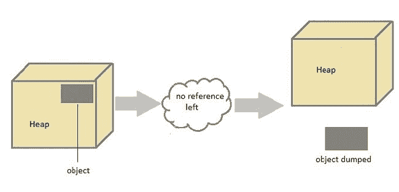

# Java 中的垃圾收集

> 原文：<https://www.studytonight.com/java/garbage-collection.php>

Java 垃圾回收是释放未使用对象占用的未使用内存的**过程。这个过程由 JVM 自动完成，因为它对于内存管理至关重要。**

当 Java 程序在 JVM 上运行时，对象是在堆上创建的，堆是程序专用的一部分内存。最终，一些对象将不再需要。

当没有对某个对象的引用时，则认为不再需要该对象，并释放该对象占用的内存。这种技术叫做**垃圾收集**。

### 垃圾收集是如何工作的？

垃圾收集是 JVM 的一部分，是由 JVM 完成的自动过程。我们不需要显式标记要删除的对象。然而，我们可以请求 JVM 对一个对象进行垃圾收集，但最终它依赖于 JVM 来调用垃圾收集器。

与 C++不同，没有明确的方法来销毁对象。

在下图中，您可以理解，如果一个对象没有任何引用，它将被 JVM 转储。



* * *

### 可以显式强制垃圾收集吗？

不，不能显式强制垃圾收集。我们可以通过调用 **System.gc()** 方法来请求 JVM 进行**垃圾收集**。但是这并不能保证 JVM 会执行垃圾收集。

* * *

### 垃圾收集的优势

1.  程序员不需要担心对象的解引用。
2.  它是由 JVM 自动完成的。
3.  提高内存效率并减少内存泄漏的机会。

如果一个对象是非引用的，那么它能够获得垃圾收集。我们可以通过三种方法使一个对象成为非引用对象。

1.将 null 设置为对象引用，这使得它能够进行垃圾收集。例如:

```java
 Demo demo = new Demo();
demo = null; // ready for garbage collection 
```

2.我们可以通过为对象设置新的引用来不引用它，这使得它能够进行垃圾收集。例如

```java
    Demo demo = new Demo();
Demo demo2 = new Demo();
demo2 = demo // referring object 

```

3.**匿名对象**没有任何引用，所以如果不使用，就可以进行垃圾收集了。

* * *

## `finalize()`方法

有时，一个对象在被销毁之前需要执行一些特定的任务，例如关闭一个打开的连接或释放任何被占用的资源。为了处理这种情况**使用 finalize()** 方法。

**finalize()** 方法是垃圾收集线程在收集对象之前调用**。这是任何对象执行清理实用程序的最后机会。**

**最终确定()方法的签名**

```java
protected void finalize()
{
 //finalize-code
}
```

* * *

#### 需要记住的几个要点

1.  它是在 java.lang.Object 类中定义的，因此所有类都可以使用它。
2.  它在对象类中被声明为受保护。
3.  它只被一个名为垃圾收集器的守护线程调用一次。

* * *

### 垃圾收集请求

我们可以请求 JVM 进行垃圾收集，但是何时启动垃圾收集器取决于 JVM。

Java **gc()** 方法用于显式调用垃圾收集器。但是 gc()方法不能保证 JVM 会执行垃圾收集。它只请求 JVM 进行垃圾收集。该方法存在于**系统和运行时类**中。

#### 气相色谱()方法示例

让我们举个例子，了解 gc()方法的功能。

```java
public class Test
{

    public static void main(String[] args)
    {
        Test t = new Test();
        t=null;
        System.gc();
    }
    public void finalize()
    {
        System.out.println("Garbage Collected");
    }
}
```

垃圾收集

* * *

* * *