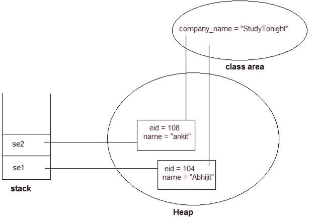

# Java 中的静态块

> 原文：<https://www.studytonight.com/java/static-in-java.php>

Static 是 Java 中的一个关键字，用来声明静态的东西。它可以用来创建变量、方法块或类。

静态变量或方法可以在没有类实例的情况下访问，因为它属于类。静态成员对于类的所有实例都是通用的，但是非静态成员对于类的每个实例都是不同的。让我们研究它如何与变量和方法一起工作。

### 静态变量

定义为类成员的静态变量可以在没有该类对象的情况下**访问。静态变量是**初始化一次**和**在类的不同对象**之间共享。具有静态变量的类的所有对象将具有相同的静态变量实例。**

**注:**静态变量用于表示一个类的公共属性。它节省内存。

#### 示例:

假设一家公司有 100 名员工。所有员工都有其唯一的姓名和员工 id，但公司名称将与所有 100 名员工相同。这里公司名称是共同财产。因此，如果创建一个类来存储员工详细信息，那么将 company_name 字段声明为静态的

下面我们有一个带有一个静态变量的简单类，参见示例。

```java
	 class Employee
{
    int eid;
    String name;
    static String company = "Studytonight";

    public void show()
    {
        System.out.println(eid + "-" + name + "-" + company);
    }

    public static void main( String[] args )
    {
        Employee se1 = new Employee();
        se1.eid = 104;
        se1.name = "Abhijit";
        se1.show();

        Employee se2 = new Employee();
        se2.eid = 108;
        se2.name = "ankit";
        se2.show();
    }

} 

```

104-Abhijit-今晚学习 108-ankit-今晚学习

我们可以使用下图来理解它，下图显示了程序使用的不同内存区域，以及静态变量是如何在类的对象之间共享的。



当我们有一个像这样的类变量，使用 **static** 关键字定义，那么这个变量只定义一次，并且被这个类的所有实例使用。因此，如果任何一个类实例修改了它，那么这个类的所有其他实例都会改变它。

### 静态变量与实例变量

下面是静态变量和实例变量之间的一些区别。实例变量是非静态变量，存储在堆中，只能通过对象访问。

| 静态变量 | 实例变量 |
| 代表共同财产 | 表示唯一属性 |
| 使用类名访问(也可以使用对象名访问) | 使用对象访问 |
| 只分配一次内存 | 每次创建新对象时分配新内存 |

#### 示例:静态变量与实例变量

我们举个例子，了解一下区别。

```java
	 public class Test
{
    static int x = 100;
    int y = 100;
    public void increment()
    {
        x++; y++;
    }
    public static void main( String[] args )
    {
        Test t1 = new Test();
        Test t2 = new Test();
        t1.increment();
        t2.increment();
        System.out.println(t2.y);
        System.out.println(Test.x);  //accessed without any instance of class.
    }
} 

```

101 102

查看两个变量的值的差异。静态变量 x 显示了不同对象上 **increment()** 方法对其所做的更改。而实例变量 y 仅显示了该特定实例上 **increment()** 方法对其所做的更改。

### Java 中的静态方法

方法也可以声明为静态的。静态方法不需要其类的实例来访问。main()方法是静态方法最常见的例子。`main()`方法被声明为静态的，因为它是在创建类的任何对象之前被调用的。

让我们举个例子

```java
	 class Test
{

  public static void square(int x)
  {  
    System.out.println(x*x);
  }

  public static void main (String[] arg)
  {
    square(8)   //static method square () is called without any instance of class.
  }
} 

```

Sixty-four

### Java 中的静态块

静态块用于初始化静态数据成员。静态块甚至在 main()方法之前就执行了。

当类加载到内存中时，它会执行。一个类可以有多个静态块，这些静态块将按照它们被编程的相同顺序执行。

#### 例子

让我们看一个例子，其中我们声明了一个静态块来初始化静态变量。

```java
	 class ST_Employee
{
    int eid;
    String name;
    static String company_name;

    static {
      company_name ="StudyTonight";   //static block invoked before main() method
    }

    public void show()
    {
        System.out.println(eid+" "+name+" "+company_name);
    }
    public static void main( String[] args )
    {
      ST_Employee se1 = new ST_Employee();
      se1.eid = 104;
      se1.name = "Abhijit";
      se1.show();
    }

} 

```

104 Abhijit 研究今晚

#### **不能从静态上下文引用非静态(实例)变量。**

当我们试图从像 main 方法这样的静态上下文中访问非静态变量时，java 编译器会抛出一条错误消息**非静态变量不能从静态上下文**中引用。这是因为非静态变量与类(对象)的实例相关，并且它们是在使用新运算符创建类的实例时创建的。因此，如果我们试图在没有任何实例的情况下访问非静态变量，编译器会抱怨，因为这些变量尚未创建，并且在创建实例并与之关联之前，它们不存在。

#### 例子

让我们举一个从静态上下文访问非静态变量的例子。

```java
	 class Test
{
  int x;
  public static void main(String[] args)
  {
    x = 10;
  }
} 

```

编译器错误:不能从静态上下文引用非静态变量计数

### 为什么 main()方法在 java 中是静态的？

因为静态方法可以在没有类的任何实例的情况下调用，并且在创建类的任何实例之前调用`main()`。

* * *