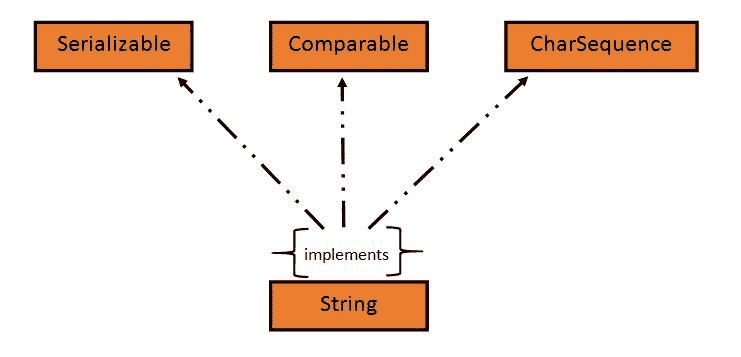
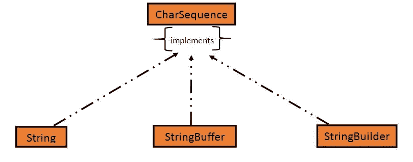
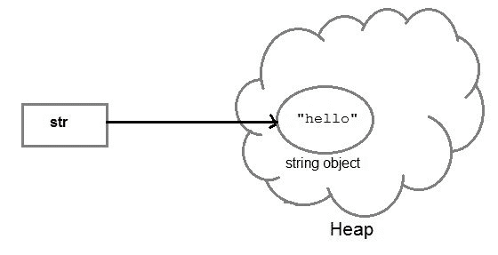
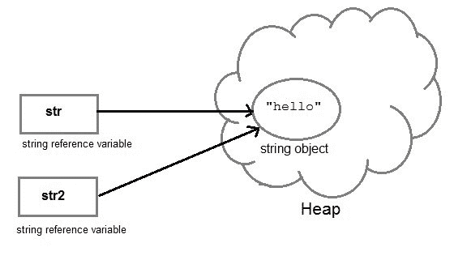
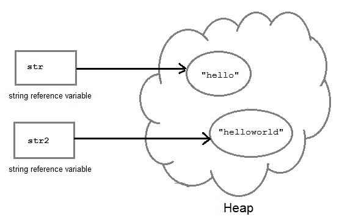
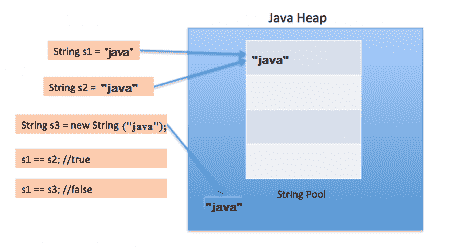

# Java 字符串处理简介

> 原文：<https://www.studytonight.com/java/string-handling-in-java.php>

字符串是表示字符序列的对象。在 Java 中，字符串由位于`java.lang`包中的字符串类表示

它可能是 java 库中最常用的类。在 java 中，我们创建的每个字符串实际上都是一个类型为 **String** 的对象。关于字符串对象需要注意的一点是，字符串对象是**不可变的**，这意味着一旦创建了字符串对象，它就不能被更改。

Java String 类实现了 Serializable、Comparable 和 CharSequence 接口，我们用下图表示了这个接口。



在 Java 中，**字符序列**接口用于表示一个字符序列。CharSequence 接口由 String、StringBuffer 和 StringBuilder 类实现。这三个类可用于在 java 中创建字符串。



### 什么是不可变对象？

状态在创建后不能改变的对象称为不可变对象。String、Integer、Byte、Short、Float、Double 和所有其他包装类对象都是不可变的。

### 创建字符串对象

字符串可以通过多种方式创建，以下是创建字符串对象的几种方法。

### 1)使用字符串文字

字符串文字是用双引号`" "`括起来的简单字符串。字符串文字被视为字符串对象。

```java
public class Demo{    
    public static void main(String[] args) {  
    	String s1 = "Hello Java";
    	System.out.println(s1);
    }  
} 
```

你好 Java

### 2)使用新关键字

我们可以通过使用 **new** 操作符为对象分配内存来创建一个新的字符串对象。

```java
public class Demo{    
    public static void main(String[] args) {  
    	String s1 = new String("Hello Java");
    	System.out.println(s1);
    }  
} 
```

你好 Java

每次我们创建字符串文字时，JVM 都会首先检查字符串池。如果字符串文字已经存在于池中，则返回对池实例的引用。如果池中不存在字符串，则会创建一个新的字符串对象，并将其放入池中。字符串对象存储在堆内存中称为**字符串常量池**的特殊内存区域。

### 字符串对象及其存储方式

当我们使用字符串文字创建一个新的字符串对象时，该字符串文字被添加到字符串池中，如果它还不存在的话。

```java
String str= "Hello";
```



并且，当我们创建另一个具有相同字符串的对象时，将返回字符串池中已经存在的字符串文字的引用。

```java
String str2 = str;
```



但是如果我们改变新的字符串，它的引用就会被修改。

```java
str2=str2.concat("world");
```



### 串联字符串

有两种方法可以连接两个或多个字符串。

1.  使用 **concat()** 方法
2.  使用`+`运算符

### 1)使用 concat()方法

`Concat()`方法用于将两个或多个字符串添加到单个字符串对象中。它是字符串类方法，并返回一个字符串对象。

```java
public class Demo{    

    public static void main(String[] args) {  
    	String s = "Hello";
    	String str = "Java";
    	String str1 = s.concat(str);
    	System.out.println(str1);
    }  
} 
```

你好 java

### 2)使用+运算符

Java 使用`"+"`运算符将两个字符串对象连接成一个。它还可以将数值与字符串对象连接起来。见下面的例子。

```java
public class Demo{    
    public static void main(String[] args) {  
    	String s = "Hello";
    	String str = "Java";
    	String str1 = s+str;
    	String str2 = "Java"+11;
    	System.out.println(str1);
    	System.out.println(str2);
    }  
} 
```

hellojava java 11

### 字符串比较

为了比较字符串对象，Java 同时提供了方法和运算符。所以我们可以用以下三种方法比较字符串。

1.  使用`equals()`方法
2.  使用`==`运算符
3.  通过`CompareTo()`方法

### 使用 equals()方法

`equals()`方法比较两个字符串是否相等。它的一般语法是，

```java
boolean equals (Object str)
```

### 例子

它比较字符串的内容。如果字符串匹配，它将返回 **true** ，否则返回 **false** 。

```java
public class Demo{    
    public static void main(String[] args) {  
    	String s = "Hell";
    	String s1 = "Hello";
    	String s2 = "Hello";
    	boolean b = s1.equals(s2);    //true
    	System.out.println(b);
    	b =	s.equals(s1) ;   //false
    	System.out.println(b);
    }  
} 
```

真假

### 使用==运算符

double `equal (==)`运算符比较两个对象引用，检查它们是否引用同一个实例。这也，将在成功匹配上返回**真**否则返回假。

```java
public class Demo{    
    public static void main(String[] args) {  
    	String s1 = "Java";
    	String s2 = "Java";
    	String s3 = new String ("Java");
    	boolean b = (s1 == s2);     //true
    	System.out.println(b);
    	b =	(s1 == s3);      //false
    	System.out.println(b);  
    }  
} 
```

真假

### 说明

我们正在使用新的操作符创建一个新的对象，因此它是在堆的非池内存区域中创建的。s1 指向字符串池中的字符串，而 s3 指向堆中的字符串，因此，当我们比较 s1 和 s3 时，答案是假的。

下图会解释得更清楚。



### 通过`compareTo()`方法

字符串`compareTo()`方法比较值并返回一个整数值，该整数值告诉比较的字符串是否小于、等于或大于另一个字符串。它根据自然顺序(即字母顺序)比较字符串。它的一般语法是。

### 语法:

```java
int compareTo(String str)
```

### 示例:

```java
public class HelloWorld{    
    public static void main(String[] args) {  
    	String s1 = "Abhi";
    	String s2 = "Viraaj";
    	String s3 = "Abhi";
    	int a = s1.compareTo(s2);     //return -21 because s1 < s2 
    	System.out.println(a);
    	a = s1.compareTo(s3);     //return 0 because s1 == s3 
    	System.out.println(a);
    	a = s2.compareTo(s1);     //return 21 because s2 > s1
    	System.out.println(a);
    }  
} 
```

-21 0 21

* * *