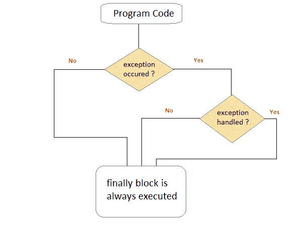

# Java `throw`、`throws`和`finally`

> 原文：<https://www.studytonight.com/java/throw-throws-and-finally-keyword.php>

`throw`、`throws`和`finally`是 Java 中用于异常处理的关键字。throw 关键字用于引发异常，throw 用于用方法签名声明可能的异常列表。而 finally block 用于执行基本代码，特别是释放被占用的资源。

现在让我们用例子详细讨论每一个。

### Java Throw

throw 关键字用于显式引发异常。只能抛出可抛出类或其子类的对象。程序执行在遇到**抛出**语句时停止，检查最接近的 catch 语句是否匹配异常类型。

**语法:**

```java
**throw** *ThrowableInstance*
```

### 创建可抛出类的实例

我们允许使用新的操作符来创建类 Throwable 的实例，

```java
**new** NullPointerException("test");
```

这用名称测试构造了一个 NullPointerException 的实例。

### 示例抛出异常

在本例中，我们使用抛出关键字显式抛出算术异常，该关键字将由 catch 块处理。

```java
class Test
{
  static void avg()
  {
    try
    {
      throw new ArithmeticException("demo");
    }
    catch(ArithmeticException e)
    {
      System.out.println("Exception caught");
    }
 }

 public static void main(String args[])
 {
    avg();
 }
} 
```

在上面的例子中，avg()方法抛出了一个 ArithmeticException 的实例，使用 catch 语句成功地处理了这个实例，因此，程序输出了“捕获的异常”。

## Java `throws`关键字

throws 关键字用于声明一个方法在程序执行期间可能抛出的异常列表。任何能够导致异常的方法都必须列出其执行过程中可能出现的所有异常，这样任何调用该方法的人都可以事先知道要处理哪些异常。一个方法可以通过使用**抛出**关键字来实现。

**语法:**

```java
type method_name(parameter_list) throws exception_list
{
  // definition of method
} 
```

### 示例抛出关键字

这里，我们有一个可以抛出算术异常的方法，所以我们在方法声明中提到了它，并在主方法中使用 catch 处理程序来捕获它。

```java
class Test
{
  static void check() throws ArithmeticException
  {  
    System.out.println("Inside check function");
    throw new ArithmeticException("demo");
  }

  public static void main(String args[])
  {
    try
    {
      check();
    }
    catch(ArithmeticException e)
    {
      System.out.println("caught" + e);
    }
  }
}
```

内部检查函数 caughtjava . lang . arithmeticexception:演示

* * *

### 投掷和投掷的区别

| 扔 | 投 |
| throw 关键字用于显式抛出异常。 | throws 关键字用于在异常执行期间声明异常是可能的。 |
| throw 关键字后面是 Throwable 类或其子类之一的实例。 | 抛出关键字后跟一个或多个异常类名，用逗号分隔。 |
| throw 关键字在方法体中声明。 | throws 关键字与方法签名(方法声明)一起使用。 |
| 我们不能使用 throw 关键字抛出多个异常。 | 我们可以使用 throws 关键字声明多个异常(用逗号分隔)。 |

### `finally`条款

finally 关键字用于创建跟随 try 块的代码块。无论异常是否发生，最终代码块总是被执行。使用 finally 块，它允许您运行任何想要执行的清理类型语句，无论受保护的代码中发生了什么。最后一个块出现在 catch 块的末尾。



### 示例最终阻止

在这个例子中，我们使用了 finally 块和 try 块。这个程序抛出一个异常，由于异常，程序终止它的执行，但是看到写在最终执行的块里面的代码。正是由于 finally 块的性质，保证了代码的执行。

```java
Class ExceptionTest
{
  public static void main(String[] args)
  {
    int a[] = new int[2];
    System.out.println("out of try");
    try
    {
      System.out.println("Access invalid element"+ a[3]);
      /* the above statement will throw ArrayIndexOutOfBoundException */
    }
    finally
    {
      System.out.println("finally is always executed.");
    }
  }
}
```

不尝试最后总是被执行。线程主 java 中的异常。郎。异常数组索引超出界限异常。

你可以在上面的例子中看到，即使程序抛出了异常，而异常不是由 catch 块处理的，但是最终块还是会被执行。

### 示例:最终阻止

最后，无论是否捕获到异常，block 都会在所有场景中执行。在前面的例子中，我们在异常没有被捕获的地方使用了 finally，但是在这里异常被捕获并最终与 handler 一起使用。

```java
class Demo
{
  public static void main(String[] args)
  {
    int a[] = new int[2];
    try
    {
      System.out.println("Access invalid element"+ a[3]);
      /* the above statement will throw ArrayIndexOutOfBoundException */
    }
    catch(ArrayIndexOutOfBoundsException e) {
      System.out.println("Exception caught");
    }
    finally
    {
      System.out.println("finally is always executed.");
    }
  }
} 
```

最后捕获的异常总是被执行。

* * *