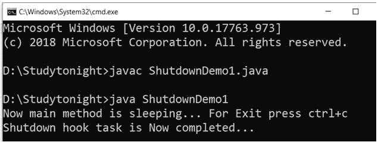
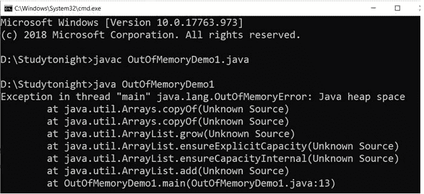

# Java 线程类

> 原文：<https://www.studytonight.com/java/thread-class-and-functions.php>

线程类是 Java 多线程系统所基于的主要类。线程类及其伴随接口 Runnable 将用于创建和运行线程，以利用 Java 的多线程特性。

它提供了支持多线程的构造函数和方法。它扩展了对象类并实现了 Runnable 接口。

### 线程类的签名

```java
public class Thread extends Object implements Runnable
```

### 线程类优先级常数

| 田 | 描述 |
| 最大优先级 | 它表示线程可以拥有的最大优先级。 |
| 最小 _ 优先级 | 它表示线程可以拥有的最低优先级。 |
| NORM_PRIORITY | 它表示线程可以拥有的默认优先级。 |

## 线程类的构造函数

1.  **螺纹**()
2.  **螺纹**(弦线)
3.  **螺纹**(可运行)
4.  **螺纹**(可运行 r，弦线)
5.  **螺纹** ( **螺纹组**组，**可运行**目标)
6.  **线程** ( **线程组**组，**可运行**目标，字符串名称)
7.  **线程** ( **线程组**组，**可运行**目标，字符串名称，长堆栈大小)
8.  **螺纹** ( **螺纹组**组，**螺纹**名称)

### 线程类方法

线程类还定义了许多管理线程的方法。其中一些是，

| 方法 | 描述 |
| --- | --- |
| setName() | 给线程命名 |
| getName（） | 返回线程的名称 |
| getPriority() | 返回线程的优先级 |
| isalive() | 检查线程是否仍在运行 |
| 加入() | 等待线程结束 |
| 运行() | 线程的入口点 |
| 睡眠() | 将线程挂起指定的时间 |
| 开始() | 通过调用 run()方法启动线程 |
| 活动计数() | 返回当前线程的线程组及其子组中活动线程数量的估计值。 |
| checkAccess() | 确定当前运行的线程是否有权修改此线程。 |
| currentThread() | 返回对当前正在执行的线程对象的引用。 |
| dumpStack() | 将当前线程的堆栈跟踪打印到标准错误流。 |
| getId() | 返回此线程的标识符。 |
| getState（） | 返回此线程的状态。 |
| getThreadGroup() | 返回该线程所属的线程组。 |
| 中断() | 中断这个线程。 |
| 中断() | 测试当前线程是否已被中断。 |
| isalive() | 测试这个线程是否是活动的。 |
| isDaemon() | 测试该线程是否是守护线程。 |
| isInterrupted() | 测试此线程是否已被中断。 |
| setDaemon(boolean on) | 将此线程标记为守护程序线程或用户线程。 |
| 设置优先级(整数新优先级) | 更改此线程的优先级。 |
| 产量() | 给调度程序的提示，表明当前线程愿意让出它当前对处理器的使用。 |

* * *

### 需要记住的几个要点

1.  当我们扩展 Thread 类时，我们不能覆盖 **setName()** 和 **getName()** 函数，因为它们在 Thread 类中被声明为 final。
2.  使用 **sleep()** 时，始终处理它抛出的异常。

    ```java
    *static* void sleep(long *milliseconds*) throws InterruptedException
    ```

### 可运行接口

它也用于创建线程，如果您只打算覆盖`run()`方法而没有其他线程方法，则应该使用它。

### 签名

```java
 @FunctionalInterface
public interface Runnable 
```

### 可运行接口方法

它只提供一个必须由类实现的方法。

| 方法 | 描述 |
| 运行() | 它运行实现的线程。 |

### 关机钩

在 Java 中，shut hook 用于清理所有资源，它意味着关闭所有文件，发送警报等。我们还可以保存 JVM 关闭时的状态。关闭挂钩主要用于在任何 JVM 关闭之前执行任何代码的情况。以下是 JVM 关闭的一些原因:

*   在命令提示符下按 ctrl+c
*   调用 System.exit(int)方法时。
*   当用户注销或关机等

#### 添加关闭钩(线程钩)

addShutdownHook(线程挂钩)方法用于向虚拟机注册线程。此方法属于运行时类。

**示例:**

```java
	 class Demo6 extends Thread
{  
    public void run()
	{  
	System.out.println("Shutdown hook task is Now completed...");  
	}  
}  

public class ShutdownDemo1
{  
	public static void main(String[] args)throws Exception 
	{  

		Runtime obj=Runtime.getRuntime();  
		obj.addShutdownHook(new Demo6());  
		System.out.println("Now main method is sleeping... For Exit press ctrl+c");  
		try
		{
			Thread.sleep(4000);
		}
		catch (Exception e) {}  
	}  
} 

```



### 内存不足异常

在 Java 中，我们知道所有的对象都存储在堆中。这些对象是使用 new 关键字创建的。出现以下 OutOfMemoryError 错误:


当 Java 虚拟机无法分配对象时，会出现此错误，因为对象内存不足，垃圾收集器没有可用的内存。

OutOfMemoryError 的意思是程序中有问题。当第三方库缓存字符串时，问题可能会失控。

### 可能出现内存不足错误的基本程序

**示例:**

```java
	 import java.util.ArrayList;
import java.util.List;
import java.util.Random;

public class OutOfMemoryDemo1 {
	public static void main(String[] args) {
		List<integer>obj = new ArrayList<>();
		Random obj1= new Random();
		while (true)
			obj.add(obj1.nextInt());
	}
}</integer> 

```



### 由于内存不足而可能出现内存不足错误的程序

**示例:**

```java
	 public class OutOfMemoryErrorDemo2
{
	public static void main(String[] args) 
	{
		Integer[] a = new Integer[100000*10000*1000];
		System.out.println("Done");
	}
} 

```


### 当垃圾收集器超过限制时，可能出现内存不足错误的程序

**示例:**

```java
	 import java.util.*; 

public class OutOfMemoryErrorDemo2{ 
public static void main(String args[]) throws Exception 
    { 
        Map a = new HashMap(); 
        a = System.getProperties(); 
        Random b = new Random(); 
        while (true) { 
a.put(b.nextInt(), "randomValue"); 
        }   } 
} 

```


* * *

* * *