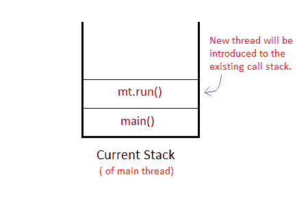
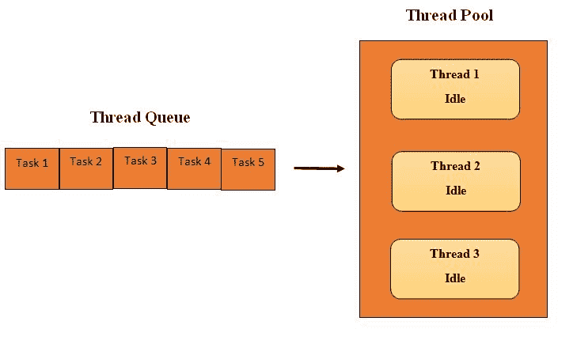
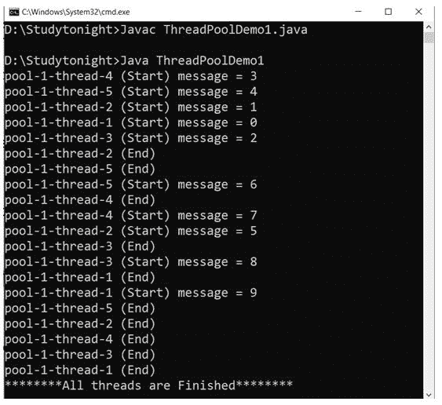

# 使用 Java 创建一个线程

> 原文：<https://www.studytonight.com/java/creating-a-thread.php>

为了实现多线程，Java 定义了两种创建线程的方法。

*   通过实现**可运行**接口。
*   通过扩展**线程**类。

### 实现可运行接口

创建线程最简单的方法是创建一个实现可运行接口的类。实现可运行接口后，类需要实现`run()`方法。

### 运行方法语法:

```java
public void run()
```

*   它在你的程序中引入了一个并发线程。当`run()`方法终止时，该线程将结束。
*   您必须指定您的线程将在`run()`方法中执行的代码。
*   `run()`方法可以调用其他方法，可以像其他普通方法一样使用其他类和声明变量。

```java
class MyThread implements Runnable
{
    public void run()
    {
        System.out.println("concurrent thread started running..");
    }
}

class MyThreadDemo
{
    public static void main(String args[])
    {
        MyThread mt = new MyThread();
        Thread t = new Thread(mt);
        t.start();
    }
} 
```

并发线程开始运行..

调用`run()`方法，使用`start()`方法。在调用 start()时，会向线程提供一个新堆栈，并调用 run()方法将新线程引入程序。

**注意:**如果在类中实现 Runnable 接口，那么需要显式创建 Thread 类对象，并且需要将 Runnable 接口实现的类对象作为参数传递到其构造器中。

* * *

## 扩展线程类

这是通过扩展 **Thread** 类的新类创建线程并创建该类实例的另一种方法。扩展类必须覆盖`run()`方法，这是新线程的入口点。

```java
class MyThread extends Thread
{
 	public void run()
 	{
  		System.out.println("concurrent thread started running..");
 	}
}

classMyThreadDemo
{
 	public static void main(String args[])
 	{
  		MyThread mt = new  MyThread();
  		mt.start();
 	}
}
```

并发线程开始运行..

同样在这种情况下，我们必须覆盖`run()`，然后使用`start()`方法运行线程。此外，当你创建一个神话类对象时，线程类构造器也会被调用，因为它是超级类，因此神话类对象充当线程类对象。

### 不使用`start()`方法直接调用`run()`方法会怎么样？

在上面的程序中如果我们直接调用`run()`方法，不使用`start()`方法，

```java
public static void main(String args[])
{
 	MyThread mt = new MyThread();
	mt.run();
}
```

这样做，不会给线程分配新的调用栈，它会在当前的调用栈中开始运行，也就是**主**线程的调用栈。因此多线程不会出现。



* * *

### 我们可以开始一个线程两次吗？

不，线程不能启动两次。如果尝试这样做，将抛出**illegalthreadstatexception**。

```java
public static void main(String args[])
{
 	MyThread mt = new MyThread();
 	mt.start();
 	mt.start();		//Exception thrown
}
```

当一个线程处于运行状态，并且您试图再次启动它，或者任何方法试图使用 **start()** 方法再次调用该线程时，将引发异常。

### 线程池

在 Java 中，用于重用先前为执行当前任务而创建的线程。如果在线程周期或资源抖动中出现任何问题，它也提供了解决方案。在 Java 线程池中，创建一组线程，选择一个线程并分配给作业，作业完成后，它被发送回组中。



### 线程池有三种方法。它们如下:

1\. 新固定线程池（int）

2.newCachedThreadPool()

3.newSingleThreadExecutor()

### 以下是创建线程池程序的步骤

1.创建一个可运行的对象来执行。

2.使用执行器创建执行器池

3.现在将对象传递给执行器池

4.最后关闭执行器池。

#### **示例:**

```java
	 import java.util.concurrent.ExecutorService;
import java.util.concurrent.Executors;

class WorkerThread implements Runnable 
	{
		private String message;
		public WorkerThread(String a)
		{
			this.message=a;
		}
    public void run() 
	{
        System.out.println(Thread.currentThread().getName()+" (Start) message = "+message);
        processmessage();
        System.out.println(Thread.currentThread().getName()+" (End)");
    }
    private void processmessage() 
	{
        try 
		{  
			Thread.sleep(5000);  
		} 
		catch (InterruptedException e) 
		{
			System.out.println(e);
		}
    }
}
public class ThreadPoolDemo1 
{ 
    public static void main(String[] args) 
	{
        ExecutorService executor = Executors.newFixedThreadPool(5);
        for (int i = 0; i < 10; i++) 
		{
            Runnable obj = new WorkerThread("" + i);
            executor.execute(obj);
         }
        executor.shutdown();
        while (!executor.isTerminated()) 
		{
        }
        System.out.println("********All threads are Finished********");
    }
} 

```



* * *