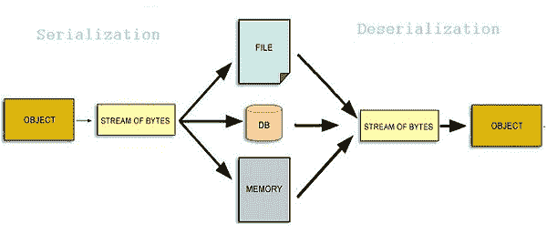

# Java 序列化和反序列化

> 原文：<https://www.studytonight.com/java/serialization-and-deserialization.php>

**序列化**是将一个对象转换成一个字节序列的过程，该字节序列可以保存到磁盘或数据库中，也可以通过流发送。从字节序列创建对象的相反过程称为**反序列化**。

一个类必须实现`java.io`包中存在的**可序列化**接口，才能成功序列化其对象。 **Serializable** 是一个**标记接口**，它为实现它的类增加了可序列化的行为。

Java 提供封装在`java.io`包下的 **Serializable** API，用于序列化和反序列化对象，包括:

*   `java.io.serializable`
*   `java.io.Externalizable`
*   `ObjectInputStream`
*   `ObjectOutputStream`

### Java 标记接口

标记接口是 Java 中的一个特殊接口，没有任何字段和方法。标记接口用于通知编译器实现它的类有一些特殊的行为或意义。标记界面一些例子是，

*   `java.io.serializable`
*   `java.lang.Cloneable`
*   `java.rmi.Remote`
*   `java.util.RandomAccess`

所有这些接口都没有任何方法和字段。它们只给实现它们的类添加特殊行为。然而，标记接口从 Java 5 开始就被弃用了，它们被**注释**所取代。注释被用来代替标记接口，其作用与标记接口之前的作用完全相同。

为了实现序列化和反序列化，Java 提供了两个类 ObjectOutputStream 和 ObjectInputStream。

### 对象输出流类

它用于将对象状态写入文件。实现 java.io.Serializable 接口的对象可以写入 strams。它提供了各种方法来执行序列化。

### ObjectInputStream 类

ObjectInputStream 反序列化使用 ObjectOutputStream 编写的对象和原始数据。

### `writeObject()`和`readObject()`方法

`ObjectOutputStream`类的`writeObject()`方法序列化一个对象并将其发送到输出流。

```java
public *final* void **writeObject**(*object x*) throws **IOException**
```

`ObjectInputStream`类的`readObject()`方法引用流外的对象并反序列化它。

```java
public final *Object* **readObject()** throws **IOException,ClassNotFoundException**
```

在序列化时，如果您不想让任何字段成为对象状态的一部分，那么根据您的需要声明它为**静态或瞬态**,并且在 java 序列化过程中不会包含它。



### 示例:用 Java 序列化对象

在这个例子中，我们有一个实现 Serializable 接口的类来使它的对象序列化。

```java
import java.io.*;
class Studentinfo implements Serializable
{
    String name;
    int rid;
    static String contact;
    Studentinfo(String n, int r, String c)
    {
    this.name = n;
    this.rid = r;
    this.contact = c;
    }
}

class Demo
{
    public static void main(String[] args)
    {
        try
        {
            Studentinfo si = new Studentinfo("Abhi", 104, "110044");
            FileOutputStream fos = new FileOutputStream("student.txt");
            ObjectOutputStream oos = new ObjectOutputStream(fos);
            oos.writeObject(si);
            oos.flush();
            oos.close();
        }
        catch (Exception e)
        {
            System.out.println(e);
        }
    }
} 
```

Studentinfo 类的对象使用`writeObject()`方法序列化并写入`student.txt`文件。

### 示例:Java 中对象的反序列化

为了反序列化对象，我们使用 ObjectInputStream 类，该类将从指定的文件中读取对象。见下面的例子。

```java
import java.io.*;

class Studentinfo implements Serializable
{
    String name;
    int rid;
    static String contact;
    Studentinfo(String n, int r, String c)
    {
    this.name = n;
    this.rid = r;
    this.contact = c;
    }
}

class Demo
{
    public static void main(String[] args)
    {
        Studentinfo si=null ;
        try
        {
            FileInputStream fis = new FileInputStream("/filepath/student.txt");
            ObjectInputStream ois = new ObjectInputStream(fis);
            si = (Studentinfo)ois.readObject();
        }
        catch (Exception e)
        {
            e.printStackTrace(); }
            System.out.println(si.name);
            System.out. println(si.rid);
            System.out.println(si.contact);
        }
} 
```

Abhi 104 是空的

联系人字段为空，因为它被标记为静态，并且正如我们前面讨论的，静态字段不会被序列化。

**注意:**静态成员从不序列化，因为它们连接到类而不是类的对象。

### `transient`关键词

序列化对象时，如果我们不想序列化对象的某个数据成员，我们可以称之为瞬态。transient 关键字将阻止数据成员被序列化。

```java
class studentinfo implements Serializable 
{
    String name;
    transient int rid;
    static String contact;
}
```

*   创建数据成员`transient`将阻止其序列化。
*   在本例中`rid`将不会被序列化，因为它是**瞬态**，而`contact`也将保持未序列化，因为它是**静态**。