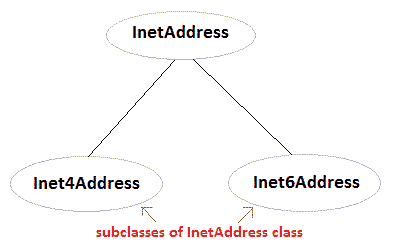
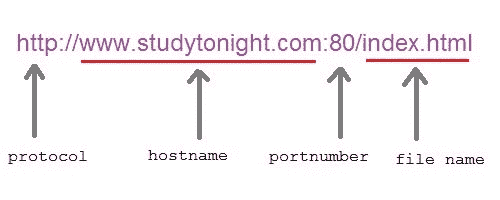

# Java 中的网络

> 原文：<https://www.studytonight.com/java/networking-in-java.php>

Java 是网络编程的主要语言。**java.net**包封装了大量的类和接口，提供了一种简单易用的方式来访问网络资源。以下是 java.net 包的一些重要类和接口。

### Java 网络类

| 班 |
| CacheRequest | CookieHandler |
| CookieManager | 数据报 |
| Inet 地址 | 服务器套接字 |
| 窝 | 关闭 |
| 代理 | 统一资源定位器 |
| 通过 |  |

### Java 网络接口

| 接口 |
| CookiePolicy | 烹饪商店 |
| 文件名映射 | 插座 |
| 互联网地址 | 服务器套接字 |
| SocketImplFactory | 原嗅觉家族 |

### 互联网地址

Inet 地址封装了数字 IP 地址和该地址的域名。Inet 地址可以处理 IPv4 和 Ipv6 地址。Inet 地址类没有可见的构造函数。要创建 inet 地址对象，必须使用**工厂方法**。

三种常用的 Inet 地址工厂方法是。

1.  静态*在线处理*T2【getLocalHost()抛出**未知异常**
2.  静态*地址*T2(*字符串主机名*)抛出**未知异常**
3.  静态*InetAddress[]***getAllByName**(*String hostname*)抛出**未知异常**



### 使用 InetAddress 类的示例

```java
import java.net.*;
class Demo
{
  public static void main(String[] args) throws UnknownHostException
  {
    InetAddress address = InetAddress.getLocalHost();
    System.out.println(address);
    address = InetAddress.getByName("www.studytonight.com");
    System.out.println(address);
    InetAddress sw[] = InetAddress.getAllByName("www.google.com");
    for(int i=0; i< sw.length; i++)
    {
      System.out.println(sw[i]);
    }
  }
} 
```

www.studytonight.com/208.91.198.55·www.google.com/74.125.236.115·www.google.com/74.125.236.116·www.google.com/74.125.236.112·www.google.com/74.125.236.113·www.google.com/74.125.236.114·www.google.com/2404:6800:4009:802:0:0:0:1014

### 套接字和服务器套接字类

套接字是现代网络的基础，一个套接字允许单台计算机同时服务于许多不同的客户端。套接字通过使用端口建立连接，端口是特定机器上的编号套接字。套接字通信通过协议进行。套接字使用 TCP 在两台计算机之间提供通信机制。Java 中有两种 TCP 套接字。一个用于服务器，另一个用于客户端。

*   **ServerSocket** 是针对服务器的。
*   **Socket** 类为客户端。

### 网址类别

java.net 包中的 Java URL 类，处理唯一标识或定位互联网上资源的 URL(统一资源定位符)。



### 网址分类的重要方法

*   **getProtocol() :** 返回 URL 的协议
*   **getHost() :** 返回 URL 的主机名(域名)
*   **getPort() :** 返回 URL 的端口号
*   **getFile() :** 返回网址的文件名

### 使用网址类的程序

```java
import java.net.*;
class Demo
{
  public static void main(String[] arg) throws MalformedURLException
  {
    URL hp = new URL("http://www.studytonight.com/index");
    System.out.println(hp.getProtocol());
    System.out.println(hp.getFile());
  }
} 
```

http/索引

* * *