# Java 中的 Applet

> 原文：<https://www.studytonight.com/java/java-applet.php>

Applet 是一种特殊的 Java 程序，在支持 Java 的浏览器中运行。这是第一个可以使用浏览器在网络上运行的 Java 程序。Applet 通常嵌入在网页中，并在浏览器中运行。

换句话说，我们可以说 Applet 是小型的 Java 应用，可以在互联网服务器上访问，通过互联网传输，并且可以作为网络文档的一部分自动安装和运行。

在用户接收到 Applet 之后，Applet 可以产生图形用户界面。它对资源的访问有限，因此它可以运行复杂的计算，而不会引入病毒或破坏数据完整性的风险。

要创建 Applet，类必须扩展 **java.applet.Applet** 类。

Applet 类没有任何 main()方法。使用 JVM 查看。JVM 可以使用网络浏览器的插件或者单独的运行时环境来运行 Applet 应用。

JVM 创建一个 applet 类的实例，并调用`init()`方法来初始化 Applet。

**注意:** Java Applet 从 Java 9 开始就被弃用了。这意味着 Applet API 不再被认为是重要的。

### Java Applet 的生命周期

以下是 Applet 中的各个阶段

1.  Applet 已初始化。
2.  Applet 已启动
3.  Applet 已绘制。
4.  Applet 已停止。
5.  Applet 被销毁。

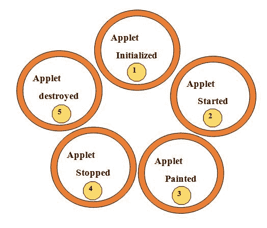

* * *

## 简单的 Applet

```java
import java.awt.*;
import java.applet.*;
public class Simple extends Applet
{
  public void **paint**(Graphics g)
    {
      g.drawString("A simple Applet", 20, 20);
    }
}
```

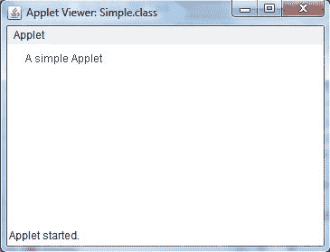

每个 Applet 应用必须导入两个包- `java.awt`和`java.applet`。

`java.awt.*`导入抽象窗口工具包(AWT)类。Applet 通过 AWT 与用户交互(直接或间接)。AWT 支持基于窗口的图形用户界面。`java.applet.*`导入 applet 包，其中包含 Applet 类。您创建的每个 applet 都必须是 Applet 类的子类。

程序中的类必须声明为公共的，因为它将被程序外的代码访问。每个 Applet 应用都必须声明一个`paint()`方法。这个方法是由 AWT 类定义的，必须被 applet 覆盖。每当 Applet 需要重新显示其输出时，都会调用 paint()方法。关于 applet 应用需要注意的另一件重要的事情是，applet 的执行并不是从`main()`方法开始的。事实上，Applet 应用没有任何`main()`方法。

### Applet 的优势

1.  因为它在客户端工作，所以需要非常少的响应时间。
2.  它可以在任何运行 JVM 的浏览器上运行。

### Applet 类

Applet 类为 applet 的执行提供了所有必要的支持，比如 applet 的初始化和销毁。它还提供了加载和显示图像的方法以及加载和播放音频剪辑的方法。

### Applet 框架

大多数 Applet 会覆盖这四种方法。这四种方法形成了 Applet 生命周期。

*   **init() :** init()是第一个被调用的方法。这是变量初始化地方。这个方法在 applet 运行时只被调用一次。
*   **start():**init()之后调用 start()方法。调用此方法是为了在 Applet 停止后重新启动它。
*   **stop() :** 调用 stop()方法，在 applet 不可见时挂起不需要运行的线程。
*   **destroy() :** 当你的 Applet 需要从内存中完全移除时，会调用 destroy()方法。

**注意:**stop()方法总是在 destroy()方法之前调用。

### Applet 框架示例

```java
import java.awt.*;
import java.applet.*;
public class AppletTest extends Applet
{
 public void **init()**
 {
  //initialization
 }
 public void **start** ()
 {
  //start or resume execution
 }
 public void **stop()**
 {
  //suspend execution
 {
 public void **destroy()**
 {
  //perform shutdown activity
 }
 public void **paint** (Graphics g)
 {
  //display the content of window
 }
}
```

### Applet 示例

```java
import java.applet.*;
import java.awt.*;
public class MyApplet extends Applet
{
 int height, width;
 public void init()
 {
  height = getSize().height;
  width = getSize().width;
  setName("MyApplet");
 }
 public void paint(Graphics g)
 {
  g.drawRoundRect(10, 30, 120, 120, 2, 3);
 }
}
```

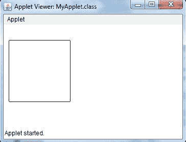

* * *

### Applet 中的参数

可以在 Applet 中使用**<【PARAM…>**标签应用用户定义的参数。每个**<PARAM……>**标签都有一个名称和值属性。

### 示例:

```java
  name = color
Value = red 

```

### 语法:

```java
<PARAM name = ……… Value = “………” >
```

在 applet 代码中，applet 可以通过名称引用参数，然后找到它的值。

处理和设置参数最重要的两件事是 HTML 文档中的<param>标记和解析该参数的 Applet 代码。

init()方法用于获取<param>标签中定义的参数。getParameter()方法用于获取参数。

在 Applet 中，参数在加载时传递给 Applet。

### 示例:

java 停止

```java
  import java.applet.*;
import java.awt.*;
public class param extends Applet
{
  String str;
  public void init()
  {
    str=getParameter("pname");  
    if (str == null)
    str = "Welcome to studytonight.com";
    str = "Hello " + str; 
  }   
    public void paint(Graphics g)
    {
      g.drawString(str, 200, 200);
    }
} 

```

我的钱. html

```java
  <html>
<applet code=param.class height=300 width=300> 
<param Name="pname" value="Welcome to studytonight.com">
</applet>
</html> 

```


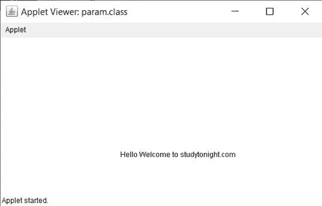

### 如何运行 Applet 程序

Applet 程序的编译方式与您编译控制台程序的方式相同。然而，有两种方法可以运行 Applet。

*   在兼容 Java 的网络浏览器中执行 Applet。
*   使用 Applet 查看器，如标准工具 Applet 查看器。Applet 查看器在窗口中执行您的 Applet

要在网络浏览器中执行 Applet，请在同一目录中创建简短的 **HTML 文件**。在文件的**正文**标签内，包含以下代码。(**Applet**标签加载 Applet 类)

```java
< applet code = "MyApplet" width=400 height=400 >
< /applet >

```

### 运行 HTML 文件

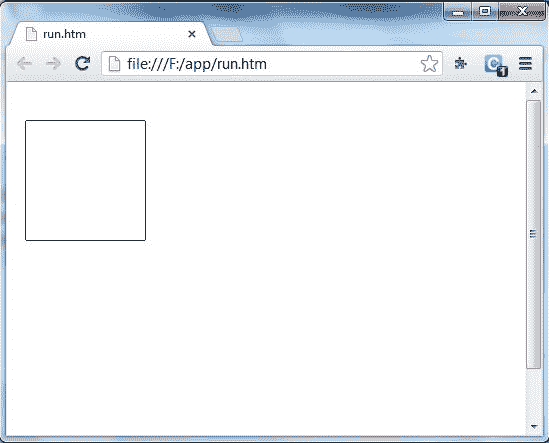

### 使用 Applet 查看器运行 Applet

要使用 Applet 查看器执行 Applet，请编写如上所述的短 HTML 文件。如果你将其命名为**run.htm**，那么下面的命令将运行你的 Applet 程序。

```java
f:/>appletviewer run.htm 
```

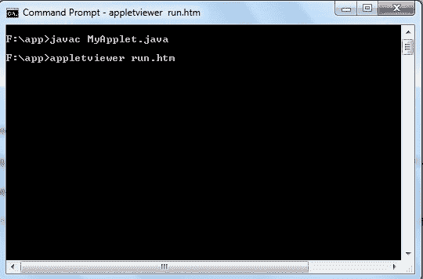

* * *

### Applet 中的图形

在 Applet 中，java.awt.Graphicsclass 提供了使用图形的方法。

下面是图形类的方法。

| 不，先生。 | 方法 | 描述 |
| one | 公共抽象空拉绳(字符串，int x，int y) | 用于绘制指定的字符串。 |
| Two | 公共 void drawRect(int x，int y，int 宽度，int 高度) | 用于绘制指定宽度和高度的矩形。 |
| three | 公共抽象 void fillRect(int x，int y，int 宽度，int 高度) | 用于绘制具有指定宽度和高度的默认颜色的矩形。 |
| four | 公共抽象 void drawOval(int x，int y，int 宽度，int 高度) | 用于绘制指定宽度和高度的椭圆形。 |
| five | 公共抽象 void fillOval(int x，int y，int 宽度，int 高度) | 用于绘制具有指定宽度和高度的默认颜色的椭圆形。 |
| six | 公共抽象 void drawLine(int x1，int y1，int x2，int y2) | 用于在点(x1，x1)和(x2，y2)之间画线。 |
| seven | 公共抽象 boolean image(img image、int x、int y、ImageObserver) | 用于绘制指定的图像。 |
| eight | 公共抽象空绘图弧(int x，int y，int 宽度，int 高度，intstartAngle，intarcAngle) | 用于画圆弧。 |
| nine | 公共抽象空填充弧(int x，int y，int 宽度，int 高度，intstartAngle，intarcAngle) | 用于填充圆弧。 |
| Ten | 公共抽象空集合颜色 | 用于设置对象的颜色。 |
| Eleven | 公共抽象空集字体(字体) | 用于设置字体。 |

### 示例:

graphicsdemo 1 . java

```java
  import java.applet.Applet;  
import java.awt.*;  
public class GraphicsDemo1 extends Applet
{    
  public void paint(Graphics g)
  {  
    g.setColor(Color.black);  
    g.drawString("Welcome to studytonight",50, 50); 
    g.setColor(Color.blue);  
    g.fillOval(170,200,30,30);  
    g.drawArc(90,150,30,30,30,270);  
    g.fillArc(270,150,30,30,0,180);  
    g.drawLine(21,31,20,300);  
    g.drawRect(70,100,30,30);  
    g.fillRect(170,100,30,30);  
    g.drawOval(70,200,30,30);  
  }  
} 

```

GraphicsDemo1.html

```java
  <html>
<body>
<applet code="GraphicsDemo1.class" width="300" height="300">
</applet>
</body>
</html> 

```


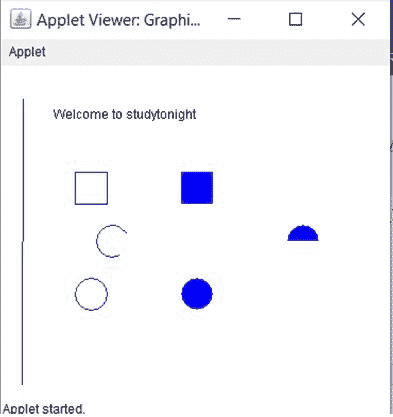

### 在 Applet 中使用图像

在 Applet 程序中，也可以使用图像

**java.awt.Image** 类用于表示图像。

**java.applet、java.awt 和 java.awt.image** 是用于事件处理的包。

### 加载图像

在 Applet 中，使用 **getImage()** 方法加载图像。当调用 Applet 的构造器时，此方法有效。总是建议在 **init()** 方法中调用构造器。

**这里有一些例子:**

image1 = getImage(getCodeBase()、“image 1 . gif”)；
image 2 = getimage(getdocumentbase()，" image 1 . JPEG ")；【image 3 = getimage(新 URL(" http://Java . sun . com/graphics/image . gif ")；

### 显示图像

在 Applet 中，使用 drawImage()方法显示图像。此方法由 Graphics 对象提供，该对象被传递给 paint()方法。

### 示例:

aiming . Java

```java
  import java.awt.*;
import java.applet.*;
public class Aimage extends Applet
{
  Image img1;
  public void init()
  {
    img1=getImage(getDocumentBase(),"icon.png");
  }
  public void paint(Graphics g)
  {
    g.drawImage(img1,100,100,this);
  }   
} 

```

aiming . html

```java
  <html>
<applet code=Aimage height=300 width=300>
</applet>
</html> 

```


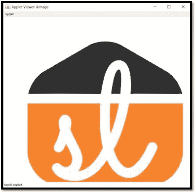

### Applet 中的事件处理

在 Applet 中，我们还可以执行事件处理。

下面是一个事件处理的例子，点击按钮时会打印一条消息。

### 示例:

EventAppletDemo.java

```java
  import java.applet.*;  
import java.awt.*;  
import java.awt.event.*;  
public class EventAppletDemo extends Applet implements ActionListener
{  
  Button b1;  
  TextField tf1;  
  public void init()
  {  
    tf1=new TextField();  
    tf1.setBounds(30,40,200,20);  
    b1=new Button("Click");  
    b1.setBounds(80,150,60,50);    
    add(b1);
    add(tf1);  
    b1.addActionListener(this);  
    setLayout(null);  
  }  
  public void actionPerformed(ActionEvent e)
  {  
    tf1.setText("Welcome to studytonight");  
  }   
} 

```

Myapplet.html

```java
  <html>
<body>
<applet code="EventAppletDemo.class" width="300" height="300">
</applet>
</body>
</html> 

```


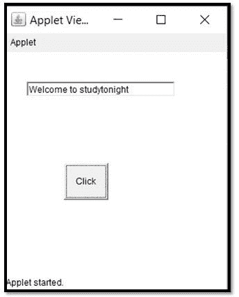

### Applet 中的动画

在 Applet 中，我们还可以使用 gif 图像在程序中创建动画。下面是一个使用 drawImage()方法的示例，该方法属于 Graphics 类，用于显示图像。

**注意:下载下面例子的 gif 文件**

### 示例:

动画演示. java

```java
  import java.awt.*;  
import java.applet.*;  
public class AnimationDemo extends Applet 
{  
  Image p;  
  public void init() 
  {  
    p = getImage(getDocumentBase(),"ball.gif");  
  }  
  public void paint(Graphics g) 
  {  
    for(inti=0;i<500;i++)
    {  
      g.drawImage(p, i,50, this);  
      try
      {
        Thread.sleep(100);
      }
      catch(Exception e)
      {}  
    }  
  }  
} 

```

动画演示. html

```java
  <html>
<body>
<applet code="AnimationDemo.class" width="300" height="300">
</applet>
</body>
</html> 

```

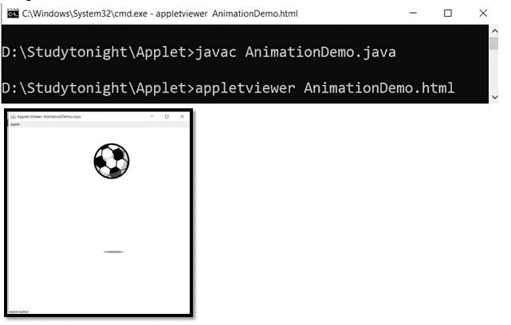

### 日本管道等级

在 Java 中，JApplet 是 swing 的公共类。japlet 在 java.applet.Applet 中扩展了这个类。japlet 在 JVM 或 Applet 查看器的帮助下生成一个字节码。JApplet 可以用任何编程语言编写，然后可以编译成 Java 字节码。

### 示例:

JAppletDemo.java

```java
  import java.applet.*;  
import javax.swing.*;  
import java.awt.event.*;  
public class JAppletDemo extends JApplet implements ActionListener
{  
  JButton b;  
  JTextField t;  
  public void init()
  {  
    t=new JTextField();  
    t.setBounds(30,40,220,20);  
    b=new JButton("Click");  
    b.setBounds(80,150,70,40);  
    add(b);
    add(t);  
    b.addActionListener(this);  
    setLayout(null);  
  }  
  public void actionPerformed(ActionEvent e)
  {  
    t.setText("Welcome to studytonight.com");  
  }  
} 

```

JAppletDemo.html

```java
  <html>
<body>
<applet code="JAppletDemo.class" width="300" height="300">
</applet>
</body>
</html> 

```

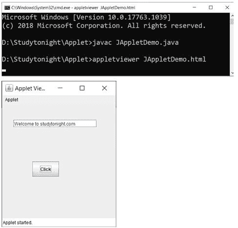

### 在 Applet 中绘画

下面是一个在 Applet 中使用 MouseMotionListener 的 mouseDragged()方法进行绘画的例子。

### 示例:

PaintingDemo.java

```java
  import java.awt.*;  
import java.awt.event.*;  
import java.applet.*;  
public class PaintingDemo extends Applet implements MouseMotionListener
{    
  public void init()
  {  
    addMouseMotionListener(this);  
    setBackground(Color.white);  
  }  
  public void mouseDragged(MouseEvent me)
  {  
    Graphics g=getGraphics();  
    g.setColor(Color.black);  
    g.fillOval(me.getX(),me.getY(),5,5);  
  }  
  public void mouseMoved(MouseEvent me)
  {}  
} 

```

PaintingDemo.html

```java
  <html>
<body>
<applet code="PaintingDemo.class" width="300" height="300">
</applet>
</body>
</html> 

```

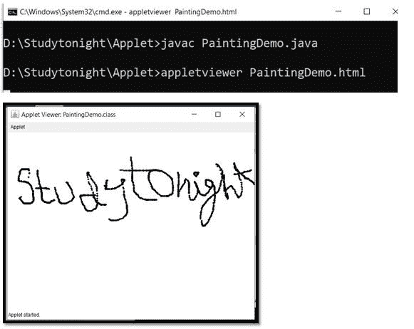

### Applet 中的模拟时钟

在 java 中，Applet 可以用来创建一个模拟时钟。为模拟时钟创建程序，需要导入 java.apple、java.awt、java.util 和 java.text 包。还使用了日期和时间功能。数学函数在创建模拟时钟中起着重要作用。下面是一个创建模拟时钟的程序。

### 示例:

模拟演示 1.java

```java
  import java.applet.*;  
import java.awt.*;  
import java.util.*;  
import java.text.*;  

public class AnalogDemo1 extends Applet implements Runnable 
{  
int width, height;  
    Thread t = null;  
    booleanthreadSuspended;  
    int hours=0, minutes=0, seconds=0;  
    String timeString = ""; 
    public void init() 
      {   
        width = getSize().width;  
        height = getSize().height;  
        setBackground( Color.black );  
      }  
public void start() 
  {  
    if ( t == null ) 
      {  
        t = new Thread( this );  
        t.setPriority( Thread.MIN_PRIORITY );  
        threadSuspended = false;  
        t.start();  
      }  
    else 
      {  
        if ( threadSuspended ) 
          {  
            threadSuspended = false;  
            synchronized( this ) 
            {  
              notify();  
            }  
          }  
      }  
   }  

public void stop() 
{  
  threadSuspended = true;  
}  

public void run() {  
  try {  
     while (true) {  

        Calendar cal = Calendar.getInstance();  
        hours = cal.get( Calendar.HOUR_OF_DAY );  
        if ( hours> 12 ) hours -= 12;  
        minutes = cal.get( Calendar.MINUTE );  
        seconds = cal.get( Calendar.SECOND );  
        SimpleDateFormat formatter = new SimpleDateFormat( "hh:mm:ss", Locale.getDefault() );  
        Date date = cal.getTime();  
        timeString = formatter.format( date );  
        if ( threadSuspended ) {  
            synchronized( this ) {  
              while ( threadSuspended ) {  
                wait();  
              }  
           }  
        }  
        repaint(); 
        t.sleep( 1000 ); 
     }  
  }  
  catch (Exception e) { }
}  

void drawHand( double angle, int radius, Graphics g ) {  
  angle -= 0.5 * Math.PI;  
  int x = (int)( radius*Math.cos(angle) );  
  int y = (int)( radius*Math.sin(angle) );  
  g.drawLine( width/2, height/2, width/2 + x, height/2 + y );  
}  

void drawWedge( double angle, int radius, Graphics g ) {  
  angle -= 0.5 * Math.PI;  
  int x = (int)( radius*Math.cos(angle) );  
  int y = (int)( radius*Math.sin(angle) );  
  angle += 2*Math.PI/3;  
  int x2 = (int)( 5*Math.cos(angle) );  
  int y2 = (int)( 5*Math.sin(angle) );  
  angle += 2*Math.PI/3;  
  int x3 = (int)( 5*Math.cos(angle) );  
  int y3 = (int)( 5*Math.sin(angle) );  
  g.drawLine( width/2+x2, height/2+y2, width/2 + x, height/2 + y );  
  g.drawLine( width/2+x3, height/2+y3, width/2 + x, height/2 + y );  
  g.drawLine( width/2+x2, height/2+y2, width/2 + x3, height/2 + y3 );  
}  

public void paint( Graphics g ) {  
  g.setColor( Color.pink );  
  drawWedge( 2*Math.PI * hours / 12, width/5, g );  
  drawWedge( 2*Math.PI * minutes / 60, width/3, g );  
  drawHand( 2*Math.PI * seconds / 60, width/2, g );  
  g.setColor( Color.white );  
  g.drawString( timeString, 10, height-10 );  
}  
} 

```

AnalogueDemo1.html

```java
  <html>
<body>
<applet code="AnalogDemo1.class" width="300" height="300">
</applet>
</body>
</html> 

```

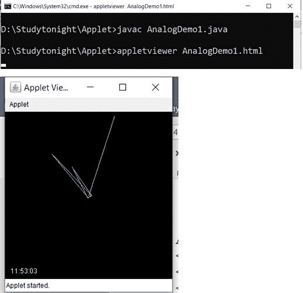

### Applet 中的数字时钟

在 java 中，Applet 可以用来创建数字时钟。为了给数字钟创建一个程序，需要导入 java.apple、java.awt、java.util 和 java.text 包。还使用了日期和时间功能。下面是一个创建数字时钟的程序。

### 示例:

DigitalClockDemo1.java

```java
  import java.applet.*;  
import java.awt.*;  
import java.util.*;  
import java.text.*;  
public class DigitalClockDemo1 extends Applet implements Runnable 
{  
  Thread t = null;  
  int h=0, m=0, s=0;  
  String timeString = "";  
public void init() 
{  
  setBackground( Color.black);  
}  
public void start() 
{  
  t = new Thread( this );  
  t.start();  
}  
public void run() 
{  
  try 
    {  
      while (true) 
        {  
          Calendar cal = Calendar.getInstance();  
          h = cal.get( Calendar.HOUR_OF_DAY );  
          if ( h> 12 ) h -= 12;  
          m = cal.get( Calendar.MINUTE );  
          s = cal.get( Calendar.SECOND );  
          SimpleDateFormat f = new SimpleDateFormat("hh:mm:ss");  
          Date date = cal.getTime();  
          timeString = f.format( date );  
          repaint();  
          t.sleep( 1000 );  
       }  
    }  
  catch (Exception e) { }
}  
public void paint( Graphics g ) 
  {  
    g.setColor( Color.white );  
    g.drawString( timeString, 50, 50 );  
  }  
} 

```

DigitalClockDemo1.html

```java
  <html>
<body>
<applet code="DigitalClockDemo1.class" width="300" height="300">
</applet>
</body>
</html> 

```

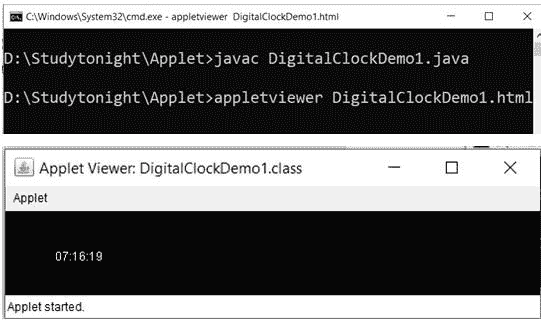

* * *

* * *