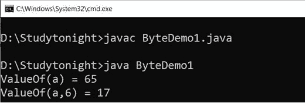
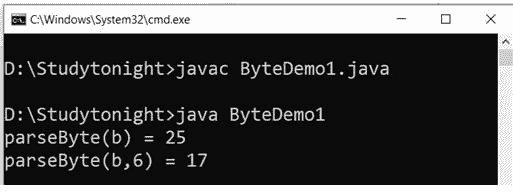
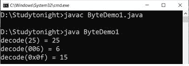
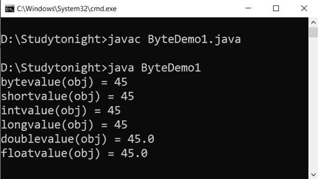
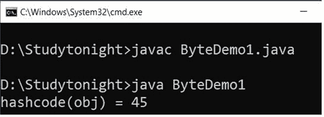
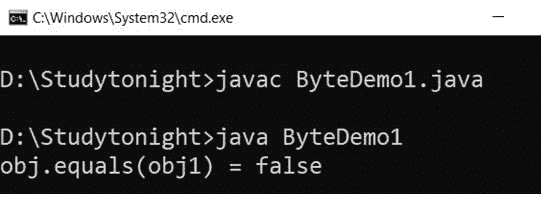
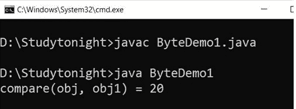

# Java 字节类

> 原文：<https://www.studytonight.com/java/byte-class.php>

字节类是一个包装类，用于包装对象中基元类型字节的值。字节类型的对象包含类型为字节的单个字段。

这个类位于 **java.lang** 包中，并提供了几种将一个字节转换为字符串的方法，反之亦然。这个类的声明如下。

### 声明:

```java
public final class Byte extends Number implements Comparable<Byte>
```

现在让我们通过例子来看看它的方法和用法。

### 1.toString()

### 语法:

```java
	 public String toString(byte b) 

```

### 示例:

让我们举个例子来获取字节类型的字符串对象。我们使用了`toString()`方法，它是静态的，所以我们可以用类名来调用它。

```java
	 public class ByteDemo1 
{ 
	public static void main(String[] args)  
	{ 
		byte a = 65; 
		System.out.println("toString(a) = " + Byte.toString(a));
	}
} 

```


### 2.valueOf()

此方法返回一个表示指定字节值的字节实例。此方法通常应优先于构造器 Byte(字节)使用。

### 语法:

```java
	 public static Byte valueOf(byte b) 

```

### 示例:

在这个例子中，我们使用`valueOf()`方法返回代表指定字节类型的字节类实例。

```java
	 public class ByteDemo1 
{ 
    public static void main(String[] args)  
        { 
        byte a = 65; 
        String b = "25";
        Byte x = Byte.valueOf(a); 
        System.out.println("ValueOf(a) = " + x);
        x = Byte.valueOf(b, 6); 
        System.out.println("ValueOf(a,6) = " + x);
     }
} 

```



### 3.parseByte()

此方法返回指定字符串值的字节值。我们可以用它从字符串类型值中获取字节值。

```java
	 public static byte parseByte(String val, int radix) throws NumberFormatException 

```

### 示例:

让我们举一个例子，其中我们有一个字符串类型变量，并使用 parseByte()方法获取它的字节值。

```java
	 public class ByteDemo1 
{ 
	public static void main(String[] args)  
	{ 
		byte a = 65; 
		String b = "25";
		byte x = Byte.parseByte(b); 
		System.out.println("parseByte(b) = " + x); 
		x = Byte.parseByte(b, 6); 
		System.out.println("parseByte(b,6) = " + x); 
	}
} 

```



### 4.解码()

此方法用于将字符串解码为字节。它接受十进制、十六进制和八进制数字。

### 语法:

```java
	 public static Byte decode(String s) throws NumberFormatException 

```

### 示例:

我们可以使用 decode 方法将字符串类型解码为字节对象。见下面的例子。

```java
	 public class ByteDemo1 
{ 
	public static void main(String[] args)  
	{ 
		String a = "25"; 
		String b = "006"; 
		String c = "0x0f"; 
		Byte x = Byte.decode(a); 
		System.out.println("decode(25) = " + x); 
		x = Byte.decode(b); 
		System.out.println("decode(006) = " + x); 
		x= Byte.decode(c); 
		System.out.println("decode(0x0f) = " + x); 
	}
} 

```



### 5\. 字节值（）

此方法用于从 byte 对象获取基元类型字节值。在转换为类型字节后，它返回由该对象表示的数值。

### 句法

```java
	 public byte byteValue() 

```

### 6\. 短值（）

此方法在扩展基元转换后以短整型返回此字节的值。

### 句法

```java
	 public short shortValue() 

```

### 7\. intValue（）

`intValue()`方法在扩展基元转换后，将该字节的值作为基元 int 类型返回。

### 句法

```java
	 public int intValue() 

```

### 8\. 长值（）

`longValue()`方法在扩展原语转换后，将该字节类型的值作为长类型返回。

### 句法

```java
	 public long longValue() 

```

### 9.doubleValue()

在扩展原语转换后，它将该字节类型的值作为双精度类型返回。

### 句法

```java
	 public double doubleValue() 

```

### 10\. 浮点值（）

此方法用于在扩展基元转换后将此字节类型的值作为浮点类型获取。

### 语法:

```java
	 public float floatValue() 

```

### 示例:

让我们举一个例子，将字节类型转换为 int、long 和 float 类型的值。在这个例子中，我们使用`intValue(), floatValue(), doubleValue()`方法。

```java
	 public class ByteDemo1 
{ 
	public static void main(String[] args)  
	{ 
		Byte a = 45;
		Byte obj = new Byte(a);

		System.out.println("bytevalue(obj) = " + obj.byteValue()); 
		System.out.println("shortvalue(obj) = " + obj.shortValue()); 
		System.out.println("intvalue(obj) = " + obj.intValue()); 
		System.out.println("longvalue(obj) = " + obj.longValue()); 
		System.out.println("doublevalue(obj) = " + obj.doubleValue()); 
		System.out.println("floatvalue(obj) = " + obj.floatValue());
	}
} 

```



### 11\. hashCode()

此方法用于获取字节值的哈希代码。它返回一个字节对象的 int 值。

### 语法:

```java
	 public inthashCode() 

```

### 示例:

```java
	 public class ByteDemo1 
{ 
    public static void main(String[] args)  
	{ 
        Byte a = 45;
		Byte obj = new Byte(a);

		int x =obj.hashCode(); 
		System.out.println("hashcode(obj) = " + x); 
	}
} 

```



### 12.等于()

`equals()`方法将一个对象与指定的对象进行比较。如果对象相同，则返回 true 否则为假。

### 语法:

```java
	 public boolean equals(Object obj) 

```

### 示例:

我们使用 equals 方法比较两个字节对象，如果两个对象都为真，则该方法返回 true。

```java
	 public class ByteDemo1 
{ 
    public static void main(String[] args)  
	{ 
        Byte a = 45;
		String b ="25";
		Byte obj = new Byte(a);
		Byte obj1 = new Byte(b);

		boolean z = obj.equals(obj1); 
		System.out.println("obj.equals(obj1) = " + z); 
	}
} 

```



### 13.compareTo()

此方法用于对两个字节对象进行数字比较。如果两个字节对象相等，则返回 0。如果一个字节对象小于参数对象，则返回小于 0 的值。如果一个字节对象的数值大于参数字节对象，则返回大于 0 的值。

### 语法:

公共内部比较

### 示例:

在本例中，我们使用`compareTo()`方法比较两个字节对象，该方法对两个字节对象进行数值比较并返回一个数值。

```java
	 public class ByteDemo1 
{ 
    public static void main(String[] args)  
	{ 
        Byte a = 45;
		String b ="25";
		Byte obj = new Byte(a);
		Byte obj1 = new Byte(b);

		int z = obj.compareTo(obj1); 
		System.out.println("obj.compareTo(obj1) = " + z); 
	}
} 

```


### 14.比较()

它用于在数字上比较两个字节值。返回的值与。

### 语法:

```java
	 public static intcompare(byte x,byte y) 

```

### 示例:

我们可以使用比较方法来比较两个字节的值。如果两者相等，则返回 0，否则返回负值或正值。

```java
	 public class ByteDemo1 
{ 
    public static void main(String[] args)  
	{ 
        Byte a = 45;
		String b ="25";
		Byte obj = new Byte(a);
		Byte obj1 = new Byte(b);

		int z = Byte.compare(obj, obj1); 
		System.out.println("compare(obj, obj1) = " + z); 
	}
} 

```



* * *