# Java `Float`类

> 原文：<https://www.studytonight.com/java/float-class.php>

Float 类将基元类型的浮点值包装在对象中。`Float`类型的对象包含一个类型为浮点的字段。

此外，此类提供了几种将浮点转换为字符串和将字符串转换为浮点的方法，以及处理浮点时有用的其他常量和方法。

### 声明:

```java
public final class Float extends Number implements Comparable<Float>
```

下面是 Float 类的方法及其示例。

### 1.toString()

它返回一个表示指定浮点对象的新字符串。下面给出了该方法的语法。

### 语法:

```java
	 public String toString(float b) 

```

### 示例:

让我们举一个例子来获取`Float`类型的字符串对象。我们使用了`toString()`方法，它是静态的，所以我们可以用类名来调用它。

```java
	 public class FloatDemo1
{ 
    public static void main(String[] args)  
	{ 
        float a = 72.05F; 
		System.out.println("toString(a) = " + Float.toString(a)); 
	}
} 

```


### 2.valueOf()

此方法返回一个表示指定浮点值的浮点实例。该方法通常应该优先于构造器 Float(float)使用。

### 句法

```java
	 public static Float valueOf(float b) 

```

### 示例:

在这个例子中，我们使用了 valueOf()方法，该方法返回代表指定`Float`类型的`Float`类的实例。

```java
	 public class FloatDemo1
{ 
    public static void main(String[] args)  
	{ 
        float a = 72.05F;
		String b = "63"; 
		Float x = Float.valueOf(a); 
		System.out.println("valueOf(a) = " + x); 
        x = Float.valueOf(b); 
		System.out.println("ValueOf(b) = " + x);         
	}
} 

```

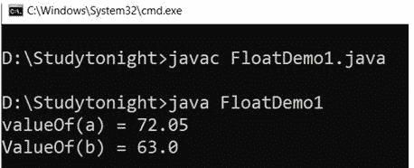

### 3.解析浮点()

此方法返回指定字符串值的浮点值。我们可以用它从字符串类型值中获取一个浮点值。

### 语法:

```java
	 public static float parseFloat(String val) throws NumberFormatException 

```

### 示例:

让我们举一个例子，其中我们有一个字符串类型的变量，并使用`parseFloat()`方法获取其浮点值。

```java
	 public class FloatDemo1
{ 
    public static void main(String[] args)  
	{ 
        float a = 72.05F;
		String b = "63"; 
		float x = Float.parseFloat(b); 
		System.out.println("parseFloat(b) = " + x);        
	}
} 

```

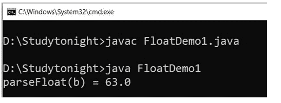

### 4\. 字节值（）

此方法用于从浮点对象中获取一个基元类型的浮点值。它在转换为类型 float 后返回由该对象表示的数值。

### 句法

```java
	 public byte byteValue() 

```

### 5\. 短值（）

此方法在扩展基元转换后以短整型形式返回此 Float 的值。

### 句法

```java
	 public short shortValue() 

```

### 6\. intValue（）

`intValue()`方法在一个扩展原语转换后，将该浮点值作为一个原语 int 类型返回。下面给出了该方法的语法。

### 句法

```java
	 public int intValue() 

```

### 7\. 长值（）

`longValue()`方法在扩展原语转换后，将该`Float`类型的值作为长类型返回。下面给出了该方法的语法。

### 句法

```java
	 public long longValue() 

```

### 8.doubleValue()

它在扩展基元转换后，将此`Float`类型的值作为双精度类型返回。下面给出了该方法的语法。

### 句法

```java
	 public double doubleValue() 

```

### 9\. 浮点值（）

此方法用于在扩展基元转换后将此`Float`类型的值作为`Float`类型获取。下面给出了该方法的语法。

### 语法:

```java
	 public float floatValue() 

```

### 示例:

让我们举一个例子来转换`Float`类型为 int，long 和 float 类型的值。在这个例子中，我们使用`intValue(), floatValue(), doubleValue()`方法。

```java
	 public class FloatDemo1
{ 
    public static void main(String[] args)  
	{ 
        float a = 72.05F;
		Float obj = new Float(a); 
		System.out.println("bytevalue(obj) = " + obj.byteValue()); 
		System.out.println("shortvalue(obj) = " + obj.shortValue()); 
		System.out.println("intvalue(obj) = " + obj.intValue()); 
		System.out.println("longvalue(obj) = " + obj.longValue()); 
		System.out.println("doublevalue(obj) = " + obj.doubleValue()); 
		System.out.println("floatvalue(obj) = " + obj.floatValue()); 
	}
} 

```

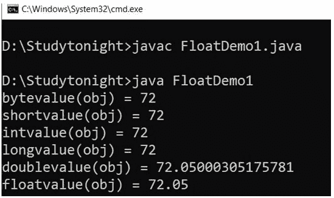

### 10\. hashCode()

此方法用于获取浮点值的哈希代码。它返回一个浮点对象的 int 值。

### 语法:

```java
	 public inthashCode() 

```

### 示例:

```java
	 public class FloatDemo1
{ 
    public static void main(String[] args)  
	{ 
        float a = 72.05F;
		Float obj = new Float(a); 
		int x = obj.hashCode(); 
		System.out.println("hashcode(x) = " + x); 
	}
} 

```

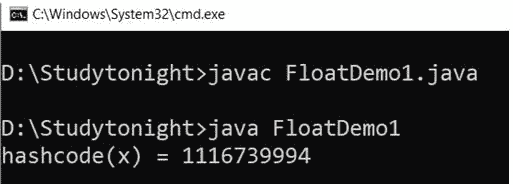

### 11\. isNaN（）

此方法返回真或假的布尔值。如果这个浮点值是一个**非数字(NaN)** ，则返回真，否则返回假。

### 语法:

```java
	 public booleanisNaN() 

```

### 示例:

让我们举个例子来检查给定的浮点值是否是 NaN。见下面的例子。

```java
	 public class FloatDemo1
{ 
    public static void main(String[] args)  
	{ 
        float a = 72.05F;
		Float obj = new Float(a); 
		Float x = Float.valueOf(a); 
		System.out.println("isNaN(d) = " + x.isNaN());  
	}
} 

```

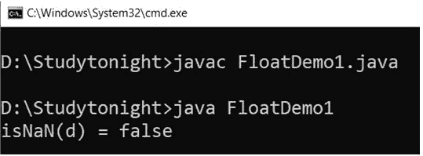

### 12\. 是无限（）

此方法用于检查浮点值的大小是否无限大。它返回真或假的布尔值。下面给出了该方法的语法。

### 语法:

```java
	 public booleanisInfinite() 

```

### 示例:

我们可以用这个方法来检查浮点值的范围是否无限。

```java
	 public class FloatDemo1
{ 
    public static void main(String[] args)  
	{ 
        float a = 72.05F;
		Float obj = new Float(a); 
		Float x = Float.valueOf(a); 
		x = Float.valueOf(Float.POSITIVE_INFINITY + 1); 
		System.out.println("Float.isInfinite(x) = " + Float.isInfinite(x.floatValue()));
	}
} 

```

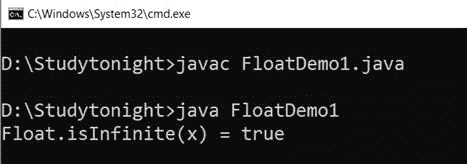

### 13\. 十六进制字符串（）

此方法用于获取浮点参数的十六进制字符串表示形式。它接受一个浮点型参数，该参数将被转换为十六进制值。下面给出了该方法的语法。

### 语法:

```java
	 public static String toHexString(float val) 

```

### 示例:

```java
	 public class FloatDemo1
{ 
    public static void main(String[] args)  
	{ 
        float a = 72.05F;
		Float obj = new Float(a); 
		System.out.println("Float.toString(a) = " + Float.toHexString(a));	
	}
} 

```

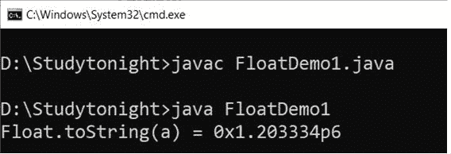

### 14.浮点位()

此方法用于根据 IEEE 754 浮点“单一格式”位布局获取指定浮点值的表示。它需要浮点参数。下面给出了该方法的语法。

### 语法:

```java
	 public static intfloatToIntBits(float val) 

```

### 示例:

在这个例子中，我们使用`floattointbits()`方法返回浮点值的位布局。

```java
	 public class FloatDemo1
{ 
    public static void main(String[] args)  
	{ 
        float a = 72.05F;
		Float obj = new Float(a); 
		int x = Float.floatToIntBits(a); 
		System.out.println("Float.floatToLongBits(a) = " + x); 
	}
} 

```

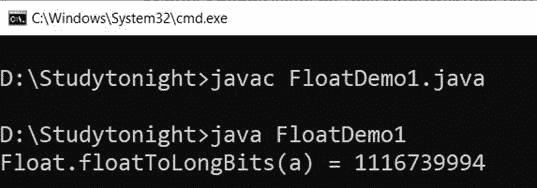

### 15.floatToRawIntBits()

此方法根据 IEEE 754 浮点“单一格式”位布局返回指定浮点值的表示形式，保留非数字(NaN)值。下面给出了该方法的语法。

### 语法:

```java
	 public static intfloatToRawIntBits(float val) 

```

### 示例:

```java
	 public class FloatDemo1
{ 
    public static void main(String[] args)  
	{ 
        float a = 72.05F;
		Float obj = new Float(a); 
		int x = Float.floatToRawIntBits(a); 
		System.out.println("Float.floatToRawIntBits(a) = " + x); 
	}
} 

```

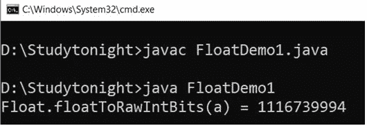

### 16.IntBitsToFloat()

此方法用于获取具有相同位模式的浮点值。根据 IEEE 754 浮点“单一格式”位布局，该参数被认为是浮点值的表示。下面给出了该方法的语法。

### 语法:

```java
	 public static float IntBitsToFloat(long b) 

```

### 示例:

让我们举个例子来理解一下返回浮点值的`intbitstofloat()`方法。

```java
	 public class FloatDemo1
{ 
    public static void main(String[] args)  
	{ 
		int a = 72;
		float y = Float.intBitsToFloat(a); 
		System.out.println("Float.intBitsToFloat(a) = " + y); 
	}
} 

```

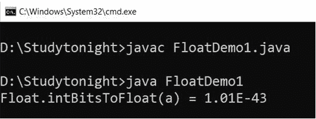

### 17.等于()

`equals()`方法将一个对象与指定的对象进行比较。如果对象相同，则返回 true 否则为假。下面给出了该方法的语法。

### 语法:

```java
	 public boolean equals(Object obj) 

```

### 示例:

我们正在使用 equals 方法比较两个浮点对象，如果两个对象都为真，则该方法返回 true。

```java
	 public class FloatDemo1
{ 
    public static void main(String[] args)  
	{ 
		float a = 25.34F;
		String b = "26";
        Float obj = new Float(a); 
        Float obj1 = new Float(b); 
		boolean x = obj.equals(obj1); 
		System.out.println("obj.equals(obj1) = " + x);
	}
} 

```

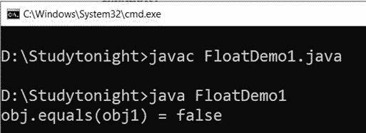

### 18.compareTo()

此方法用于对两个浮动对象进行数值比较。如果两个浮点对象相等，则返回 0。如果一个浮点对象小于参数对象，则返回小于 0 的值。如果一个浮点对象的数值大于参数浮点对象，则返回大于 0 的值。下面给出了该方法的语法。

### 语法:

```java
	 public intcompareTo(Float b) 

```

### 示例:

在本例中，我们使用`compareTo()`方法比较两个浮动对象，该方法对两个浮动对象进行数值比较并返回一个数值。

```java
	 public class FloatDemo1
{ 
    public static void main(String[] args)  
	{ 
		float a = 25.34F;
		String b = "26";
        Float obj = new Float(a); 
        Float obj1 = new Float(b); 
		int x = obj.compareTo(obj1); 
		System.out.println("obj.compareTo(obj1) = " + x);
	}
} 

```

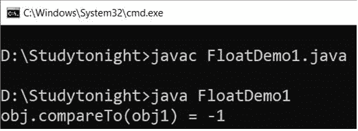

### 19.比较()

它用于在数值上比较两个浮点值。返回的值与。下面给出了该方法的语法。

### 语法:

```java
	 public static int compare(float x,float y) 

```

### 示例:

我们可以使用比较方法来比较两个浮点值。如果两者相等，则返回 0，否则返回负值或正值。

```java
	 public class FloatDemo1
{ 
    public static void main(String[] args)  
	{ 
		float a = 25.34F;
		String b = "26";
        Float obj = new Float(a); 
        Float obj1 = new Float(b); 
		int x = Float.compare(obj, obj1); 
		System.out.println("compare(obj, obj1) = " + x);
	}
} 

```

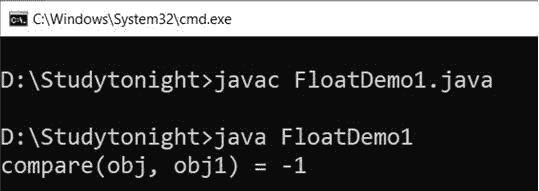

* * *