# Java 双类

> 原文：<https://www.studytonight.com/java/double-class.php>

double 类是一个包装类，用于包装对象中基本 Double 类型的值。类型为 double 的对象包含类型为 Double 的单个字段。Double 类扩展了 Number 类并实现了 Comparable 接口。

此外，此类提供了将双精度转换为字符串和将字符串转换为双精度的几种方法，以及处理双精度时有用的其他常量和方法。该类的声明如下。

### 声明:

```java
public final class Double extends Number implements Comparable<Double>
```

在这里，我们将解释 Double 类的方法和它们的例子。

### 1.toString()

它返回一个表示指定双精度对象的新字符串。下面给出了该方法的语法。

### 语法:

```java
	 public String toString(double b) 

```

### 示例:

让我们举一个例子来获取一个双重类型的字符串对象。我们使用了静态的 toString()方法，这样我们就可以通过使用类名来调用它。见下面的例子。

```java
	 public class DoubleDemo1
{ 
    public static void main(String[] args) 
    { 
        double a = 46.23; 
		System.out.println("toString(a) = " + Double.toString(a)); 
     }
} 

```

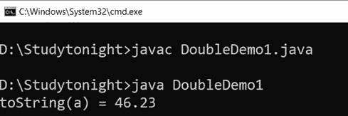

### 2.valueOf()

此方法返回一个表示指定双精度值的 Double 实例。此方法通常应优先于构造器 Double(double)使用。它需要双类型的单个参数。

### 语法:

```java
	 public static Double valueOf(double b) 

```

### 示例:

在这个例子中，我们使用`valueOf()`方法返回表示指定双精度类型的 Double 类的实例。

```java
	 public class DoubleDemo1
{ 
    public static void main(String[] args) 
    { 
        double a = 46.23; 
        String b = "85";
        Double x = Double.valueOf(a); 
	   	System.out.println("valueOf(a) = " + x); 
        x = Double.valueOf(b); 
		System.out.println("ValueOf(b) = " + x); 
     }
} 

```

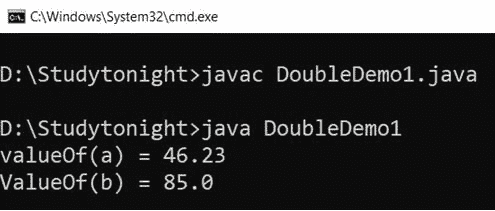

### 3.parseDouble()

此方法返回指定字符串值的双精度值。我们可以用它从字符串类型值中获取一个双精度值。它只接受一个字符串类型的参数。

### 语法:

```java
	 public static double parseDouble(String val) throws NumberFormatException 

```

### 示例:

让我们举一个例子，其中我们有一个字符串类型的变量，并使用`parseDouble()`方法获得它的双精度值。

```java
	 public class DoubleDemo1
{ 
    public static void main(String[] args) 
    { 
        double a = 46.23; 
	String b = "85";
        double x = Double.parseDouble(b); 
System.out.println("parseDouble(b) = " + x);
     }
} 

```

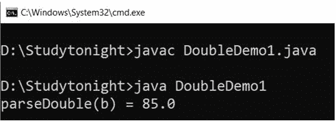

### 4\. 字节值（）

该方法用于从 double 对象中获取一个基元类型的 Double 值。在转换为 double 类型后，它返回由该对象表示的数值。

### 句法

```java
	 public byte byteValue() 

```

### 5\. 短值（）

此方法在加宽基元转换后，将此 double 的值作为 Double 返回。下面给出了该方法的语法。

### 句法

```java
	 public short shortValue() 

```

### 6\. intValue（）

`intValue()`方法在扩展基元转换后，将该 Double 的值作为基元 int 类型返回。下面给出了该方法的语法。

### 句法

```java
	 public int intValue() 

```

### 7\. 长值（）

`longValue()`方法在扩展原语转换后，将该 Double 类型的值作为长类型返回。下面给出了该方法的语法。

### 句法

```java
	 public long longValue() 

```

### 8.doubleValue()

它在扩展基元转换后，将该 double 类型的值作为 Double 类型返回。下面给出了该方法的语法。

### 句法

```java
	 public double doubleValue() 

```

### 9\. 浮点值（）

此方法用于在扩展基元转换后将此 Double 类型的值作为浮点类型获取。下面给出了该方法的语法。

### 句法

```java
	 public float floatValue() 

```

### 示例:

让我们举一个例子，将 double 类型转换为 int、long 和 float 类型的值。在这个例子中，我们使用`intValue(), floatValue(), doubleValue()`方法。

```java
	 public class DoubleDemo1
{ 
    public static void main(String[] args) 
    { 
        double a = 46.23; 
		Double obj = new Double(a); 
		System.out.println("bytevalue(obj) = " + obj.byteValue()); 
		System.out.println("shortvalue(obj) = " + obj.shortValue()); 
		System.out.println("intvalue(obj) = " + obj.intValue()); 
		System.out.println("longvalue(obj) = " + obj.longValue()); 
		System.out.println("doublevalue(obj) = " + obj.doubleValue()); 
		System.out.println("floatvalue(obj) = " + obj.floatValue());
     }
} 

```

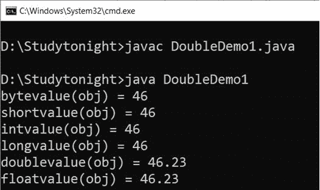

### 10\. hashCode()

此方法用于获取双类型值的哈希代码。它返回一个双对象的 int 值。

### 语法:

```java
	 public inthashCode() 

```

### 示例:

```java
	 public static void main(String[] args) 
    { 
        double a = 46.23; 
        Double obj = new Double(a); 
        int x = obj.hashCode(); 
   	  	System.out.println("hashcode(x) = " + x); 
     }
} 

```

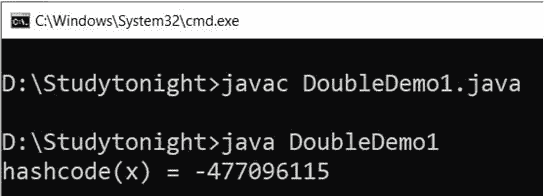

### 11\. isNaN（）

此方法返回真或假的布尔值。如果这个 Double 值是一个**非数字(NaN)** ，则返回 true，否则返回 false。

### 语法:

```java
	 public booleanisNaN() 

```

### 示例:

让我们举个例子来检查给定的双精度值是否是 NaN。见下面的例子。

```java
	 public class DoubleDemo1
{ 
    public static void main(String[] args) 
    { 
        double a = 46.23; 
        Double obj = new Double(a); 
        Double x = Double.valueOf(a); 
    	System.out.println("isNaN(x) = " + x.isNaN());  
     }
} 

```

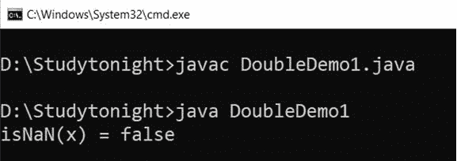

### 12\. 是无限（）

这个方法是用来检查双值的大小是否无限大。它返回真或假的布尔值。下面给出了该方法的语法。

### 语法:

```java
	 public booleanisInfinite() 

```

### 示例:

我们可以用这个方法来检查 Double 值的范围是否无限。

```java
	 public class DoubleDemo1
{ 
    public static void main(String[] args) 
    { 
        double a = 46.23; 
        Double obj = new Double(a); 
        Double x = Double.valueOf(a);
        x = Double.valueOf(Double.POSITIVE_INFINITY + 1); 
   	    System.out.println("Double.isInfinite(x) = " + Double.isInfinite(x.doubleValue()));   
     }
} 

```

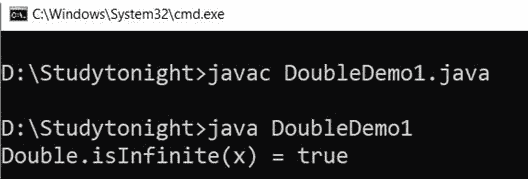

### 13\. 十六进制字符串（）

此方法用于获取双参数的十六进制字符串表示形式。它采用双类型参数，该参数将被转换为十六进制值。下面给出了该方法的语法。

### 语法:

```java
	 public static String toHexString(double val) 

```

### 示例:

```java
	 public class DoubleDemo1
{ 
    public static void main(String[] args) 
    { 
        double a = 46.23; 
        Double obj = new Double(a); 
        Double x = Double.valueOf(a);
	    System.out.println("Double.toHexString(a) = " + Double.toHexString(a));         
    }
} 

```


### 14.doubleToLongBits()

此方法用于根据 IEEE 754 浮点“单一格式”位布局获取指定浮点值的表示。它需要浮点参数。下面给出了该方法的语法。

### 语法:

```java
	 public static long doubleToLongBits(double val) 

```

### 示例:

在本例中，我们使用 floattointbits()方法，该方法返回浮点值的位布局。

```java
	 public class DoubleDemo1
{ 
    public static void main(String[] args) 
    { 
        double a = 46.23; 
		Double obj = new Double(a); 
		long x = Double.doubleToLongBits(a); 
		System.out.println("Double.doubleToLongBits(a) = " + x);        
	}
} 

```


### 15.doubleToRawLongBits()

此方法根据 IEEE 754 浮点“单一格式”位布局返回指定浮点值的表示形式，保留非数字(NaN)值。下面给出了该方法的语法。

### 语法:

```java
	 public static long doubleToRawLongBits(double val) 

```

### 示例:

```java
	 public class DoubleDemo1
{ 
    public static void main(String[] args) 
    { 
        double a = 46.23; 
		Double obj = new Double(a); 
		long x = Double.doubleToRawLongBits(a); 
		System.out.println("Double.doubleToRawLongBits(a) = " + x);        
	}
} 

```


### 16.LongBitsToDouble()

此方法用于获取具有相同位模式的双浮点值。根据 IEEE 754 浮点“单一格式”位布局，该参数被认为是浮点值的表示。下面给出了该方法的语法。

### 句法

```java
	 public static double LongBitsToDouble(long b) 

```

### 示例:

让我们举一个例子来理解返回浮点值的 intbitstofloat()方法。

```java
	 public class DoubleDemo1
{ 
    public static void main(String[] args) 
    { 
        double a = 46.23; 
		Double obj = new Double(a); 
		long x = Double.doubleToLongBits(a); 
        double y = Double.longBitsToDouble(x); 
		System.out.println("Double.LongBitsToDouble(x) = " + y);       
	}
} 

```

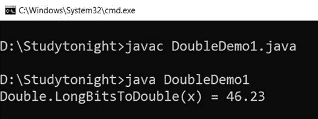

### 17.等于()

`equals()`方法将一个对象与指定的对象进行比较。如果对象相同，则返回 true 否则为假。下面给出了该方法的语法。

### 语法:

```java
	 public boolean equals(Object obj) 

```

### 示例:

我们正在使用 equals 方法比较两个双对象，如果两个对象都为真，则该方法返回 true。

```java
	 public class DoubleDemo1
{ 
    public static void main(String[] args) 
    { 
        double a = 46.23; 
		String b ="12";
		Double obj = new Double(a);
		Double obj1 = new Double(b); 
		boolean x = obj.equals(obj1); 
		System.out.println("obj.equals(obj1) = " + x); 
	}
} 

```

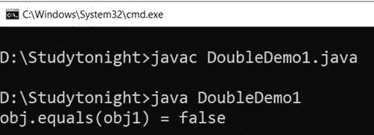

### 18.compareTo()

这种方法用于对两个双物体进行数值比较。如果两个双对象相等，则返回 0。如果一个双精度对象小于参数对象，则返回小于 0 的值。如果一个 double 对象的数值大于参数 double 对象，则返回大于 0 的值。下面给出了该方法的语法。

### 语法:

```java
	 public intcompareTo(Double b) 

```

### 示例:

在本例中，我们使用`compareTo()`方法比较两个双对象，该方法对两个双对象进行数值比较并返回一个数值。

```java
	 public class DoubleDemo1
{ 
    public static void main(String[] args) 
    { 
        double a = 46.23; 
		String b ="12";
		Double obj = new Double(a);
		Double obj1 = new Double(b); 
		int x = obj.compareTo(obj1); 
		System.out.println("obj.compareTo(obj1) = " + x); 
	}
} 

```

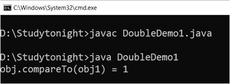

### 19.比较()

它用于在数值上比较两个双精度值。返回的值与。下面给出了该方法的语法。

### 语法:

```java
	 public static int compare(double x,double y) 

```

### 示例:

我们可以使用比较方法来比较两个双精度值。如果两者相等，则返回 0，否则返回负值或正值。

```java
	 public class DoubleDemo1
{ 
    public static void main(String[] args) 
    { 
        double a = 46.23; 
		String b ="12";
		Double obj = new Double(a);
		Double obj1 = new Double(b); 
		int x = Double.compare(obj, obj1); 
		System.out.println("compare(obj, obj1) = " + x); 
	}
} 

```

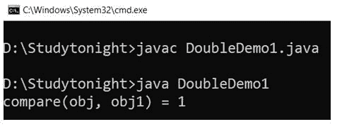

* * *