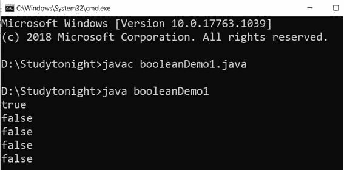
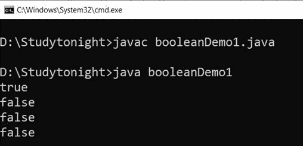
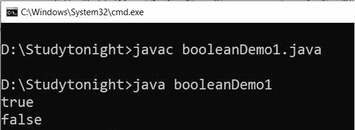
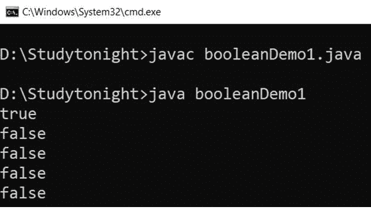
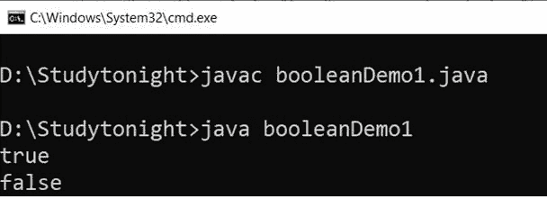
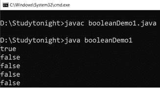
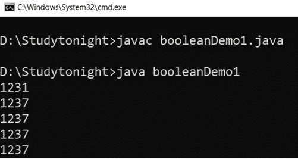
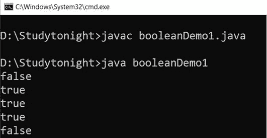
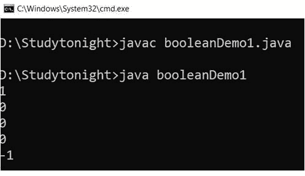
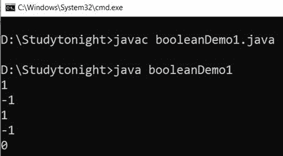

# Java `Boolean`类

> 原文：<https://www.studytonight.com/java/boolean-class.php>

`Boolean`类是类中的包装器，用于包装对象中基本类型布尔的值。`Boolean`类型的对象包含一个类型为布尔的字段。

这个类包含许多帮助方法，用于将布尔值转换为字符串和将字符串转换为布尔值，以及在使用布尔值时有帮助的其他常量和方法。

这个类位于 java.lang 包中，有以下声明。

### 申报

```java
public final class Boolean extends Object implements Serializable, Comparable<Boolean>
```

这里我们解释`Boolean`类的各种方法和它们的例子。

### 1.解析布尔(字符串)

`parseBoolean()`方法用于将字符串参数解析为布尔值。它返回真或假的布尔值。如果字符串参数不为 null 并且等于字符串“true”，则忽略大小写，返回 true。

它接受一个包含要解析的布尔表示的字符串参数。

### 语法:

```java
	 public static boolean parseBoolean(String s) 

```

### 示例:

在本例中，我们使用`parseBoolean()`方法将字符串参数解析为`Boolean`类型。如果指定的字符串可以解析为布尔值，则此方法返回 true，否则返回 false。

```java
	 public class booleanDemo1
{ 
    public static void main(String[] args) 
    { 
        boolean obj1 = Boolean.parseBoolean("True"); 
    	boolean obj2 = Boolean.parseBoolean("False");
        boolean obj3 = Boolean.parseBoolean("StUdYtONiGhT"); 
        boolean obj4 = Boolean.parseBoolean("STUDYTONIGHT"); 
        boolean obj5 = Boolean.parseBoolean("studytonight"); 
        System.out.println(obj1); 
        System.out.println(obj2); 
        System.out.println(obj3); 
        System.out.println(obj4); 
        System.out.println(obj5);   
    } 
} 

```



### 2.booleanValue()

`booleanValue()`方法用于获取该布尔对象的布尔值作为布尔基元。它返回布尔对象的基元类型布尔值。该方法的声明如下。

### 语法:

```java
	 public boolean booleanValue() 

```

### 示例:

我们使用`booleanValue()`方法获取布尔对象的布尔值。见下面的例子。

```java
	 public class booleanDemo1
{ 
    public static void main(String[] args) 
    { 
        Boolean obj1 = new Boolean("True"); 
        Boolean obj2 = new Boolean("StUdYtONiGhT"); 
        Boolean obj3 = new Boolean("STUDYTONIGHT"); 
        Boolean obj4 = new Boolean("studytonight"); 

    	boolean obj5 = obj1.booleanValue();
    	boolean obj6 = obj2.booleanValue();
    	boolean obj7 = obj3.booleanValue();
    	boolean obj8 = obj4.booleanValue();

        System.out.println(obj5); 
        System.out.println(obj6); 
        System.out.println(obj7); 
        System.out.println(obj8);   
    } 
} 

```



### 3.valueOf(布尔型 b)

`valueOf()`方法用于获取表示指定布尔值的布尔实例。如果指定的布尔值为真，则此方法返回布尔值。**真**；如果为 false，则此方法返回布尔值。 **FALSE。**

此方法采用`Boolean`类型参数，并返回表示指定参数的布尔对象。

### 语法:

```java
	 public static boolean valueOf(boolean b) 

```

### 示例:

在本例中，我们将基元类型布尔值解析为布尔对象。我们用`valueOf()`方法得到布尔对象。

```java
	 public class booleanDemo1
{ 
    public static void main(String[] args) 
    { 
    	boolean obj1 = true;
    	boolean obj2 = false;

    	Boolean obj3 = Boolean.valueOf(obj1);
    	Boolean obj4 = Boolean.valueOf(obj2);

        System.out.println(obj3); 
        System.out.println(obj4);    
    } 
} 

```



### 4.valueOf(字符串 s)

`valueOf()`方法用于获取一个布尔值，该值由指定的字符串表示。它接受一个字符串参数，并返回一个由指定参数表示的布尔值。

### 语法:

```java
	 public static boolean valueOf(String s) 

```

### 示例:

```java
	 public class booleanDemo1
{ 
    public static void main(String[] args) 
    { 
        Boolean obj1 = Boolean.valueOf("True"); 
        Boolean obj2 = Boolean.valueOf(null);
        Boolean obj3 = Boolean.valueOf("StUdYtONiGhT"); 
        Boolean obj4 = Boolean.valueOf("STUDYTONIGHT"); 
        Boolean obj5 = Boolean.valueOf("studytonight"); 
        System.out.println(obj1); 
        System.out.println(obj2); 
        System.out.println(obj3); 
        System.out.println(obj4); 
        System.out.println(obj5);   
    } 
} 

```



### 5\. toString（布尔值 b）

此方法用于获取表示指定布尔值的字符串对象。如果指定的布尔值为真，则返回的字符串为**“真”**，否则返回字符串**“假”**。

它接受一个布尔值参数，并返回指定布尔值的字符串表示形式。下面给出了该方法的语法。

### 语法:

```java
	 public static String toString(boolean b) 

```

### 示例:

我们可以使用这个方法来获取`Boolean`类型值的字符串表示。在这个例子中，我们取两个保存布尔值的布尔变量，并使用 toString()方法获取它们的字符串值。见下面的例子。

```java
	 public class booleanDemo1
{ 
    public static void main(String[] args) 
    { 
        boolean obj1 = true; 
        boolean obj2 = false; 

        String s1 = Boolean.toString(obj1); 
        String s2 = Boolean.toString(obj2); 

        System.out.println(s1); 
        System.out.println(s2);
    } 
} 

```



### 6.toString()

此方法返回一个表示该布尔值的字符串对象。如果该对象表示值为真，则返回一个等于**“真”**的字符串。否则，返回等于**“假”**的字符串。这不需要任何争论。

### 语法:

```java
	 public String toString() 

```

### 示例:

在这个例子中，我们使用`toString()`方法获得了布尔对象的字符串表示。

```java
	 public class booleanDemo1
{ 
    public static void main(String[] args) 
    { 
        Boolean obj1 = new Boolean("True"); 
        Boolean obj2 = new Boolean(null);
        Boolean obj3 = new Boolean("StUdYtONiGhT"); 
        Boolean obj4 = new Boolean("STUDYTONIGHT"); 
        Boolean obj5 = new Boolean("studytonight"); 

    	String s1 = obj1.toString();
    	String s2 = obj2.toString();
    	String s3 = obj3.toString();
    	String s4 = obj4.toString();
    	String s5 = obj5.toString();

		System.out.println(s1); 
        System.out.println(s2); 
        System.out.println(s3); 
        System.out.println(s4); 
        System.out.println(s5); 
    } 
} 

```



### 7\. int hashcode（）

此方法用于获取布尔值的哈希代码。它返回一个布尔对象的哈希码值。它不接受任何参数，但返回一个表示布尔值哈希代码的 int 值。

这个方法包含在 Java 8 版本中。下面给出了该方法的语法。

### 语法:

```java
	 public int hashCode() 

```

### 示例:

让我们创建一个示例来获取布尔值的哈希代码。这里我们已经创建了几个布尔变量，用来获取不同的哈希代码值。

```java
	 public class booleanDemo1
{ 
    public static void main(String[] args) 
    { 
        Boolean obj1 = new Boolean("True"); 
        Boolean obj2 = new Boolean(null);
        Boolean obj3 = new Boolean("StUdYtONiGhT"); 
        Boolean obj4 = new Boolean("STUDYTONIGHT"); 
        Boolean obj5 = new Boolean("studytonight"); 

		System.out.println(obj1.hashCode()); 
        System.out.println(obj2.hashCode()); 
        System.out.println(obj3.hashCode()); 
        System.out.println(obj4.hashCode()); 
        System.out.println(obj5.hashCode()); 
    } 
} 

```



### 8.等于(对象对象)

`equal()`方法用于检查两个布尔对象是否代表相同的值。此方法用于比较两个布尔值，如果两者相等，则返回 true，否则返回 false。

它接受一个不应为 null 的参数，并返回一个布尔值 true 或 false。下面给出了该方法的语法。

### 语法:

```java
	 boolean equals(Object obj) 

```

### 示例:

让我们创建一个示例来比较两个布尔值是否具有相同的值。如果两个值相同，则返回 true。

```java
	 public class booleanDemo1
{ 
    public static void main(String[] args) 
    { 
        Boolean obj1 = new Boolean("True"); 
        Boolean obj2 = new Boolean(null);
        Boolean obj3 = new Boolean("StUdYtONiGhT"); 
        Boolean obj4 = new Boolean("STUDYTONIGHT"); 
        Boolean obj5 = new Boolean("studytonight"); 

		System.out.println(obj1.equals(obj2)); 
        System.out.println(obj2.equals(obj3)); 
        System.out.println(obj3.equals(obj4)); 
        System.out.println(obj4.equals(obj5)); 
        System.out.println(obj5.equals(obj1)); 
    } 
} 

```



### 9.比较

`compareTo()`方法用于比较一个布尔实例和另一个布尔实例。此方法在接受`Boolean`类型的单个参数的`Comparable`接口中指定。

如果两个对象表示相同的布尔值，则返回 0；如果此对象为真，而参数为假，则为正值；如果此对象表示 false，并且参数表示 true，则为负值。

### 语法:

```java
	 public int compareTo(Boolean b) 

```

### 示例:

让我们举个例子，用`compareTo()`比较两个布尔对象。这将根据对象比较返回一个 int 值。

```java
	 public class booleanDemo1
{ 
    public static void main(String[] args) 
    { 
        Boolean obj1 = new Boolean("True"); 
        Boolean obj2 = new Boolean(null);
        Boolean obj3 = new Boolean("StUdYtONiGhT"); 
        Boolean obj4 = new Boolean("STUDYTONIGHT"); 
        Boolean obj5 = new Boolean("studytonight"); 

		System.out.println(obj1.compareTo(obj2)); 
        System.out.println(obj2.compareTo(obj3)); 
        System.out.println(obj3.compareTo(obj4)); 
        System.out.println(obj4.compareTo(obj5)); 
        System.out.println(obj5.compareTo(obj1)); 
    } 
} 

```



### 10.int compare(布尔 x，布尔 y)

`compare()`方法用于比较两个布尔值。它接受两个布尔参数，如果两个值相等，则返回 0；负整数或正整数。下面给出了该方法的语法。

### 语法:

```java
	 public static int compare(boolean x, boolean y) 

```

### 示例:

让我们举一个比较两个布尔值并根据比较结果返回整数的例子。

```java
	 public class booleanDemo1
{ 
    public static void main(String[] args) 
    { 
        boolean obj1 = true;
        boolean obj2 = false;
        boolean obj3 = true;
        boolean obj4 = false;
        boolean obj5 = true;

		System.out.println(Boolean.compare(obj1, obj2)); 
        System.out.println(Boolean.compare(obj2, obj3)); 
        System.out.println(Boolean.compare(obj3, obj4)); 
        System.out.println(Boolean.compare(obj4, obj5)); 
        System.out.println(Boolean.compare(obj5, obj1)); 
    } 
} 

```



* * *