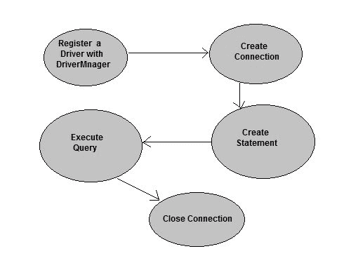

# 将 Java 应用程序连接到数据库的步骤

> 原文：<https://www.studytonight.com/java/steps-to-connect-to-database-in-java.php>

以下 5 个步骤是使用 JDBC 将 Java 应用程序与数据库连接的基本步骤。

1.  注册驱动程序
2.  创建连接
3.  创建 SQL 语句
4.  执行 SQL 语句
5.  关闭连接



### 注册驱动程序

它首先是建立 JDBC 联系的一个重要部分。JDBC API 提供了一种方法`Class.forName()`，用于显式加载驱动程序类。例如，如果我们想要加载一个 jdbc-odbc 驱动程序，那么我们可以这样调用它。

### 向 JDBC-ODBC 驱动程序注册的示例

```java
Class.forName("sun.jdbc.odbc.JdbcOdbcDriver");
```

### 创建连接

在步骤 1 中注册并加载驱动程序后，现在我们将使用 DriverManager 类的`getConnection()`方法创建一个连接。这个方法有几个重载方法，可以根据需求使用。基本上，它需要数据库名称、用户名和密码来建立连接。下面给出了该方法的语法。

### 句法

```java
getConnection(String url)
getConnection(String url, String username, String password)
getConnection(String url, Properties info)
```

这是一个与 Oracle 驱动程序建立连接的示例

```java
Connection con = DriverManager.getConnection("jdbc:oracle:thin:@localhost:1521:XE","username","password");
```

```java
	 import java.sql.*;
class Test {
 public static void main(String[] args) {
  try {
   //Loading driver
   Class.forName("oracle.jdbc.driver.OracleDriver");

   //creating connection
   Connection con = DriverManager.getConnection("jdbc:oracle:thin:@localhost:1521:XE", "username", "password");

   Statement s = con.createStatement(); //creating statement

   ResultSet rs = s.executeQuery("select * from Student"); //executing statement

   while (rs.next()) {
    System.out.println(rs.getInt(1) + " " + rs.getString(2));
   }

   con.close(); //closing connection
  } catch (Exception e) {
   e.printStacktrace();
  }
 }
} 

```

### 创建 SQL 语句

在这一步中，我们将使用 create statement()方法创建语句对象。它用于执行 sql 查询，并在连接类中定义。下面给出了该方法的语法。

### 句法

```java
public Statement createStatement() throws SQLException
```

### 创建 SQL 语句的示例

```java
Statement s=con.createStatement();
```

### 执行 SQL 语句

创建语句后，现在使用语句界面的`executeQuery()`方法执行。此方法用于执行 SQL 语句。下面给出了该方法的语法。

### 句法

```java
public ResultSet executeQuery(String query) throws SQLException
```

### 执行 SQL 语句的示例

在这个例子中，我们正在执行一个 sql 查询，从用户表中选择所有的记录并存储到 resultset 中，resultset 进一步用于显示这些记录。

```java
ResultSet rs=s.executeQuery("select * from user");
  while(rs.next())
  {
   System.out.println(rs.getString(1)+" "+rs.getString(2));
 }
```

### 关闭连接

这是最后一步，包括关闭我们在前面步骤中打开的所有连接。执行完 SQL 语句后，您需要关闭连接并释放会话。连接界面的`close()`方法用于关闭连接。

### 句法

```java
public void close() throws SQLException
```

### 关闭连接的示例

```java
con.close();
```

现在，让我们将所有这些步骤组合成一个示例，并创建一个完整的 JDBC 连通性示例。

### 示例:所有步骤进入一个地方

```java
	 import java.sql.*;
class Test {
 public static void main(String[] args) {
  try {
   //Loading driver
   Class.forName("oracle.jdbc.driver.OracleDriver");

   //creating connection
   Connection con = DriverManager.getConnection("jdbc:oracle:thin:@localhost:1521:XE", "username", "password");

   Statement s = con.createStatement(); //creating statement

   ResultSet rs = s.executeQuery("select * from Student"); //executing statement

   while (rs.next()) {
    System.out.println(rs.getInt(1) + " " + rs.getString(2));
   }

   con.close(); //closing connection
  } catch (Exception e) {
   e.printStacktrace();
  }
 }
} 

```