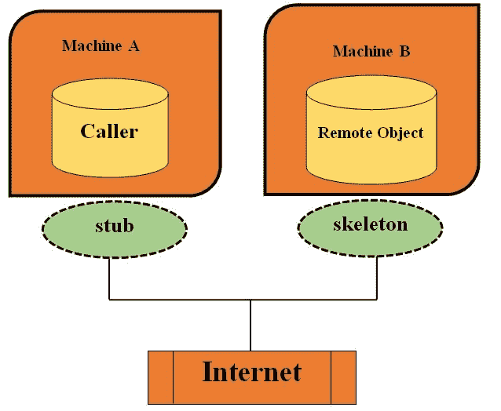
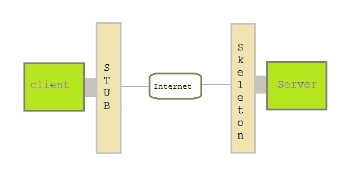
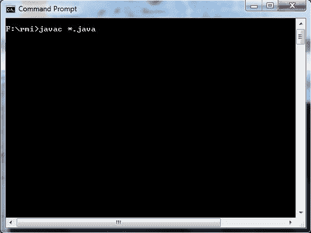
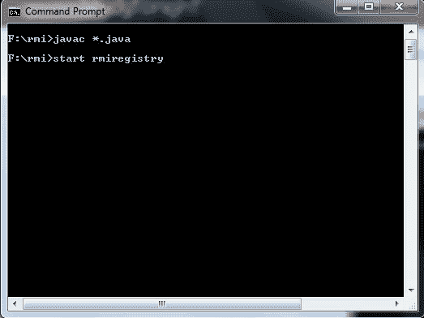
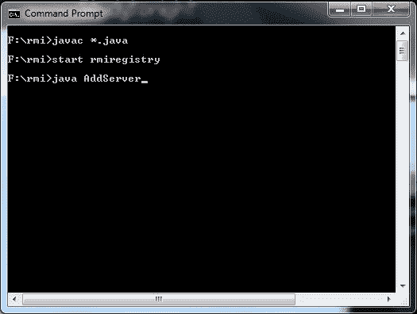
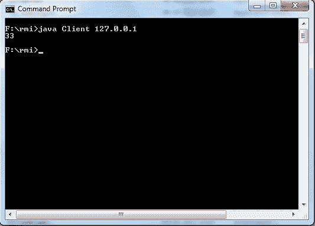
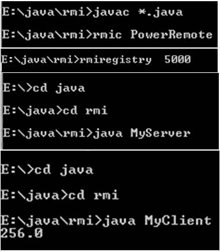

# Java RMI

> 原文：<https://www.studytonight.com/java/rmi-in-java.php>

远程方法调用(RMI)允许 java 对象在另一台机器上运行的对象上调用方法。RMI 提供 java 程序之间远程通信。RMI 用于构建分布式应用。

* * *

### RMI 应用的概念

一个 RMI 应用可以分为两部分，**客户端**程序和**服务器**程序。一个**服务器**程序创建一些远程对象，使它们的引用可供客户端调用其上的方法。一个**客户端**程序请求服务器上的远程对象，并在其上调用方法。**存根**和**骨架**是用于与远程对象通信的两个重要对象。

* * *

### 烟蒂

在 RMI 中，存根是一个用作客户端网关的对象。所有传出的请求都是通过它发送的。当客户端调用存根对象上的方法时，会在内部执行以下操作:

1.  使用远程虚拟机建立连接。
2.  然后，它将参数传输到远程虚拟机。这也被称为法警
3.  在第二步之后，它等待输出。
4.  现在它读取作为输出的值或异常。
5.  最后，它将值返回给客户端。

* * *

### 骨骼

在 RMI 中，骨架是用作服务器端网关的对象。所有传入的请求都是通过它发送的。当服务器调用骨架对象上的方法时，会在内部执行以下操作:

1.  读取远程方法的所有参数。
2.  在远程对象上调用方法。
3.  然后，它写入并传输结果的参数。这也被称为法警。



* * *

### 存根和骨架

**存根**作为客户端程序的网关。它驻留在客户端，与**骨骼**对象通信。它建立远程对象之间的连接，并向其发送请求。



骨架对象驻留在服务器程序上。它负责将请求从**存根**传递到远程对象。

* * *

### 创建一个简单的 RMI 应用包括以下步骤

*   定义远程接口。
*   实现远程接口。
*   创建并启动远程应用
*   创建并启动客户端应用

* * *

### 定义远程接口

远程接口指定客户端可以远程调用的方法。客户端程序与远程接口通信，而不是与实现它的类通信。要成为远程接口，一个接口必须扩展 **java.rmi** 包的**远程**接口。

```java
import java.rmi.*;
public interface AddServerInterface extends Remote
{
public int sum(int a,int b);
}
```

* * *

### 远程接口的实现

为了实现远程接口，一个类必须扩展 **UnicastRemoteObject** 或者使用 **UnicastRemoteObject** 类的 exportObject()方法。

```java
import java.rmi.*;
import java.rmi.server.*;
public class Adder extends UnicastRemoteObject implements AddServerInterface
{
	Adder()throws RemoteException{
	super();
}
public int sum(int a,int b)
{
	return a+b;
}
}
```

* * *

### 创建 AddServer 并托管 rmi 服务

您需要创建一个服务器应用，并在其中托管 rmi 服务**加法器**。这是使用 **java.rmi .命名**类的`rebind()`方法完成的。`rebind()`方法取两个参数，第一个参数代表对象引用的名称，第二个参数是引用实例**加法器**

```java
import java.rmi.*;
import java.rmi.registry.*;
public class AddServer {
	public static void main(String args[]) {
		try {
			AddServerInterface addService=new Adder();
			Naming.rebind("AddService",addService);	//addService object is hosted with name AddService

		}
		catch(Exception e) {
			System.out.println(e);
		}
	}
}
```

* * *

### 创建客户端应用

客户端应用包含一个 java 程序，该程序调用**命名**类的`lookup()`方法。这个方法接受一个参数，即 **rmi** URL，并返回一个对类型为 **AddServerInterface** 的对象的引用。所有远程方法调用都是在这个对象上完成的。

```java
import java.rmi.*;
public class Client {
	public static void main(String args[]) {
		try{
			AddServerInterface st = (AddServerInterface)Naming.lookup("rmi://"+args[0]+"/AddService");
			System.out.println(st.sum(25,8));
		}
		catch(Exception e) {
			System.out.println(e);
		}
	}
}
```

* * *

### 运行这个 RMI 应用的步骤

将上述所有 java 文件保存到一个目录中，并将其命名为“rmi”

*   compile all the java files

    ```java
    javac *.java
    ```

    

*   Start RMI registry

    ```java
    start rmiregistry
    ```

    

*   Run Server file

    ```java
    java AddServer
    ```

    

*   Run Client file in another command prompt abd pass local host port number at run time

    ```java
    java Client 127.0.0.1
    ```

    

* * *

### 示例:

**节目:Power.java**

```java
	 import java.rmi.*;  
public interface Power extends Remote
{  
	public int power1()throwsRemoteException;  
} 

```

**节目:PowerRemote.java**

```java
	 import java.rmi.*;  
import java.rmi.server.*; 
import java.util.Scanner; 
public class PowerRemote extends UnicastRemoteObject implements Power
{  
PowerRemote()throws RemoteException
{  
	super();  
}  
public int power1(int z)
{
int z;
Scanner sc = new Scanner(System.in);
System.out.println("Enter the base number ::");
int x = sc.nextInt();
System.out.println("Enter the exponent number ::");
int y = sc.nextInt();
               z=y^x;
System.out.println(z);
}  
} 

```

**MyServer.java**

```java
	 import java.rmi.*;  
import java.rmi.registry.*;  
public class MyServer
{  
public static void main(String args[])
{  
try
{  
Power stub=new PowerRemote();  
Naming.rebind("rmi://localhost:1995/shristee",stub);  
}
catch(Exception e)
{
System.out.println(e);
}  
}  
} 

```

**MyClient.java**

```java
	 import java.rmi.*;  
public class MyClient
{  
public static void main(String args[])
{  
try
{  
Power stub=(Power)Naming.lookup("rmi://localhost:1995/shristee");  
System.out.println(stub.power1());  
}
catch(Exception e){}  
}  
} 

```



* * *

* * *