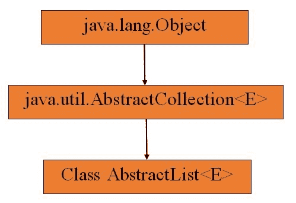
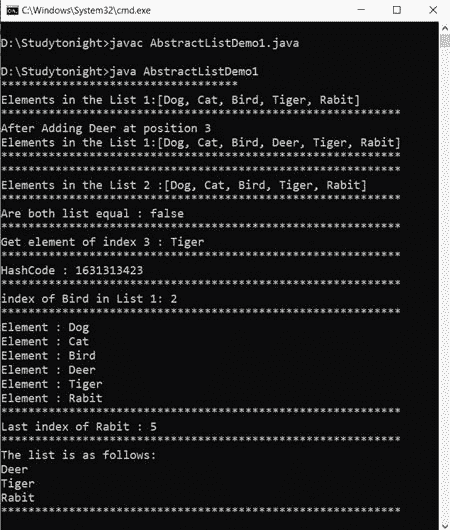
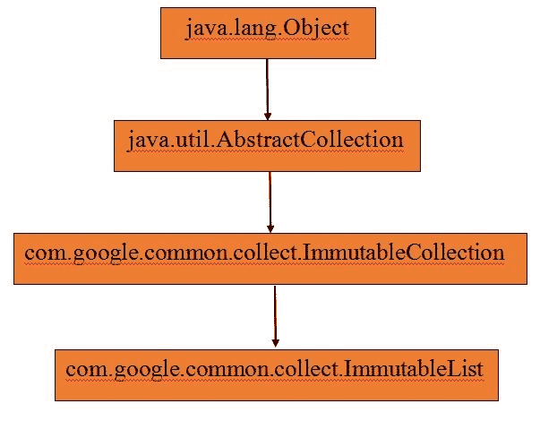

# Java 中的抽象列表

> 原文：<https://www.studytonight.com/java/abstract-list.php>

* * *

在 Java 中，抽象列表是 Java 集合框架的一部分。抽象列表由集合接口和抽象集合类实现。当列表无法修改时使用。为了实现这个抽象列表，类与 get()和 size()方法一起使用。

* * *

#### **下面是班级层级**



**语法:**

```java
	 public abstract class AbstractList<E> extends AbstractCollection<E>implements List<E> 

```

### 下面是抽象列表类的方法

| 没有。 | 方法 | 描述 |
| one | 添加(英、法) | 它用于将元素添加到列表的末尾。 |
| Two | 加法(整数索引，E 元素) | 它用于在列表的指定位置添加元素。 |
| three | 加法(整数索引，集合 c) | 它用于将指定集合中的元素添加到指定位置。 |
| four | 清除() | 它用于从列表中移除所有元素。 |
| five | 等于(对象 0) | 它用于比较列表中另一个元素的元素。 |
| six | get(int 索引) | 它用于从列表中的指定位置获取元素。 |
| seven | hashCode() | 它用于从列表中获取哈希代码。 |
| eight | 索引（对象 o） | 它用于从列表中获取第一个元素。如果列表为空，则返回-1。 |
| nine | 迭代器() | 它返回列表中的所有元素。使用迭代器。 |
| Ten | lastIndexOf（Object o） | 它用于从列表中获取最后一个元素。如果列表为空，则返回-1。 |
| Eleven | 列表迭代器() | 它用于以适当的顺序获取迭代列表。 |
| Twelve | 移除(整数索引) | 它用于从列表中移除指定的元素。 |
| Thirteen | removeRange(intfromIndex，inttoIndex) | 它用于从指定范围中移除元素。 |
| Fourteen | 集合(整数索引，E 元素) | 它用于替换指定元素中的元素。 |
| Fifteen | subList（intfromIndex， inttoIndex） | 它用于获取指定范围内的元素。 |

* * *

#### **示例:**

```java
	 import java.util.*; 

public class AbstractListDemo1 { 
    public static void main(String args[]) 
    { 
AbstractList <string>list = new LinkedList<string>(); 
list.add("Dog"); 
list.add("Cat"); 
list.add("Bird"); 
list.add("Tiger"); 
list.add("Rabit"); 

	System.out.println("***********************************");
System.out.println("Elements in the List 1:" + list);

	list.add(3, "Deer"); 
	System.out.println("***********************************************************"); 
System.out.println("After Adding Deer at position 3");

	System.out.println("Elements in the List 1:" + list); //New List
	System.out.println("***********************************************************");
	AbstractList <string>list1 = new LinkedList<string>();
	list1.add("Dog"); 
        list1.add("Cat"); 
        list1.add("Bird"); 
        list1.add("Tiger"); 
        list1.add("Rabit"); 
	System.out.println("***********************************************************");
System.out.println("Elements in the List 2 :" + list1); //New List2
	System.out.println("***********************************************************");
	boolean ab = list.equals(list1); 
	System.out.println("Are both list equal : "+ ab); 
	System.out.println("***********************************************************");	
	String bc = list1.get(3);
	System.out.println("Get element of index 3 : "+bc);
	System.out.println("***********************************************************");
	int cd= list.hashCode();
System.out.println("HashCode : " + cd); 
	System.out.println("***********************************************************");
	int de= list.indexOf("Bird"); 
	System.out.println("index of Bird in List 1: " + de); 
	System.out.println("***********************************************************");
	Iterator ef = list.iterator(); 
            while (ef.hasNext()) 
		{ 
System.out.println("Element : "+ ef.next()); 
		}
	System.out.println("***********************************************************");
	intfg= list.lastIndexOf("Rabit"); 
	System.out.println("Last index of Rabit : "+ fg); 
	System.out.println("***********************************************************");
	ListIteratorgh = list.listIterator(3); 
System.out.println("The list is as follows:"); 
        while (gh.hasNext()) { 
System.out.println(gh.next()); 
        } 
	System.out.println("***********************************************************");
    } 
}</string></string></string></string> 

```



* * *

### 不可变列表

在 Java 中，不可变列表是不可变的。不可变列表的元素是固定的。这意味着列表的元素是只读的。如果我们试图添加、删除或更新任何元素，那么它将抛出 UnsupportedOperationException。它也不允许空元素。如果我们试图创建一个空元素，那么它将抛出 NullPointerException，如果我们试图添加空元素，那么它将抛出 UnsupportedOperationException。

#### **以下是不变列表的优势。**

1.它是螺纹安全的。

2.记忆组织得很好。

* * *

### 下面是类层次结构



* * *

* * *