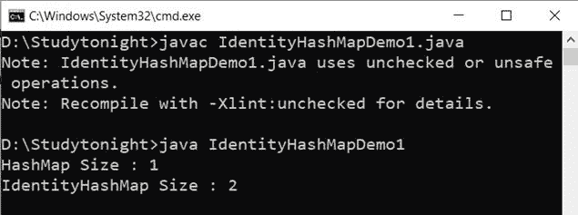
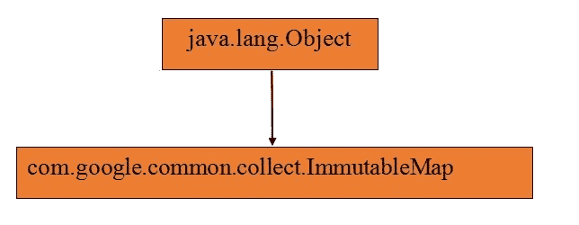

# identityhashmap 类

> 原文：<https://www.studytonight.com/java/identity-hash-map.php>

* * *

在 Java 中，IdentityHashMap 类实现了 Map 接口。它还实现了可序列化和可克隆的接口。它扩展了抽象映射类。它需要通过引用进行比较的对象。

#### **以下是 IdentityHashMap 类的构造函数**

1.IdentityHashMap()。

2.IdentityHashMap(IntexpectedMaxsize)

3.IdentityHashMap(Map m)

* * *

#### **下面是抽象列表类**的方法

* * *

| 没有。 | 方法 | 描述 |
| one | 清除() | 它用于从映射中移除所有映射。 |
| Two | 克隆() | 它用于获取地图的副本。 |
| three | 包含密钥(对象密钥) | 它用于获取指定键的映射。 |
| four | 包含键(对象值) | 它用于获取指定值的映射。 |
| five | entrySet() | 它用于设置映射视图。 |
| six | 等于(对象 0) | 它用于比较地图中另一个对象的对象。 |
| seven | 获取(对象键) | 它用于从地图中的指定位置获取值。 |
| eight | hashCode() | 它用于从地图中获取哈希代码。 |
| nine | hashCode() | 它用于从地图中获取哈希代码。 |
| nine | isEmpty() | 它用于检查地图是否包含任何键值。 |
| Ten | 密钥集() | 它用于在地图中设置视图。 |
| Eleven | 放(K 键，V 值)。 | 它用于在地图中添加关键字和值。 |
| Twelve | 地图(米) | 它用于复制整个地图。 |
| Thirteen | 移除(对象键) | 它用于从弱哈希映射中移除密钥。 |
| Fourteen | 大小() | 它用于获取地图中键值的总数。 |
| Fifteen | 值() | 它用于从地图中获取值。 |

**示例:**

```java
	 import java.util.Map; 
import java.util.HashMap; 
import java.util.IdentityHashMap; 

public class IdentityHashMapDemo1 
{ 
    public static void main(String[] args)  
    {
        Map a = new HashMap(); 
        Map b = new IdentityHashMap(); 

a.put("H_key","H_value"); 
a.put(new String("H_key"),"H_value1");  
b.put("H_key","H_value");  
b.put(new String("H_key"),"H_value1");  

System.out.println("HashMapSize : "+a.size()); 

System.out.println("IdentityHashMapSize : "+b.size());           
    } 
} 

```



* * *

# 不可变地图

在 Java 中，不可变映射是一种映射。它是不可变的意味着它不能被修改，它在声明后是固定的。如果试图添加、删除或更新元素，则会引发 UnsupportedOperationException。它也不允许任何空元素。

#### **以下是不变列表的优势。**

1.它是螺纹安全的。

2.记忆组织得很好。

#### **下面是班级层级**



* * *

* * *