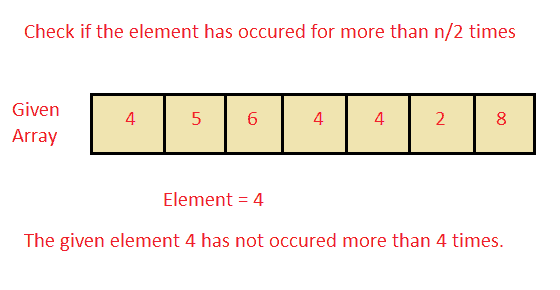

# Java 程序：检查给定整数`X`在数组中出现次数是否超过`N/2`次

> 原文：<https://www.studytonight.com/java-programs/java-program-to-find-if-a-given-integer-x-appears-more-than-n2-times-in-an-array>

在本教程中，我们将学习如何查找给定的整数 X 在 N 个整数的排序数组中出现的次数是否超过 N/2 次。但是在继续之前，如果您不熟悉数组的概念，那么请务必查看 Java 中的文章[数组](https://www.studytonight.com/java/array.php)。



**输入:**

数组:4 5 3 6 2 3 1 7

搜索元素:3

**输出:**

3 次发生不超过 4 次。

## 程序 1:查找给定的整数 X 在 N 个整数的排序数组中出现的次数是否超过 N/2 次。

在这种方法中，我们将看到如何通过使用循环来查找给定的整数 X 在 N 个整数的排序数组中出现的次数是否超过 N/2 次。使用这种方法背后的逻辑是，我们计算排序数组中元素的出现次数，然后将其与 n/2 值进行比较。需要记住的一点是，如果我们需要在计数元素出现之前先对数组进行排序。这将使我们的任务更容易，因为要搜索的 if 元素将位于相邻位置，这将使我们计算该变量出现次数的任务更容易。

### 算法

1.  开始
2.  声明数组大小。
3.  要求用户初始化数组大小。
4.  声明数组。
5.  要求用户初始化数组元素。
6.  通过比较和交换数组对数组进行排序。
7.  打印排序后的数组。
8.  输入要检查其频率的元素。
9.  使用两个 for 循环遍历数组的所有元素，并计算元素的频率。
10.  第一个 for 循环用于保存数组元素。
11.  第二个 for 循环用于检查剩余的数组元素。
12.  使用 if 循环检查元素以前是否出现过。
13.  如果该元素以前发生过，则递增计数变量。
14.  如果元素出现次数超过 n/2 次，则打印该元素出现次数超过 n/2 次的消息。
15.  如果元素出现次数不超过 n/2 次，则打印该元素出现次数不超过 n/2 次的消息。
16.  停下来。

下面是相同的代码。

下面的程序演示了如何使用循环来查找给定的整数 X 在 N 个整数的排序数组中出现的次数是否超过 N/2 次。

```java
/* Java Program to find the find if a given integer X appears more than N/2 times in a sorted Array of N integers using loops */

import java.util.*; 

public class Main 
{ 

    // Main driver method 
    public static void main(String args[]) 
    { 

        // Taking input from user 
        Scanner sc = new Scanner(System.in); 
        int n,x;     //Declaring Variables
        int count=0;     //declare the variable and initialize it to 0

        //Ask the user to enter the Array Size
        System.out.println("Enter the Array Size ");
        n=sc.nextInt();

        //Declare the array
        int arr[] = new int[n]; 
        System.out.println("Enter the Array elements ");
        for(int i=0;i<n;i++)   //Ask the user to initialize the array
        {
            arr[i]=sc.nextInt();
        }

        //Use a for loop to Sort the Array
        int temp;     //Temporary variable to hold the element
        System.out.print("Sorted Array: ");
        for(int i = 0; i < n; i++)    //Holds the array elements
        {
            for(int j = i + 1; j < n; j++)   //Checks for the remaining elements
            {
                if(arr[i] > arr[j])    //Check for the condition
                {
                    temp = arr[i];     //Sort by Swapping the variables
                    arr[i] = arr[j];
                    arr[j] = temp;
                }
            }
        }

        //Print the sorted array
        for(int i=0;i<n;i++)
        {
            System.out.print(arr[i]+" ");
        }
        System.out.println("");

         System.out.println("Enter the element which you want to check:");
        x = sc.nextInt();      //Element that you want to check
        for(int i = 0; i < n; i++)
        {
            if(arr[i] == x)
            {
                count++;      //Increment the count each time the variable is found
            }
        }

        //check whether the element has occurred for more than n/2 times 
        if(count > (n / 2))
        {
            System.out.println("Given Integer "+ x +" appears more than "+ n/2 + "times");
        }
        else
        {
            System.out.println("Given Integer "+ x +" does not appear more than "+ n/2 +" times");
        }    

    }   
}
```

输入数组大小 5
输入数组元素 6 7 5 4 3 5 6 9 6 6
排序数组:3 4 5 6 6 6 6 7 9
输入要检查的元素:6
给定整数 6 出现次数不超过 5 次

* * *

* * *