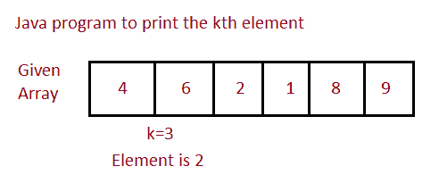

# 打印数组第 k 个元素的 Java 程序

> 原文：<https://www.studytonight.com/java-programs/java-program-to-print-the-kth-element-of-array>

在本教程中，我们将学习如何打印数组中的第 k 个元素。但是在继续之前，如果您不熟悉数组的概念，那么请务必查看 Java 中的文章[数组](https://www.studytonight.com/java/array.php)。



**输入:**

数组元素:4 6 2 1 8 9 4 3 6 8 9

输入您想知道其元素的位置:5

**输出:**位置 5 的元素为 8

## 程序 1:打印数组中的第 k 个元素

在这种情况下，我们将看到当程序中预定义了值时，如何打印数组中的第 k 个元素。这意味着这些值已经在程序中定义了，我们的任务是编写一个程序，这样它将打印指定位置的元素。

### 算法

1.  开始
2.  声明一个数组。
3.  在程序中初始化数组。
4.  打印数组的元素。
5.  声明一个存储位置值的变量。
6.  初始化您想要知道其元素的位置。
7.  打印该位置的元素。
8.  停止

下面是相同的代码。

下面的程序演示了如何打印数组中的第 k 个元素。

```java
// Java Program to Print the kth Element in the Array with pre defined elements

import java.io.*; 
import java.util.Scanner; 

public class Main 
{ 
    public static void main(String[] args) 
    { 
            // declare and intialize the array 
            int a[] = {3, 5, 7, 1 , 2, 9 , 8 , 1 , 4, 7 };
            //Print the Array elements
            System.out.println("Elements in the array ");
            for(int i=0;i<a.length;i++)
            {
                System.out.print(a[i]+" ");
            }
            System.out.println("");
            System.out.println("The position at which you want to check number:"); 

            int k = 5;

            //Print the element at kth  position 
            if(k<a.length)
            {
            System.out.println("Element at "+ k +"th position is " + a[k - 1]); 
            }
            else
            {
                System.out.println("Enter valid position");
            }
    } 
}
```

数组中的元素
3 5 7 1 2 9 8 1 4 7
您要检查编号的位置:
第 5 个位置的元素是 2

## 程序 2:打印第 k 个元素

在这种情况下，我们将看到当程序中的值是用户定义的时，如何打印数组中的第 k 个元素。这意味着这里的值是由用户提供的，我们在这里的任务是编写一个程序，这样它将打印在指定位置出现的元素。

### 算法

1.  开始
2.  声明数组大小。
3.  要求用户初始化阵列大小
4.  声明一个数组。
5.  要求用户初始化数组元素。
6.  声明一个变量来存储数组的位置。
7.  要求用户初始化数组位置。
8.  在该位置打印元素。
9.  停止

下面是相同的代码。

下面的程序演示了如何打印数组中的第 k 个元素。我们将要求用户输入元素想要知道的位置的值。

```java
// Java Program to Print the kth Element in the Array with User Defined elements

import java.io.*; 
import java.util.Scanner; 

public class Main 
{ 
    public static void main(String[] args) 
    { 
            int n; 

            // scanner object to acces user input 
            Scanner s = new Scanner(System.in); 
            System.out.print("Enter the number of elements in the array:"); 
            // Ask the user to initialize the array size
            n = s.nextInt(); 

            // declare an array 
            int a[] = new int[n]; 
            System.out.println("Enter all the elements of the array:"); 

            // Ask the user to initializing the array elements using a for loop
            for (int i = 0; i < n; i++) 
            { 
                a[i] = s.nextInt(); 
            } 

            System.out.println("Enter the position at which you want to check number:"); 
            //Ask the user to intialize the position
            int k = s.nextInt(); 

            //Print the element at kth  position 
            System.out.println("Element at "+ k +"th position is " + a[k - 1]); 
    } 
}
```

输入数组中的元素个数:10
输入数组中的所有元素:2 3 4 6 1 2 9 8 7 6
输入要检查的位置个数:4
第 4 个位置的元素为 6

* * *

* * *