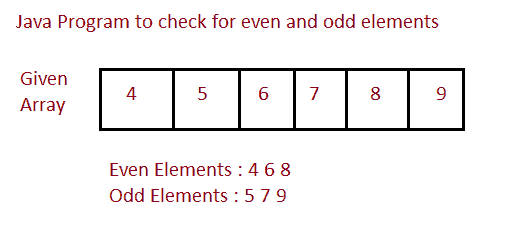

# 打印数组中奇数和偶数的 Java 程序

> 原文：<https://www.studytonight.com/java-programs/java-program-to-print-the-odd-and-even-numbers-in-an-array>

在本教程中，我们将学习如何打印数组的偶数和奇数。但是在继续之前，如果您不熟悉数组的概念，那么请务必查看 Java 中的文章[数组](https://www.studytonight.com/java/array.php)。



**输入:**输入数组元素:5 4 3 6 7 8 9 4 2 1

**输出:**偶数元素:4 2 6 8 4 2

奇数元素:5 3 7 9 1

## 程序 1:找出数组的偶数和奇数元素

在这种方法中，我们将看到如何在主方法中找到数组的偶数和奇数元素。

### 算法

1.  开始
2.  声明数组大小。
3.  要求用户初始化数组大小。
4.  声明一个数组。
5.  要求用户初始化数组元素。
6.  通过检查用于循环的条件来打印偶数元素。
7.  通过检查用于循环的条件来打印奇数元素。
8.  停止

下面是相同的代码。

下面的例子演示了如何找到数组的偶数和奇数元素。

```java
// Java Program to Print the even and odd Element of the Array 

import java.io.*; 
import java.util.Scanner; 

public class Main 
{ 
    public static void main(String[] args) 
    { 
        //Take input from the user
        Scanner sc=new Scanner(System.in);

        int n;    //Declare size of an array
        System.out.println("Enter the size of the array: ");
        n=sc.nextInt();    //Intialize the array size

        int arr[]=new int[n];   //Declare an array
        System.out.println("Enter the array elements: ");
        for(int i=0;i<n;i++)
        {
            arr[i]=sc.nextInt();    //Initialize the array elements
        }
        //Print the even elements
        System.out.println("The Even Elements are...");
        for(int i=0;i<n;i++)
        {
            if(arr[i]%2==0)   //Check whether even or not
            {
                System.out.print(arr[i]+" ");
            }
        }
        System.out.println(" ");

        //Print the odd elements
        System.out.println("The Odd Elements are...");
        for(int i=0;i<n;i++)
        {
            if(arr[i]%2!=0)   //check whether odd or not
            {
                System.out.print(arr[i]+" ");
            }
        }
    }
}
```

输入数组大小:10
输入数组元素:1 3 2 4 3 1 6 8 9
偶数元素为...
2 4 6 8
奇数元素是...
1 3 1 9

## 程序 2:寻找数组的偶数和奇数元素

在这种方法中，我们将看到如何通过对每个元素使用不同的方法来找到数组的偶数和奇数元素。

### 算法

1.  开始
2.  声明数组大小。
3.  要求用户初始化数组大小。
4.  声明一个数组。
5.  要求用户初始化数组元素。
6.  调用方法检查偶数元素。
7.  打印偶数元素。
8.  调用另一个方法来检查奇数元素。
9.  打印奇数元素。
10.  停止

下面是相同的代码。

下面的示例演示了如何使用不同的方法来查找数组的偶数和奇数元素。

```java
// Java Program to Print the even and odd Element of the Array 

import java.io.*; 
import java.util.Scanner; 

public class Main 
{ 
    //Driver Method
    public static void main(String[] args) 
    { 
        //Take input from the user
        Scanner sc=new Scanner(System.in);

        int n;    //Declare size of an array
        System.out.println("Enter the size of the array: ");
        n=sc.nextInt();    //Intialize the array size

        int arr[]=new int[n];   //Declare an array
        System.out.println("Enter the array elements: ");
        for(int i=0;i<n;i++)
        {
            arr[i]=sc.nextInt();    //Initialize the array elements
        }
        System.out.println("The Even Elements are...");
        printEven(arr,n);    //Method to print even elements
        System.out.println(" ");
        System.out.println("The Odd Elements are...");
        printOdd(arr,n);    //Method to print odd elements

    } 

    //Method to print the even elements
    static void printEven(int arr[], int n)
    {
        for(int i=0;i<n;i++)
        {
            if(arr[i]%2==0)
            {
                System.out.print(arr[i]+" ");
            }
        }
    }

    //Method to print the odd elements 
    static void printOdd(int arr[], int n)
    {
        for(int i=0;i<n;i++)
        {
            if(arr[i]%2!=0)
            {
                System.out.print(arr[i]+" ");
            }
        }
    }
}
```

输入数组大小:10
输入数组元素:6 9 8 7 3 4 5 2 1 2
偶数元素为...
6 8 4 2 2
奇数元素是...
9 7 3 5 1

* * *

* * *