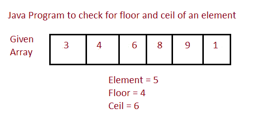

# 在给定的排序数组中查找元素的天花板和地板值

> 原文：<https://www.studytonight.com/java-programs/find-the-ceil-and-floor-value-of-an-element-in-a-given-sorted-array>

在本教程中，我们将学习如何在给定的排序数组中找到元素的天花板和地板值。但是在继续之前，如果您不熟悉数组的概念，那么请务必查看 Java 中的文章[数组](https://www.studytonight.com/java/array.php)。



**输入:**

阵列:15 17 18 19 20 21 22 24 25 26 27

要素:16

**输出:**

楼层:15

天花板:17

上述问题可以通过两种方式解决:

方法 1:二分搜索法

方法 2:线性搜索

让我们分别看看这些方法。

## 程序 1:在给定的排序数组中找到元素的天花板和地板值

在这种方法中，我们只需执行二分搜索法运算，即可找到给定排序数组中元素的下限和上限值。

### 算法

1.  开始
2.  声明数组大小。
3.  要求用户初始化数组大小。
4.  声明一个数组。
5.  要求用户初始化数组。
6.  声明一个变量来存储要搜索的元素的值。
7.  调用一个方法来检查天花板值。
8.  将 ceil 初始化为-1，然后遍历元素以搜索 ceil 值。
9.  在天花板方法中，如果 x 等于中间元素，那么它就是天花板值。
10.  如果 x 小于中间元素，则天花板值位于左子数组中。更新上限值，并在 A[低，中 1]中再次搜索。
11.  如果 x 大于中间元素，则天花板值位于右子数组中。更新上限值，并在 A[中间，结束]中再次搜索。返回找到的天花板值。
12.  调用一个方法来检查地板值。
13.  将 floor 初始化为-1，然后遍历元素以搜索 floor 值。
14.  在 floor 方法中，如果 x 等于中间元素，那么它就是 floor 值。
15.  如果 x 小于中间元素，则地板值位于左侧子阵列中。更新地板值，并在 A[低，中 1]中再次搜索。
16.  如果 x 大于中间元素，则地板值位于右子阵列中。更新地板值，并在 A[中，高]中再次搜索。
17.  返回找到的地板值。
18.  显示天花板和地板值。
19.  停止

下面是相同的代码。

下面的程序演示了如何在给定的排序数组中找到元素的天花板和地板值

```java
// Java Program to find the ceil and floor of an element in an array 

import java.io.*; 
import java.util.Scanner; 

public class Main 
{ 
    public static void main(String[] args) 
    { 
        //Take input from the user
        Scanner sc=new Scanner(System.in);

        int n;    //Declare size of an array
        System.out.println("Enter the size of the array: ");
        n=sc.nextInt();    //Initialize the array size

        int arr[]=new int[n];   //Declare an array
        System.out.println("Enter the array elements: ");
        for(int i=0;i<n;i++)
        {
            arr[i]=sc.nextInt();    //Initialize the array elements
        }

        //Enter the element whose floor and ceil values you want to check
        int x;
        System.out.println("Enter the element whose floor and ceil values you want to check: ");
        x=sc.nextInt();

        //Method to check for Ceil
        int ceil=getCeil(arr,x);
        //Print the Ceil value
        System.out.println("Ceil value is "+ceil);

        //Method to check for Floor
        int floor=getFloor(arr,x);
        //Print the floor Value
        System.out.println("floor value is "+floor);

    }
    // Function to find the ceil of X in a sorted array A[],i.e., the smallest integer greater than or equal to X
    public static int getCeil(int[] A, int x)
    {
        // search space is A[left…right]
        int left = 0, right = A.length - 1;

        // initialize ceil to -1
        int ceil = -1;

        // loop till the search space is exhausted
        while (left <= right)
        {
            // find the mid-value in the search space
            int mid = (left + right) / 2;

            // if X is equal to the middle element, it is the ceil
            if (A[mid] == x) {
                return A[mid];
            }

            // if X is less than the middle element, the ceil exists in the subarray A[left…mid]; update ceil to the middle element and reduce our search space to the left subarray A[left…mid-1]
            else if (x < A[mid])
            {
                ceil = A[mid];
                right = mid - 1;
            }

            // if X is more than the middle element, the ceil exists in the right subarray A[mid+1…right]
            else 
            {
                left = mid + 1;
            }
        }

        return ceil;
    }

    // Function to find the floor of X in a sorted array A[], i.e., the largest integer less than or equal to X
    public static int getFloor(int[] A, int x)
    {
        int left = 0, right = A.length - 1;

        // initialize floor to -1
        int floor = -1;

        // loop till the search space is exhausted
        while (left <= right)
        {
            // find the mid-value in the search space
            int mid = (left + right) / 2;

            // if X is equal to the middle element, it is the floor
            if (A[mid] == x) 
            {
                return A[mid];
            }

            // if X is less than the middle element, the floor exists in the left subarray A[left…mid-1]
            else if (x < A[mid]) {
                right = mid - 1;
            }

            // if X is more than the middle element, the floor exists in the subarray A[mid…right]; update floor to the middle element and reduce our search space to the right subarray A[mid+1…right]
            else {
                floor = A[mid];
                left = mid + 1;
            }
        }
        return floor;
    }
} 
```

输入数组的大小:10
输入数组元素:1 2 3 4 6 7 8 9 10 11
输入要检查其楼层和天花板值的元素:5
天花板值为 6
楼层值为 4

## 程序 2:在给定的排序数组中找到元素的天花板和地板值

在这种方法中，我们只需执行线性搜索，就可以在给定的排序数组中找到元素的下限和上限。

### 算法

1.  开始
2.  声明一个排序数组。
3.  声明一个变量来存储排序数组的长度。
4.  输入要检查其楼层和天花板值的数字。
5.  要查找地板值，请遍历数组。
6.  如果当前元素大于输入的元素，则打印前一个数字并中断循环。
7.  如果没有大于输入元素的数字，则打印最后一个元素
8.  如果第一个数字大于输入的元素，则打印-1。
9.  同样，如果输入的元素小于或等于数组中的第一个元素，则返回 0。
10.  否则遍历数组找到一个比输入的数字小的数字。
11.  如果没有找到这样的元素，那么返回-1。
12.  显示两个结果。
13.  停下来。

下面是相同的代码

```java
/*Java Program to check for Ceil and Floor value*/
public class Main 
{ 
    //Check For Ceil Value
    static int ceilSearch(int arr[], int low, int high, int x) 
    { 
      int i;     
      if(x <= arr[low]) 
        return low;   

      for(i = low; i < high; i++) 
      { 
        if(arr[i] == x) 
          return i; 

        if(arr[i] < x && arr[i+1] >= x) 
           return i+1; 
      }          

      return -1; 
    } 

    //Check for floor value   
    static int floorSearch(int arr[], int n, int x) 
    { 
        if (x >= arr[n - 1]) 
            return n - 1; 

        if (x < arr[0]) 
            return -1; 

        for (int i = 1; i < n; i++) 
            if (arr[i] > x) 
                return (i - 1); 

        return -1; 
    } 

    // Driver program
    public static void main (String[] args) 
    { 
       int arr[] = {1, 2, 3 , 4, 7, 8, 9, 10}; 
       int n = arr.length; 
       int x = 11; 
       int ceil = ceilSearch(arr, 0, n-1, x); 
       if(ceil == -1) 
         System.out.println("Ceiling of "+x +" doesn't exist in array"); 
       else
         System.out.println("ceiling of "+x+" is "+arr[ceil]); 

        int floor = floorSearch(arr, n - 1, x); 
        if (floor == -1) 
            System.out.print( "Floor of " + x  + " doesn't exist in array "); 
        else
            System.out.print("Floor of " + x + " is " + arr[floor]); 
    }   
} 
```

数组中不存在 11 的上限
11 的下限为 9

* * *

* * *