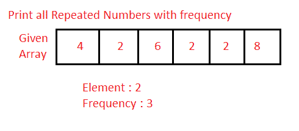

# Java 程序：打印数组中所有重复的数字

> 原文：<https://www.studytonight.com/java-programs/java-program-to-print-all-the-repeated-numbers-with-frequency-in-an-array>

在本教程中，我们将学习如何在一个数组中按频率打印所有重复的数字。但是在继续之前，如果您不熟悉数组的概念，那么请务必查看 Java 中的文章[数组](https://www.studytonight.com/java/array.php)。



**输入:**输入数组元素:2 4 3 5 2 3 4 6 7 8 9 6 5 4

**输出:**重复频率的元素:

元素频率

2 2

3 2

4 3

5 2

6 2

上述问题可以通过以下方式解决:

让我们分别看看这些方法。

## 程序 1:在一个数组中找到有频率的重复数

在这种方法中，我们将使用`HashMap`来打印数组中具有频率的重复数字。该方法的时间和空间复杂度为 O(n)。

### 算法

1.  开始
2.  声明一个变量来存储数组元素
3.  要求用户初始化变量。
4.  声明一个数组。
5.  请用户初始化该数组。
6.  为相同的声明一个 hashmap。
7.  使用 for 循环检查映射是否包含重复元素。
8.  如果发现重复元素，则将该元素的索引增加 1。
9.  如果没有找到重复的元素，那么就给它分配一个。
10.  开始打印元素。
11.  仅当计数大于 1 时才打印元素。
12.  停下来。

下面是相同的代码。

下面的程序演示了如何使用 Hashmap 打印数组中的重复元素。映射会节省很多空间和时间。

```java
/*Java Proggram to find the repeated elements with Frequency*/
import java.util.*; 

public class Main
{ 
    public static void main(String[] args) 
    { 
        //Take input from the user
        Scanner sc=new Scanner(System.in);

        int n;           //Declare variable for array size 
        System.out.println("Enter the length of the array");
        n=sc.nextInt();  //Ask the user to initialize the size of the array

        int a[]=new int[n];     //declare Array
        System.out.println("Enter the array elements ");
        for(int i=0;i<n;i++)
        {
            a[i]=sc.nextInt();     //Initialize Array elements
        }

        //Hashmap for array elements
        HashMap<Integer, Integer> map = new HashMap<>(); 
        for (int i = 0; i < n; i++) { 

            if (map.containsKey(a[i])) 
            { 

                // if duplicate element in the map then increase the value of element at index by 1 

                int c = map.get(a[i]); 
                map.replace(a[i], c + 1); 
            } 

            // if not a duplicate element in map than assign it by 1\. 
            else
                map.put(a[i], 1); 
        } 

        //Print the Repeated Elements with Frequency
        System.out.println("Elements  Frequency");
        for (Map.Entry<Integer, Integer> i : map.entrySet()) 
        { 
            // print only if count of element is greater than 1\. 
            if (i.getValue() > 1) 
                System.out.println("  "+ i.getKey() + "          "+ i.getValue()); 
            else
                continue; 
        } 
    } 
}
```

输入数组 10 的长度
输入数组元素 2 3 1 2 3 6 1 8 9
元素频率
1 2
2 3
3 2

## 程序 2:找出数组中重复出现的频率数

在这个方法中，我们将看到如何使用另一个数组打印一个数组中的重复数字。

### 算法

1.  开始
2.  声明一个变量来存储数组大小。
3.  要求用户初始化该变量。
4.  声明一个数组。
5.  请用户初始化该数组。
6.  声明一个变量 max 并用 Integer 赋值。最小值。
7.  声明另一个数组来存储所有变量的频率。
8.  计算每个变量的频率。
9.  仅当元素的频率大于 1 时，才打印元素及其频率。
10.  显示输出。
11.  停止

下面是相同的代码。

下面的程序演示了如何使用另一个查找数组中重复的元素。这个新数组用于存储每个元素的频率，然后只打印那些频率大于 1 的元素。

```java
/*Java Proggram to find the repeated elements with Frequency*/
import java.util.*; 

public class Main
{ 
    public static void main(String[] args) 
    { 
        //Take input from the user
        Scanner sc=new Scanner(System.in);

        int n;           //Declare variable for array size 
        System.out.println("Enter the length of the array");
        n=sc.nextInt();  //Ask the user to initialize the size of the array

        int arr[]=new int[n];     //declare Array
        System.out.println("Enter the array elements ");
        for(int i=0;i<n;i++)
        {
            arr[i]=sc.nextInt();     //Initialize Array elements
        }

        int max = Integer.MIN_VALUE; 
        for (int i = 0; i < n; i++) { 
            if (arr[i] > max) 
                max = arr[i]; 
        } 

        int brr[] = new int[max + 1];     //Declare another Array to store the frequency
        for (int i = 0; i < n; i++) 
        { 
            // increment in array brr for every integer in arr. 
            brr[arr[i]]++; 
        } 

         System.out.println("Element  Frequency ");
        for (int i = 0; i <= max; i++) { 
            // output only if element is more than 1 time in array A. 
            if (brr[i] > 1) 
                System.out.println("   " + i + "        " + brr[i]); 
        } 
    } 
}
```

输入数组 15 的长度
输入数组元素 2 3 1 2 3 6 1 8 9 6 8 3 4 6
元素频率
1 2
2 3
3 3
6 3
8 2

* * *

* * *