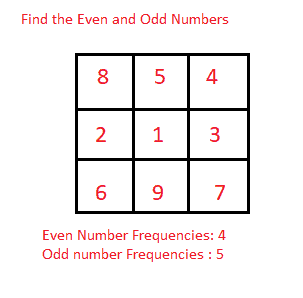

# 寻找矩阵中奇数和偶数频率的 Java 程序

> 原文：<https://www.studytonight.com/java-programs/java-program-to-find-the-frequency-of-odd-and-even-numbers-in-a-matrix>

在本教程中，我们将学习如何找到矩阵中奇数和偶数的频率。但是在继续之前，如果您不熟悉数组的概念，那么请务必查看 Java 中的文章[数组](https://www.studytonight.com/java/array.php)。

下面是矩阵的图示。



**输入:**输入矩阵元素:

1 2 3

4 3 2

6 7 8

**输出:**

偶素频率:5

奇数元素频率:4

## 程序 1:找出矩阵中奇数和偶数的频率

在下面的程序中，我们将看到当值是用户定义的时，如何计算给定矩阵中奇数和偶数的频率。

### 算法

1.  开始
2.  为矩阵行和列声明变量。
3.  请用户初始化矩阵。
4.  声明矩阵。
5.  请用户初始化矩阵。
6.  打印原始矩阵..
7.  声明两个变量来计算偶数和奇数频率。
8.  将这些变量初始化为 0。
9.  使用两个 for 循环遍历元素。
10.  使用第一个 for 循环遍历行。
11.  使用第二个 for 循环遍历列。
12.  检查每个元素。
13.  如果矩阵元素为偶数，则递增偶数计数变量。
14.  如果矩阵元素是奇数，递增奇数计数变量。
15.  打印数组中偶数和奇数元素的频率。
16.  停下来。

下面是相同的代码。

```java
/* Java Program to check the even and odd element frequencies*/
import java.util.Scanner;
public class Main 
{
    public static void main(String[] args) 
    {
        int m,n;   //Declare the variables for rows and columns

        //Take input from the user
        Scanner sc = new Scanner(System.in);

        System.out.print("Enter number of rows in matrix:");
        m = sc.nextInt();  //Initialize the number of rows

        System.out.print("Enter number of columns in matrix:");
        n = sc.nextInt();  //Initialize the number of columns

        int arr[][] = new int[m][n];  //Declare a Matrix
        System.out.println("Enter all the elements of matrix:");
        for (int i = 0; i < m; i++) 
        {
            for (int j = 0; j < n; j++) 
            {
                arr[i][j] = sc.nextInt();     //Initialize the Matrix
            }
        }

        //Print the original Matrix
        System.out.println("The Original Matrix:");
        for (int i = 0; i < m; i++)      //Used to iterate over the matrix rows
        {
            for (int j = 0; j < n; j++)    //Used to iterate over the matrix columns
            {
                System.out.print(arr[i][j] + " ");
            }
            System.out.println("");
        }

        int even=0,odd=0;   //Variables to store even and odd elements

        //Use for loops to iterate through the matrix elements
        for(int i=0;i<m;i++)      //Used to iterate over the matrix rows
        {
            for(int j=0;j<n;j++)   //Used to iterate over the matrix columns
            {
                if(arr[i][j]%2==0)     //Check whether the element is even or not
                {
                    even++;      //Increment the even frequency
                }
                else
                {
                    odd++;      //Increment the odd frequency
                }
            }
        }
        System.out.println("Total Odd Number in the Matrix: " + odd); 
        System.out.println("Total Even Number in the Matrix: " + even); 

    }
}
```

输入矩阵行数:3
输入矩阵列数:3
输入矩阵所有元素:1 2 3 4 5 6 7 8 9
原矩阵:
1 2 3
4 5 6
7 8 9
矩阵总奇数:5
矩阵总偶数:4

## 程序 2:求矩阵中奇数和偶数的频率

在下面的程序中，我们将看到当值被预定义时，如何计算给定矩阵中奇数和偶数的频率。

### 算法

1.  开始
2.  声明一个矩阵并将其初始化为 0。
3.  调用一个方法来计算偶数和奇数频率。
4.  使用 for 循环迭代元素。
5.  每次遇到偶数元素时增加偶数计数。
6.  每次遇到奇数元素时增加奇数计数。
7.  打印数组中偶数和奇数元素的频率。
8.  停止

下面是相同的代码。

```java
/*Java Program to find the trace and normal of a matrix*/
import java.io.*; 

public class Main 
{

    //To Find the normal of a matrix 
    public static void findNormal(int[][] arr) 
    { 
         double square = 0, result = 0;
        System.out.println("The Normal of the above matrix is "); 
   	for(int i = 0; i < arr.length; i++)
   	{
    	    for(int j = 0; j < arr[0].length; j++)
       	    {
       	        square = square + (arr[i][j])*(arr[i][j]);
            }
    	}
        result = Math.sqrt(square);
        System.out.println(result);
    } 

    //To Find the trace of a matrix 
    public static void findTrace(int[][] arr) 
    { 
        double sum = 0;
        System.out.println("The Trace of the above matrix is ");
  	for(int i = 0; i < arr.length; i++)
  	{  
    	    for(int j = 0; j < arr[0].length; j++)
       	    {
                if(i == j)
            	 {
               	     sum = sum + (arr[i][j]);
               	 }
            }
        }
        System.out.println(sum); 

    } 

    // Driver code 
    public static void main(String args[]) throws IOException 
    { 
        int arr[][] 
            = { { 2, 9, 8 }, { 7, 6, 4 }, { 3, 9, 2 } };  //Matrix Declaration and Initialization

       System.out.println("Original Matrix");
       for(int i = 0; i < arr.length; i++)
  	   {  
    	    for(int j = 0; j < arr[0].length; j++)
       	    {
                System.out.print(arr[i][j]+ " ");
            }
            System.out.println();
        }
        System.out.println();
        findTrace(arr);    //Find the Trace of the Matrix
        System.out.println();
        findNormal(arr);   //Find the Normal of the Matrix

    } 
} 
```

原始矩阵
2 9 8
7 6 4
3 9 2
上述矩阵的迹线为
10.0
上述矩阵的法线为
18 . 36960 . 666666666616

* * *

* * *