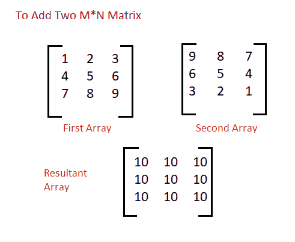

# 从用户输入中添加两个 M*N 矩阵的 Java 程序

> 原文：<https://www.studytonight.com/java-programs/java-program-to-add-two-mn-matrix-from-user-input>

在本教程中，我们将学习如何从用户输入中添加两个 M*N 矩阵。但是在继续之前，如果您不熟悉数组的概念，那么请务必查看 Java 中的文章[数组](https://www.studytonight.com/java/array.php)。

下面是同样的图示。



**输入:**

输入第一个矩阵的行数:3

输入第一个矩阵的列数:3

在第二个矩阵中输入行数:3

在第二个矩阵中输入行数:3

输入第一个矩阵的所有元素:1 2 3 4 5 6 7 8 9

输入第二个矩阵的所有元素:9 8 7 6 5 4 3 2 1

**输出:**

第一个矩阵:

1 2 3

4 5 6

7 8 9

第二个矩阵:

9 8 7

6 5 4

3 2 1

结果矩阵:

10 10 10

10 10 10

10 10 10

## 程序 1:从用户输入中添加一个 M*N 矩阵

在这个程序中，我们将执行矩阵加法。只有当给定矩阵的大小相同，即两个矩阵的行数和列数应该相同时，才能添加矩阵。

### 算法

1.  开始
2.  声明矩阵大小的变量
3.  初始化第一个矩阵的行数和列数。
4.  初始化第二个矩阵的行数和列数。
5.  检查两个矩阵的大小是否相等。
6.  如果相等，请用户初始化两个矩阵。
7.  初始化后，打印两个矩阵。
8.  创建一个新矩阵来存储两个矩阵的总和。
9.  遍历这两个矩阵的每个元素，然后将它们相加。
10.  将此总和存储在新矩阵中相应的索引处。
11.  返回结果矩阵。
12.  打印结果矩阵。
13.  如果两个矩阵的大小不相等，则打印一条消息重试。
14.  停下来。

下面是相同的 Java 语言代码。

```java
/*Java Program to add two matrix*/
import java.util.Scanner;
public class Main
{
    public static void main(String[] args) 
    {
        int p, q, m, n;    //Declare matrix size
        Scanner sc = new Scanner(System.in);
        System.out.print("Enter the number of rows in the first matrix:");
        p = sc.nextInt();    //Initialize first matrix size
        System.out.print("Enter the number of columns in the first matrix:");
        q = sc.nextInt();   //Initialize first matrix size
        System.out.print("Enter the number of rows in the second matrix:");
        m = sc.nextInt();   //Initialize second matrix size
        System.out.print("Enter the number of columns in the second matrix:");
        n = sc.nextInt();   //Initialize second matrix size
        if (p == m && q == n) 
        {
            int a[][] = new int[p][q];    //Declare first matrix
            int b[][] = new int[m][n];    //Declare second matrix
            int c[][] = new int[m][n];    //Declare third matrix
            //Initialize the first matrix
            System.out.println("Enter all the elements of first matrix:");
            for (int i = 0; i < p; i++) 
            {
                for (int j = 0; j < q; j++) 
                {
                    a[i][j] = sc.nextInt();
                }
            }
            System.out.println("");
            //Initialize the second matrix
            System.out.println("Enter all the elements of second matrix:");
            for (int i = 0; i < m; i++) 
            {
                for (int j = 0; j < n; j++) 
                {
                    b[i][j] = sc.nextInt();
                }
            }
            System.out.println("");
            //Print the first matrix
            System.out.println("First Matrix:");
            for (int i = 0; i < p; i++) 
            {
                for (int j = 0; j < q; j++) 
                {
                    System.out.print(a[i][j]+" ");
                }
                System.out.println("");
            }
            //Print the second matrix
            System.out.println("Second Matrix:");
            for (int i = 0; i < m; i++) 
            {
                for (int j = 0; j < n; j++) 
                {
                    System.out.print(b[i][j]+" ");
                }
                System.out.println("");
            }
            //Loop to add matrix elements
            for (int i = 0; i < p; i++) 
            {
                for (int j = 0; j < n; j++) 
                {
                    for (int k = 0; k < q; k++) 
                    {
                        c[i][j] = a[i][j] + b[i][j];
                    }
                }
            }
            //Print the resultant matrix
            System.out.println("Matrix after addition:");
            for (int i = 0; i < p; i++) 
            {
                for (int j = 0; j < n; j++) 
                {
                    System.out.print(c[i][j]+" ");
                }
                System.out.println("");
            }
        }
        else
        {
            System.out.println("Addition not possible");
            System.out.println("Try Again");
        }
    }
}
```

输入第一个矩阵的行数:3
输入第一个矩阵的列数:3
输入第二个矩阵的行数:3
输入第二个矩阵的列数:3
输入第一个矩阵的所有元素:1 2 3 4 5 6 7 8 9

输入第二个矩阵的所有元素:9 8 7 6 5 4 3 2 1

第一个矩阵:
1 2 3
4 5 6
7 8 9
第二个矩阵:
9 8 7
6 5 4
3 2 1
添加后的矩阵:
10 10 10 10
10 10
10 10 10

## 程序 2:从用户输入中添加一个 M*N 矩阵

在这个程序中，我们将添加两个矩阵。当给出 m*n 和 m*n 阶的两个矩阵时，产生的结果矩阵将是 m*n 阶的。这里要注意的一点是，为了执行矩阵加法，矩阵应该是相同阶的。

### 算法

1.  开始
2.  声明矩阵大小的变量
3.  初始化第一个矩阵的行数和列数。
4.  初始化第二个矩阵的行数和列数。
5.  检查两个矩阵的大小是否相等。
6.  如果相等，请用户初始化两个矩阵。
7.  初始化后，打印两个矩阵。
8.  创建一个新矩阵来存储两个矩阵的和
9.  调用一个将返回它们总和的方法。
10.  遍历这两个矩阵的每个元素，然后将它们相加。
11.  将此总和存储在新矩阵中相应的索引处。
12.  返回结果矩阵。
13.  打印结果矩阵。
14.  如果两个矩阵的大小不相等，则打印一条消息重试。
15.  停下来。

下面是相同的 Java 语言代码。

```java
/*Java Program to add two matrix*/
import java.util.Scanner;
public class Main
{
    // To print a Matrix
    static void printMatrix(int M[][],int m,int n)
    {
        for (int i = 0; i < m; i++) {
            for (int j = 0; j < n; j++)
                System.out.print(M[i][j] + " "); 
            System.out.println();
        }
    } 
    //To add the two matrices and store in matrix c
    static int[][] add(int a[][], int b[][], int m,int n)
    {
        int i, j;
        int c[][] = new int[m][m]; 
        for (i = 0; i < m; i++)
            for (j = 0; j < n; j++)
                c[i][j] = a[i][j] + b[i][j]; 
        return c;
    }
    public static void main(String[] args) 
    {
        int p, q, m, n;    //Declare matrix size
        Scanner sc = new Scanner(System.in);
        System.out.print("Enter the number of rows in the first matrix:");
        p = sc.nextInt();    //Initialize first matrix size
        System.out.print("Enter the number of columns in the first matrix:");
        q = sc.nextInt();   //Initialize the first matrix size
        System.out.print("Enter the number of rows in second matrix:");
        m = sc.nextInt();   //Initialize second matrix size
        System.out.print("Enter the number of columns in the second matrix:");
        n = sc.nextInt();   //Initialize the second matrix size
        if (p == m && q == n) 
        {
            int a[][] = new int[p][q];    //Declare first matrix
            int b[][] = new int[m][n];    //Declare second matrix            
            //Initialize the first matrix
            System.out.println("Enter all the elements of first matrix:");
            for (int i = 0; i < p; i++) 
            {
                for (int j = 0; j < q; j++) 
                {
                    a[i][j] = sc.nextInt();
                }
            }
            System.out.println("");            
            //Initialize the second matrix
            System.out.println("Enter all the elements of second matrix:");
            for (int i = 0; i < m; i++) 
            {
                for (int j = 0; j < n; j++) 
                {
                    b[i][j] = sc.nextInt();
                }
            }            
            // Print the result
            System.out.println("First Matrix:");
            printMatrix(a, m, n);            
            // Print the second matrix
            System.out.println("Second Matrix:");
            printMatrix(b, m, n);
            int c[][] = add(a, b, m,n); 
        // Print the result
        System.out.println("Resultant Matrix:");
        printMatrix(c, m, n);            
        }
        else
        {
            System.out.println("Addition not possible");
            System.out.println("Try Again");
        }
    }
}
```

输入第一个矩阵的行数:3
输入第一个矩阵的列数:3
输入第二个矩阵的行数:3
输入第二个矩阵的列数:3
输入第一个矩阵的所有元素:6 7 8 5 4 3 2 2 9
输入第二个矩阵的所有元素:9 8 7 6 7 8 9 2
第一个矩阵:
6 7 8
5 4 3
2 2 9
第二矩阵:
9 8 7
6 7 8
9 9 2
合成矩阵:
15 15 15
11 11 11
11 11 11

* * *

* * *