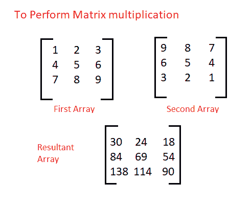

# Java 程序：执行矩阵乘法

> 原文：<https://www.studytonight.com/java-programs/java-program-to-perform-matrix-multiplication>

在本教程中，我们将学习如何执行矩阵乘法。但是在继续之前，如果您不熟悉数组的概念，那么请务必查看 Java 中的文章[数组](https://www.studytonight.com/java/array.php)。

下面是同样的图示。



**输入:**

输入第一个矩阵的行数:3

输入第一个矩阵的列数:3

在第二个矩阵中输入行数:3

在第二个矩阵中输入行数:3

输入第一个矩阵的所有元素:1 2 3 4 5 6 7 8 9

输入第二个矩阵的所有元素:9 8 7 6 5 4 3 2 1

**输出:**

第一个矩阵:

1 2 3

4 5 6

7 8 9

第二个矩阵:

9 8 7

6 5 4

3 2 1

结果矩阵:

30 24 18

84 69 54

138 114 90

## 程序 1:执行矩阵乘法

在这个程序中，我们将执行矩阵乘法。但是要进行矩阵乘法，第一个矩阵的列数必须等于第二个矩阵的行数。

### 算法

1.  开始
2.  声明矩阵大小的变量。
3.  初始化第一个矩阵的行数和列数。
4.  初始化第二个矩阵的行数和列数。
5.  声明两个矩阵。
6.  要求用户初始化矩阵。
7.  调用一个方法将两个矩阵相乘。
8.  打印两个矩阵。
9.  检查矩阵乘法是否可能。
10.  如果可能，创建一个新的矩阵来存储两个矩阵的乘积。
11.  遍历两个矩阵的每一个元素并相乘。
12.  将该产品存储在相应索引处的新矩阵中。
13.  打印最终产品矩阵。
14.  如果矩阵乘法是不可能的，那么显示相同的。
15.  停下来。

下面是相同的 Java 语言代码。

```java
/*Java Program to multiply two matrices*/
import java.util.Scanner;
public class Main
{
   // To print Matrix 
    static void printMatrix(int M[][], int rowSize, int colSize) 
    { 
        for (int i = 0; i < rowSize; i++) 
        { 
            for (int j = 0; j < colSize; j++) 
            {
                System.out.print(M[i][j] + " "); 
            }

            System.out.println(); 
        } 
    }   
    // To multiply two matrices a[][] and b[][] 
    static void multiplyMatrix(int p,int q, int a[][], int m, int n, int b[][]) 
    { 
        int i, j, k;   
        // Print the matrices A and B 
        System.out.println("First Matrix:");
        printMatrix(a, p, q); 
        System.out.println("Second Matrix:");
        printMatrix(b, m, n);   
        // Check if multiplication is Possible 
        if (m != q) 
        { 
            System.out.println("Multiplication Not Possible"); 
            return; 
        }   
        // Matrix to store the result 
        int c[][] = new int[q][n]; 

        // Multiply the two matrices 
        for (i = 0; i < p; i++) 
        { 
            for (j = 0; j < n; j++) 
            { 
                for (k = 0; k < m; k++) 
                    c[i][j] += a[i][k] * b[k][j]; 
            } 
        }   
        // Print the result 
        System.out.println("\nResultant Matrix:"); 
        printMatrix(c, p, n); 
    }   
   //Driver Code
    public static void main(String[] args) 
    {
        int p, q, m, n;    //Declare matrix size
        Scanner sc = new Scanner(System.in);
        System.out.print("Enter the number of rows in the first matrix:");
        p = sc.nextInt();    //Initialize first matrix size
        System.out.print("Enter the number of columns in the first matrix:");
        q = sc.nextInt();   //Initialize first matrix size
        System.out.print("Enter the number of rows in the second matrix:");
        m = sc.nextInt();   //Initialize second matrix size
        System.out.print("Enter the number of columns in the second matrix:");
        n = sc.nextInt();   //Initialize second matrix size
        int a[][] = new int[p][q];    //Declare first matrix
        int b[][] = new int[m][n];    //Declare second matrix            
            //Initialize the first Matrix
            System.out.println("Enter all the elements of first matrix:");
            for (int i = 0; i < p; i++) 
            {
                for (int j = 0; j < q; j++) 
                {
                    a[i][j] = sc.nextInt();
                }
            }
            System.out.println("");

            //Initialize the second matrix
            System.out.println("Enter all the elements of second matrix:");
            for (int i = 0; i < m; i++) 
            {
                for (int j = 0; j < n; j++) 
                {
                    b[i][j] = sc.nextInt();
                }
            }            
            //To Multiply two matrices
             multiplyMatrix(p ,q, a, m, n, b);    
    }
}
```

输入第一个矩阵的行数:3
输入第一个矩阵的列数:3
输入第二个矩阵的行数:3
输入第二个矩阵的列数:3
输入第一个矩阵的所有元素:1 2 3 4 5 6 5 4 3

输入第二个矩阵的所有元素:6 5 4 7 1 2 3 4 5
第一个矩阵:
1 2 3
4 5 6
5 4 3
第二矩阵:
6 5 4
7 1 2
3 4 5

合成矩阵:
29 19 23
77 49 56
67 41 43

## 程序 2:执行矩阵乘法

在这个程序中，我们将执行矩阵乘法。矩阵乘法是一种简单的二进制运算，它从两个给定的矩阵中产生一个矩阵。当 m*n 和 n*p 阶的两个矩阵相乘时，得到的矩阵将是 m*p 阶。

### 算法

1.  开始
2.  声明矩阵大小的变量。
3.  初始化第一个矩阵的行数和列数。
4.  初始化第二个矩阵的行数和列数。
5.  声明两个矩阵。
6.  要求用户初始化矩阵。
7.  打印两个矩阵。
8.  检查矩阵乘法是否可能。
9.  如果可能，创建一个新的矩阵来存储两个矩阵的乘积。
10.  遍历两个矩阵的每一个元素并相乘。
11.  将该产品存储在相应索引处的新矩阵中。
12.  打印最终产品矩阵。
13.  如果矩阵乘法是不可能的，那么显示相同的。
14.  停下来。

下面是相同的 Java 语言代码。

```java
/*Java Program to multiply two matrices*/
import java.util.Scanner;
public class Main
{
   //Driver Code
    public static void main(String[] args) 
    {
        //Take input from user
        Scanner sc = new Scanner(System.in);        
        int p, q, m, n;    //Declare matrix size
        System.out.print("Enter the number of rows in the first matrix:");
        p = sc.nextInt();    //Initialize the the first matrix size
        System.out.print("Enter number of columns in the first matrix:");
        q = sc.nextInt();   //Initialize first matrix size
        System.out.print("Enter the number of rows in the second matrix:");
        m = sc.nextInt();   //Initialize second matrix size
        System.out.print("Enter the number of columns in the second matrix:");
        n = sc.nextInt();   //Initialize second matrix size

         int a[][] = new int[p][q];    //Declare first matrix
            int b[][] = new int[m][n];    //Declare second matrix            
            //Initialize the first Matrix
            System.out.println("Enter all the elements of first matrix:");
            for (int i = 0; i < p; i++) 
            {
                for (int j = 0; j < q; j++) 
                {
                    a[i][j] = sc.nextInt();
                }
            }
            System.out.println("");            
            //Initialize the second matrix
            System.out.println("Enter all the elements of second matrix:");
            for (int i = 0; i < m; i++) 
            {
                for (int j = 0; j < n; j++) 
                {
                    b[i][j] = sc.nextInt();
                }
            }            
            //Print the First Matrix
            System.out.println("First Matrix:");
            for(int i=0;i<p;i++)
            {
                for(int j=0;j<q;j++)
                {
                    System.out.print(a[i][j]+" ");
                }
                System.out.println("");
            }            
            //Print Second Matrix
            System.out.println("Second Matrix:");
            for(int i=0;i<m;i++)
            {
                for(int j=0;j<n;j++)
                {
                    System.out.print(b[i][j]+" ");
                }
                System.out.println("");
            }                      
        // Check if multiplication is Possible 
        if (m != q) { 

            System.out.println("Multiplication Not Possible"); 
            return; 
        }   
        // Matrix to store the result 
        int c[][] = new int[q][n]; 
        int k=0;

        // Multiply the two matrices 
        for(int i=0;i<p;i++)
        { 
            for(int j=0;j<n;j++)
            { 
                for (k = 0; k < m; k++) 
                    c[i][j] += a[i][k] * b[k][j]; 
            } 
        }   
        // Print the resultant matrix
        System.out.println("Resultant Matrix:"); 
        for(int i=0;i<q;i++)
            {
                for(int j=0;j<n;j++)
                {
                    System.out.print(c[i][j]+" ");
                }
                System.out.println("");
            }   
    }
}
```

输入第一个矩阵的行数:3
输入第一个矩阵的列数:3
输入第二个矩阵的行数:3
输入第二个矩阵的列数:3
输入第一个矩阵的所有元素:1 2 3 4 5 6 7 8 9
输入第二个矩阵的所有元素:3 4 5 2 6 7 1 2 1
第一个矩阵:
1 2 3
4 5 6
7 8 9
第二矩阵:
3 4 5
2 6 7
1 2 1
合成矩阵:
10 22 22
28 58 61
46 94 100

* * *

* * *