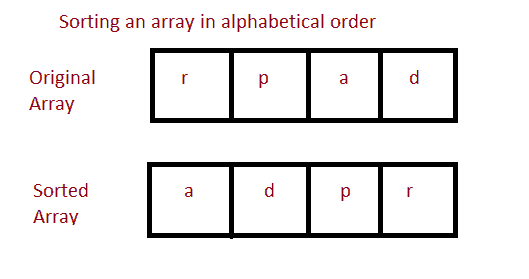

# Java 程序：按字母顺序排列数组

> 原文：<https://www.studytonight.com/java-programs/java-program-to-sort-an-array-in-alphabetical-order>

在本教程中，我们将学习如何按字母顺序对数组元素进行排序。排序是指按字母顺序或数字顺序排列数据。但是在继续之前，如果您不熟悉数组的概念，那么请务必查看 Java 中的文章[数组](https://www.studytonight.com/java/array.php)。



**输入:** a n m w r t s p

**输出:** a m n p r s t w

上述问题可以通过以下方式解决:

方法 1:使用比较()

方法 2:使用数组。排序()

方法 3:使用反转命令()

让我们分别看看这些方法。

## 程序 1:按字母顺序排列数组

在这种方法中，我们将通过将每个元素与其余元素进行比较，按字母顺序对数组进行排序。

### 算法

1.  开始
2.  声明数组
3.  初始化数组
4.  使用两个 for 循环按字母顺序对数组进行排序。
5.  使用第一个 for 循环来保存元素。
6.  使用第二个 for 循环与其余元素进行比较。
7.  使用 compareTo()进行比较。
8.  交换数组元素。
9.  打印更新后的数组。
10.  停止

下面是相同的代码。

下面的程序演示了如何使用`compareTo()`方法按字母顺序对[数组](http://www.studytonight.com/java/array.php)进行排序。

```java
//Java Program to sort an array in alphabetical order.
import java.util.Arrays;  
import java.util.Scanner;

public class Main  
{  
   public static void main(String args[])   
   {  
      Scanner sc=new Scanner(System.in);
      int n;   //Declare the array size
      System.out.println("Enter the number of elements ");
      n=sc.nextInt();    //Initialize the array size

      String fruits[]=new String[n];   //Declare the array
      System.out.println("Enter the String ");
      Scanner sc1=new Scanner(System.in);    
      for(int i=0; i<n ;i++)     //Initialize the array
      {
          fruits[i]=sc1.nextLine();
      }

        //logic for sorting     
         for(int i = 0; i<n; i++)   //Holds each element
         {  
             for (int j = i+1; j<n; j++)  //Check for remaining elements 
             {  
                //compares each elements of the array to all the remaining elements  
                if(fruits[i].compareTo(fruits[j])>0)   
                {  
                    //swapping array elements  
                    String temp = fruits[i];  
                    fruits[i] = fruits[j];  
                    fruits[j] = temp;  
                 }  
              }  
           }  
           //prints the sorted array in alphabetical order  
           System.out.println(Arrays.toString(fruits));  
       }  
} 
```

输入数组元素个数:10
输入数组元素:
苹果
奶油冻苹果
香蕉
猕猴桃
番石榴
橙子
木瓜
黑莓
红枣
葡萄
【苹果、香蕉、黑莓、奶油冻苹果、红枣、葡萄、番石榴、猕猴桃、橙子、木瓜、】

## 程序 2:按字母顺序排列数组

在这种方法中，我们将使用 Arrays.sort()方法按字母顺序对数组进行排序。

### 算法

1.  开始
2.  声明数组
3.  初始化数组
4.  调用`Arrays.sort()`函数，按字母顺序对数组进行排序。
5.  打印排序后的数组。
6.  停下来。

下面是相同的代码。

下面的程序演示了如何使用`Arrays.sort()`方法按字母顺序对[数组](http://www.studytonight.com/java/array.php)进行排序。

```java
//Java Program to sort an array in alphabetical order.
import java.util.Arrays;  
import java.util.Scanner;

public class Main  
{  
   public static void main(String args[])   
   {  
      Scanner sc=new Scanner(System.in);
      Scanner sc1=new Scanner(System.in);

      int n;    //Declare array size
      System.out.println("Enter the number of elements ");
      n=sc.nextInt();     //Initialize array size

      String str[]=new String[n];   //Declare array
      System.out.println("Enter the String ");
      for(int i=0; i<n ;i++)     //Initialize array
      {
          str[i]=sc1.nextLine();
      }

      Arrays.sort(str);    //Sort the array in alphabetical order

      System.out.println(Arrays.toString(str));  //Display the array
   }  
} 
```

输入元素数量
5
输入字符串
法国
印度
中国
德国
意大利
【中国、法国、德国、印度、意大利】

## 程序 3:按字母顺序排列数组

在这种方法中，我们将使用`Arrays.sort()`按字母顺序对数组进行排序，然后再次使用`reverseOrder()`方法按相反顺序对其进行排序。

### 算法

1.  开始
2.  声明数组
3.  初始化数组
4.  调用`Arrays.sort()`函数，按字母顺序对数组进行排序。
5.  然后调用`reverseOrder()`对数组进行逆序排序。
6.  打印排序后的数组。
7.  停下来。

下面是相同的代码。

说明:下面的程序演示了如何使用`reverseOrder()`方法按照相反的字母顺序对数组进行排序。

```java
/*Java Program to sort an array alphabetically in reverse order*/
import java.util.Arrays;  
import java.util.Scanner;
import java.util.*;  

public class Main  
{  
   public static void main(String args[])   
   {  
      Scanner sc=new Scanner(System.in);
      Scanner sc1=new Scanner(System.in);

      int n;    //Declare array size
      System.out.println("Enter the number of elements ");
      n=sc.nextInt();     //Initialize array size

      String str[]=new String[n];   //Declare array
      System.out.println("Enter the String ");
      for(int i=0; i<n ;i++)     //Initialize array
      {
          str[i]=sc1.nextLine();
      }

      Arrays.sort(str,Collections.reverseOrder());    //Sort the array in alphabetical order

      System.out.println(Arrays.toString(str));  //Display the array
   }  
} 
```

输入元素数量
5
输入字符串
孟买
浦那
金奈
兰契
加尔各答
【兰契，浦那，孟买，加尔各答，金奈】

* * *

* * *