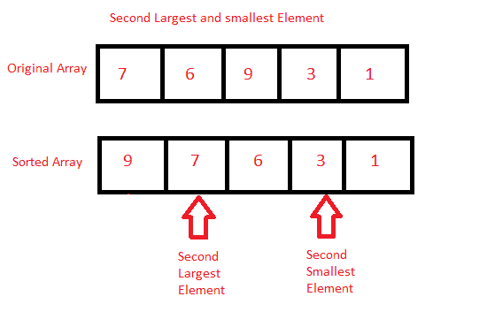

# 寻找数组中第二大和第二小元素的程序

> 原文：<https://www.studytonight.com/java-programs/java-program-to-find-the-second-largest-and-smallest-element-in-an-array>

在本教程中，我们将学习如何在数组中找到第二大和第二小的元素。找到两个最大元素的最简单方法是首先对元素进行排序，然后返回存储在数组第一个和第二个最后一个索引处的元素。但是在继续之前，如果您不熟悉数组的概念，那么一定要查看 Java 中的文章 [Arrays。](http://www.studytonight.com/java/array.php)



**输入:**输入数组元素:7 6 9 2 4 1 3 6 9

**输出:**第二小= 2

第二大= 7

## 程序 1:寻找第二大和第二小元素

在这种方法中，我们将直接找到数组中第二大和第二小的元素。

### 算法

1.  开始
2.  声明一个数组。
3.  初始化数组。
4.  使用两个 for 循环来显示数组中第二大和第二小的元素。
5.  使用第一个 for 循环来保存数组的每个元素
6.  使用第二个 for 循环将元素与其余元素进行比较。
7.  交换元素以对元素进行排序。
8.  显示第二大和第二小的元素。
9.  停止

下面是相同的代码。

下面的程序演示了如何找到数组中第二大和第二小的元素。首先，声明一个数组，然后初始化。在两个 for 循环的帮助下，对数组的所有元素进行迭代，然后按降序对元素进行比较和交换。然后分别显示第二大和第二小的元素。

```java
/*Java Program to find the second largest and second smallest elements in the array without using Functions*/
import java.util.Scanner;

public class FindElement
{

     public static void main(String []args)
     {
         Scanner sc=new Scanner(System.in);
         int n;     //Declare array size
         System.out.println("Enter the size of the array");
         n=sc.nextInt();   //Initialize array size

         int arr[]=new int[n];   //Declare array 
        System.out.println("Enter the array");  
        for(int i=0;i<n;i++)     //Initialize array
        {
            arr[i]=sc.nextInt();
        }

        for(int i=0;i<n;i++)     //Use to hold the element
        {
            for(int j=i+1;j<n;j++)    //Use to compare with the rest of the elements 
            {
                if(arr[i]<arr[j])     //Check and swap
                {
                    int temp=arr[i];
                    arr[i]=arr[j];
                    arr[j]=temp;
                }
            }
        }

        System.out.println("Second Largest element is "+arr[1]);   //Display second largest element.
        System.out.println("Second Smallest element is "+arr[n-2]);  //Display second smallest element.
    }
}
```

输入数组 10 的大小
输入数组 56 7 6 45 3 4 23 12 21 1
第二大元素是 45
第二小元素是 3

## 程序 2:寻找第二大和第二小元素

在这种方法中，我们将使用单独的方法，使用 `Arrays.sort().`找到数组中第二小和第二大的元素

### 算法

1.  开始
2.  声明一个数组。
3.  初始化数组。
4.  调用将显示数组中第二大和第二小元素的方法。
5.  使用`Arrays.sort()`对数组进行排序。
6.  在第一个和第二个最后索引处显示元素。
7.  这是第二大第二小的元素。
8.  停止

下面是相同的代码。

下面的程序演示了如何使用单独的方法，通过`Arrays.sort()`找到数组中第二大和第二小的元素。首先，声明一个数组，然后初始化。接下来调用一个方法。使用`Arrays.sort()`对数组进行排序，显示第一个和第二个最后的元素，分别是第二小和第二大元素。

```java
/*Java Program to find the second largest and second smallest elements in the array using Functions*/
import java.util.Scanner;
import java.util.*;

public class findElement
{
    static void findLargest(int arr[], int n)      //Method to find the second largest and second smallest element
     {

       Arrays.sort(arr);   //Sorts the array in ascending order

        System.out.println("Second Largest element is "+arr[n-2]);  //Display Second Smallest
        System.out.println("Second Smallest element is "+arr[1]);  //Display Second Largest

     }

     public static void main(String []args)
     {
         Scanner sc=new Scanner(System.in);
         int n;     //Declare array size
         System.out.println("Enter the size of the array");
         n=sc.nextInt();   //Initialize array size

         int arr[]=new int[n];   //Declare array 
        System.out.println("Enter the array");  
        for(int i=0;i<n;i++)     //Initialize array
        {
            arr[i]=sc.nextInt();
        }

        findLargest(arr,n);  //Function Call

    }
}
```

输入数组 10 的大小
输入数组 8 7 9 5 4 3 8 6 1 2
第二大元素是 8
第二小元素是 2

* * *

* * *