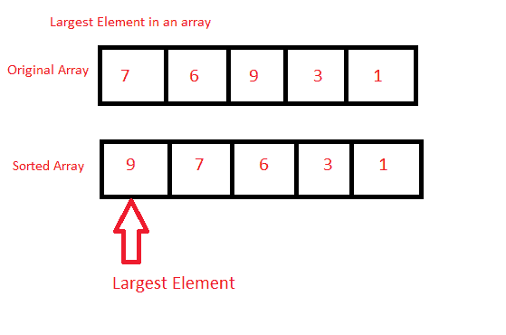

# Java 程序：寻找数组中最大元素

> 原文：<https://www.studytonight.com/java-programs/java-program-to-find-the-largest-element-in-an-array>

在本教程中，我们将学习如何找到数组中最大的元素。找到两个最大元素的最简单方法是首先对元素进行排序，然后返回存储在第 0 个索引处的元素。但是在继续之前，如果您不熟悉数组的概念，那么请务必查看 Java 中的文章[数组](https://www.studytonight.com/java/array.php)。



**输入:**输入数组元素:7 6 9 2 4 1 3 6 9

**输出:**最大= 9

## 程序 1:寻找数组中最大的元素

在这种方法中，我们将直接在主方法本身中找到最大的元素。首先，我们将按降序对元素进行排序，然后返回存储在第 0 个索引中的元素。

### 算法

1.  开始
2.  声明一个数组。
3.  初始化数组。
4.  使用两个 for 循环来显示数组中最大的元素。
5.  使用第一个 for 循环来保存数组的每个元素
6.  使用第二个 for 循环将元素与其余元素进行比较。
7.  交换元素以对元素进行排序。
8.  显示最大的元素。
9.  停止

下面是相同的代码。

下面的程序演示了如何直接找到数组中最大的元素。首先，声明一个数组，然后初始化。在两个 for 循环的帮助下，对数组的所有元素进行迭代，然后按降序对元素进行比较和交换。然后显示数组中最大的元素。

```java
/*Java Program to find the largest element in an array without using Functions*/
import java.util.Scanner;

public class findElement
{
     public static void main(String []args)
     {
         Scanner sc=new Scanner(System.in);
         int n;     //Declare array size
         System.out.println("Enter the size of the array");
         n=sc.nextInt();   //Initialize array size

         int arr[]=new int[n];   //Declare array 
        System.out.println("Enter the array");  
        for(int i=0;i<n;i++)     //Initialize array
        {
            arr[i]=sc.nextInt();
        }

        for(int i=0;i<n;i++)   //Use to hold an element
        {
            for(int j=i+1;j<n;j++)   //Use to check for rest of the elements
            {
                if(arr[i]<arr[j])    //Compare and swap
                {
                    int temp=arr[i];
                    arr[i]=arr[j];
                    arr[j]=temp;
                }
            }
        }

        System.out.println("Largest element is "+arr[0]);  //Display Largest    

    }
}
```

输入数组 10 的大小
输入数组 87 6 7 5 4 3 4 32 12 1
最大的元素是 87

## 程序 2:寻找数组中最大的元素

在这种方法中，我们将使用单独的方法，使用`Arrays.sort()`找到数组中最大的元素。`Arrays.sort()`存在于 java.util 包中。数组类在被调用时自动对数组进行排序。它减少了用户的工作，因为用户不必编写不同的代码来对数组进行排序。

### 算法

1.  开始
2.  声明一个数组。
3.  初始化数组。
4.  调用将显示数组中最大元素的方法。
5.  使用`Arrays.sort()`首先对数组的元素进行排序。
6.  最后一个元素是数组中最大的元素。
7.  显示最后一个元素。
8.  停止

下面是相同的代码。

下面的程序演示了如何使用单独的方法来查找数组中最大的元素。首先，声明一个数组，然后初始化。接下来调用一个方法。然后使用`Arrays.sort()`对数组进行排序，显示最后一个索引元素，即数组中显示最大的元素。

```java
/*Java Program to find the largest element in an array using Arrays.sort()*/
import java.util.Scanner;
import java .io.*;  
import java .util.*;  

public class findElement
{
    static void findLargest(int arr[], int n)    //Method to display the largest element  
     {

       Arrays.sort(arr);    //Sort the array

        System.out.println("Largest element is "+arr[n-1]);  //Display Largest Element

     }

     public static void main(String []args)
     {
         Scanner sc=new Scanner(System.in);
         int n;     //Declare array size
         System.out.println("Enter the size of the array");
         n=sc.nextInt();   //Initialize array size

         int arr[]=new int[n];   //Declare array 
        System.out.println("Enter the array");  
        for(int i=0;i<n;i++)     //Initialize array
        {
            arr[i]=sc.nextInt();
        }

        findLargest(arr,n);  

    }
}
```

输入数组 10 的大小
输入数组 56 7 6 45 3 4 23 12 21 1
最大的元素是 56

* * *

* * *