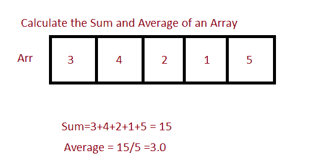

# 寻找数组的和与平均的 Java 程序

> 原文：<https://www.studytonight.com/java-programs/java-program-to-find-the-sum-and-average-of-an-array>

在本教程中，我们将学习如何计算数组中所有元素的总和和平均值。但是在继续之前，如果您不熟悉数组的概念，那么请务必查看 Java 中的文章[数组](https://www.studytonight.com/java/array.php)。



**输入:**输入数组元素:1 2 3 4 5 6 7 8 9 10

**输出:**总和= 55

平均值= 5.5

## 程序 1:计算一个数组中所有元素的总和和平均值

在这种方法中，我们将使用迭代法来计算数组中所有元素的总和和平均值。

### 算法

1.  开始
2.  声明一个数组。
3.  初始化数组。
4.  调用一个方法来计算数组中所有元素的总和和平均值。
5.  在那里声明一个 sum 变量，并将其初始化为 0。
6.  在每次迭代中更新总和。
7.  打印总和。
8.  计算平均值并返回。
9.  打印平均值。
10.  停下来。

下面是相同的代码。

下面的程序演示了如何使用迭代法计算数组的和与平均值。

```java
//Java program to calculate the average of array elements
import java.util.Scanner;
public class Main 
{
    // Function that returns the average of an array.
    static double averageCalculate(int a[], int n)
    {
        // Find sum of array element
        int sum = 0;
        for (int i = 0; i < n; i++)
        {
            sum += a[i];
        }
        System.out.println("The total sum of all the elements in the array is "+sum);
        return (double)sum / n;
    }

    //driver code
    public static void main (String[] args)
    {
        Scanner sc=new Scanner(System.in);

        int n;  //Declare array size
        System.out.println("Enter the total number of elements in the array ");
        n=sc.nextInt();  //Initialize the array size

        int arr[] = new int[n];    //Declare array
        System.out.println("Enter the array elements ");
        for(int i=0;i<n;i++)      //Initialize the array
        {
            arr[i]=sc.nextInt();
        }

        System.out.println("The average of all the elements in an array is "+averageCalculate(arr, n));
    }
} 
```

输入数组中元素的总数 10
输入数组元素 1 2 3 4 5 6 7 8 9 10
数组中所有元素的总和为 55
数组中所有元素的平均值为 5.5

## 程序 2:计算一个数组中所有元素的总和和平均值

在这种方法中，我们将使用递归方法来计算数组中所有元素的总和和平均值。

### 算法

1.  开始
2.  声明一个数组。
3.  初始化数组。
4.  调用一个方法来计算数组中所有元素的总和和平均值。
5.  使用递归函数计算数组中所有元素的总和和平均值。
6.  返回数组中所有元素的平均值和总和。
7.  打印数组中所有元素的平均值和总和。
8.  停止

下面是相同的代码。

下面的程序演示了如何使用递归函数计算数组的和与平均。

```java
//Java program to calculate the average of array elements using recursive function
import java.util.Scanner;

public class Main 
{

     // Recursively computes average of a[]
    static double avgCalcRec(int a[], int i, int n)
    {
        // Last element
        if (i == n-1)
            return a[i];

        // When index is 0, divide sum computed so
        // far by n.
        if (i == 0)
            return ((a[i] + avgCalcRec(a, i+1, n))/n);

        // Compute sum
        return (a[i] + avgCalcRec(a, i+1, n));
    }

    // Function that returns the average of an array.
    static double averageCalculate(int a[], int n)
    {
         return avgCalcRec(a, 0, n);
    }

    //driver code
    public static void main (String[] args)
    {
        Scanner sc=new Scanner(System.in);

        int n;  //Declare array size
        System.out.println("Enter the total number of elements in the array ");
        n=sc.nextInt();  //Initialize the array size

        int arr[] = new int[n];    //Declare array
        System.out.println("Enter the array elements ");
        for(int i=0;i<n;i++)      //Initialize the array
        {
            arr[i]=sc.nextInt();
        }
        //Print the average
        double avg=averageCalculate(arr, n);     
        System.out.println("The average of all the elements in an array is "+avg);

        //Print the sum
        double sum=avg*n;
        System.out.println("The sum of all the elements in an array is "+sum);
    }
} 
```

输入数组中元素的总数 10
输入数组元素 32 1 4 42 56 78 96 23 13 31
数组中所有元素的平均值为 37.6
数组中所有元素的总和为 376.0

* * *

* * *